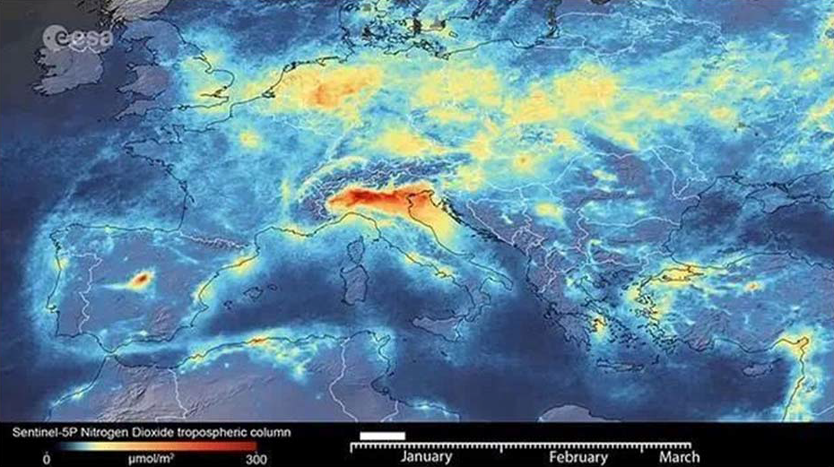
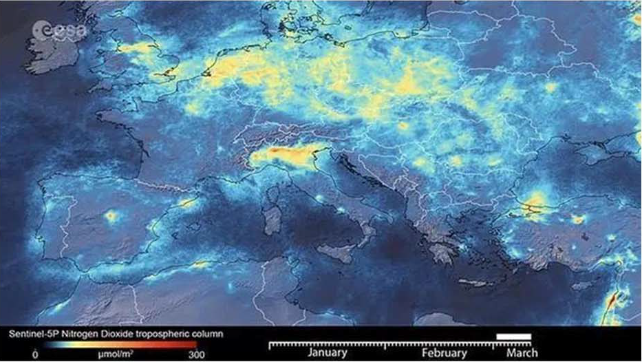
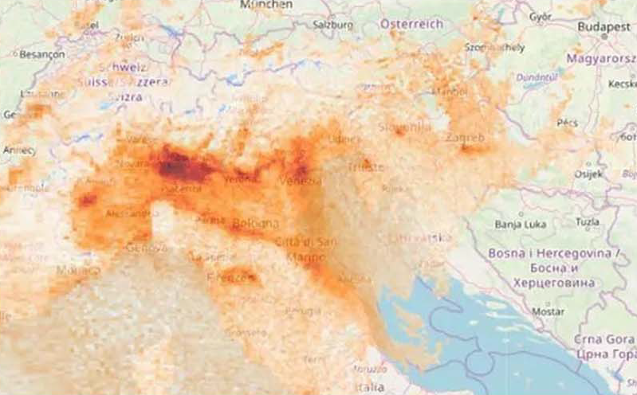
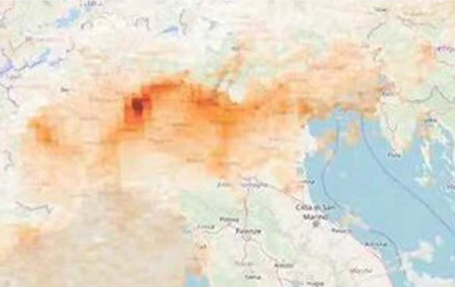

<!-- 本文录入由扫描全能王OCR完成，校对由李林峰+DeepSeek完成 -->

# 少26B班级日志 第一册

## 2019/09/16 星期一 30 张婧菲

今天是开学第三周的第一天，经过两周的适应，我们已经熟悉了这个校园，熟悉了校园里的生活。早上收作业时，井然有序，非常迅速。在各个班委、组长、课代表、及其他同学的协作下，丝毫不乱。

天还是发灰的蓝色，朝阳中掺着阵阵寒意。我们来到操场上参加本学期第三次升旗仪式。如今，我们熟悉了空中操场，熟悉了升旗仪式，熟悉了八中……

我发现班里有很多同学对老师课上讲的知识已经学过并且烂熟于心，这点各科都有体现。老师在讲的时候显然有很多同学已经知道了，上课常常是听老师讲一点，再听同学接一点，总都是知识。

下午上体育课时，我们先是玩了打鸭子。“猎人”和“鸭子”们都于高度紧张。“猎人”们要找球，还要时刻寻找机会，攻其不备；“鸭子”们要则要眼观六路、耳听八方，注意球在哪个方向，一不小心就被人“偷袭”了。操场上时不时地传来我们的笑声、喝彩声、叹息声，此起彼伏，我们玩得不亦乐乎。之后我们又学习了一下蹲踞式起跑，不知不觉，我发现我已经气喘吁吁了。

之后我们上了信息课，晚锻炼，在学校的一天就这样过去了，在少儿班，虽然压力大，但是每天都很充实、很快乐！

## 2019/09/17 星期二 29 邓馨恬

今天是开学第三周的第二天。现在已经是九月中旬了，天气慢慢转凉了，同学们的衣着也都变为了长袖。

今天早上，教学楼门口多了许多社团宣传海报，每到课间，同学们就会聚集在那里，仔细地挑选自己要参加的社团，看来八中不仅有着充实的课内生活，也有着丰富的课外活动，真是令人期待啊！

在今天的英语课上，我们进行了课文表演。看着“演员”们夸张的动作，丰富的表情，班里时不时传来笑声。这样的方式既能让我们了解课文，又可以让我们开心，效果是很好的。

上政治课时，老师问了我们进入八中后有了什么变化，有的同学说自己不再像以前那样突出，有的同学说自己的能力有所提升，也有人说对自身的认识有了改变……后来，我们了解了，认识自己其实是一个很漫长的过程。当我们正确认识自我后，也要为自己的未来立下一个目标。我相信，在少儿班学习了5年后，我们一定都能认识自己，并向着未来的目标前进，成为更好的自己！

之后我们上了自习，进行了晚锻炼，就放学了。在八中少儿班的每一天都是丰富多彩的，期待明天充实的学习与生活！

## 2019/09/18 星期三 28 范文

今天是开学第三周的第3天。同学们对校园的热情依旧没减。体育课上，同学们激情四溢，玩了传球游戏追球跑，穿叉跑……最让同学们兴奋的就是第三节课后的广播了：社团嘉年华开始了！听到这个广播，全班立刻沸腾起来了，有欢呼的，有拍手的，有站起来跳的，看来，大家都很期待这次社团嘉年华啊！经过“漫长”的等待同学们吃完了午歺来到了西侧甬道，那里早已里人声鼎沸，大家对这种课外活动也是热情不少。同学们东看看西看看，应该是在挑选自己喜欢的社团；有的同学则是看哪里人多就去那里；还有的同学专门去找有食物供给的社团去找吃的！就这样，一个小时的午休就结束了，同学们都恋恋不舍地离开了场地，开始了下午的课程。

下午，我们班先上了美术，大家都用画笔绘制出了奇特的事物，有画电影里人物的，有画表情包的，有画动漫的，更有同学自创出了一个人物！画还没画完下课铃就打响了，下一节地理课也即将开始。

上地理课是令人快乐的：地理老师比较幽默而且每一节课都会拿者地球仪来为我们讲解地球的自转与公转，有的时候也会穿插一些高中的知识，这应该也是少儿班教学的奇特之处：不会先讲简单的，之后又讲关于这个方面难一些的知识，而是会先把一个方面都讲明白了再讲其他方面。

上完地理，我们又进行了自习和晚锻炼，同学们个个奋勇向前地进行了最后一圈的冲刺。少儿班的生活应该也像跑步一样：先热身，再开始，然后保持，最后冲刺。我们现在有可能在热身与开始之间，不过也相信大家都能在以后做的更好。

## 2019/09/19 星期四 27 何欣蕾

从同学手中接过这本已经记录了三天的班级日志，我内心激动不已：终于到我了！而当我写下今天的日期时，今天在校园里发生的事情就像放电影一般在我的脑海里一幕幕闪现。

每天的校园生活都是那么的有条理：收作业、做笔记、学做操……一切井然有序。最令同学们兴奋的是生物课。课上，老师带我们去实验室做实验。到了那里，大家都不约而同的发出一声感叹：每张桌子上都摆着几台显微镜！老师先是给我们讲解了显微镜的构造，然后教我们它的使用方法，接着，老师让我们用各自的显微镜做实验。我很兴奋，因为这是我第一次亲自使用显微镜。我们从盒子里拿出一张观察样片，放到载物台上，并开始观察。老师告诉我们，仔细看会有一些红色的圆形，那些是红细胞。我看了一遍又一遍，但一直都没有看到。直到下课铃声响起，有一名同学兴奋地喊着，自己的样片里有红细胞。同学们排着队去看，每个人看后都惊喜地叫了一声：“真的有！”

“弹笔”是最近一段时间在班级里最流行的课余游戏，它的规则很简单：每人用一支笔，谁先把其他人的笔弹下桌子，就获胜。同学们丰富的想象力赋予了这种游戏更多的可能：单人弹、组队弹、用多支笔组装弹……各种玩法应有尽有。每到课间，同学们都三五成群地聚在一起玩。我的耳边时常传来同学们的笑声、喝彩声、叹息声。甚至有些同学玩得高兴时，兴奋地哼起了歌。但只要上课铃一打响，同学们就又飞快地跑回各自的座位，准备上课。

在八中少儿班的又一天就这样匆匆过去了，但今天校园里发生的各种事情仍历历在目，让我回味无穷。就在我即将结束这篇日志的同时，我也在热烈地期盼着明天的到来。

## 2019/09/20 星期五 26 徐晏熹

转眼间，一周又过去了。两天的社团嘉年华结束了，班里仿佛又恢复了平静。尽管如此，同学们的活跃仍然不减。在上政治课做游戏时，在课间弹笔、聊天时，在午休说说笑笑时，都能看出他们的热情。

今天可能是不少同学期待的一天，在下午上自然体育课时，我们都很兴奋：我们要骑独轮车了。我们要分成三人一组，两人扶着另一个人骑。今天全班30人少来了一个，于是我和30号某人，就成了孤独的二人组。我们发现，骑独轮车远不如想象中简单：一旦重心不稳就容易把车摔倒。后来，一位善良的家长志愿者阿姨答应帮我们扶着，我们就向前…向后…练了一段时间。

过了一会儿，我们开始练习只扶一边手臂，扶着的人一手扶住腋下，一手扶住手，骑车的人另一只手臂伸开。将近二十分钟，我就在骑上，从后滑下去，骑上，从前滑下去…中不停循环，我太难了。有这种感觉的不仅是我，还有一个差点用中式英语呼叫老师的人。不过，我们最后还是骑起来了。

一天就这样过去了。每天都是熟悉却又特别的。作业还是一如既往的多，写满了黑板；课程仍然充实，课本几乎塞满了书包。不知不觉中，我们已经习惯了这种生活，习惯了新校园、新老师、新同学……

## 2019/09/23 星期一 25 孙依瑶

不知不觉中，一个月就快要结束了，教室中时时刻刻都充满着同学们的欢声笑语。十一国庆节马上就要到了，而我们也在它的来临之季，迎来了体育节。今天和明天放学后，我们举行了初赛、今天进行了田赛的预赛。运动员们，从一早就显得格外兴奋，心中充满了对比赛的期盼和激动，但有些相对没有太大把握的同学，今天下午就仿佛是他们的“死期”，紧张写满了脸，哀声叹气。明天下午，是跑步项目的预赛，我心中也是五味杂尘，不知如何形容。毕竟我们的对手还是很强的！

今天一放学，我就直奔操场去观战。操场上可以说是人山人海，但又井井有条，在体育老师的组织下，操场一下变成了大大小小的模块，各自安排着自己的活动。有时还会传来鼓掌、惊叹及助威的声音，热闹极了！如果你认真观赛，你一定会有：竞争太激烈！的感受。每一位运动员都尽自己最大的力量去拼搏、去竞争不分上下，差距几乎只有几厘米。

这一周，我想体育节应该会是校园中最热的一个话题！当然；也可能会有像我一样，除了学习，其他注意力全部投入在练习比赛项目吧！

## 2019/09/24 星期二 24 潘玥含

我听过这样一句话：在平凡的日子里，能收获最多的幸福。八中的生活也是如此：每个普通却又特殊的日子里，却藏着不一样的惊喜与意外。如果你细心一点，就能发现生活馈赠给我们的礼物。

今天，上午上了一节有趣的生物实验课。课上，每个人都要制作一个洋葱内表皮装片，然后放到显微镜下观察。做装片时，不知怎的，总有一些气泡过来捣乱，你挤也不是，压也不是，最后只能拿起来重做。做完后，就该观察了。我把装片放在显微镜上，先调调放大倍数，再调调升降台高度，调一下这个，调一下那个。可不管我怎么动它，看到的永远都是一片模糊的暗黄色。正当我一筹莫展时，我对面的同学突然叫道：“看见了！”我连忙凑上前去。果然耶！灰黑色的一个个小长方形，这不正是——我苦苦寻找的细胞吗！

中午，各类社团已经陆续开始活动了。路过学生活动室的时候，大笑声与拍桌子的声音会时常出现在耳边，让同学们也不由得想进去看一看。

放学后，径赛的预赛还在火热地进行。操场上各类声音都有：脚步声，老师的声音，以及同学们的呐喊声。比赛过程就更精彩了。老师一吹哨，同学们便如离弦之箭一般冲了出去。刚开始的速度都很快，可后来却渐渐慢了下来，最后冲过终点线时已经完全没劲了。跑第一的同学固然可喜可贺，但最后一名更值得鼓励。他们虽然已经没有赢的可能性，但依然坚持着跑，直到完成目标。

不仅仅是比赛的同学，观赛的人更有意思。同学们有不停地喊名字的；有跟在后面大声助威的，还有四肢并用在后面爬的。大家的眼睛都目不转睛地盯着运动员。一刻也不肯放松。运动员冲过终点线的那一刹那，全体都沸腾了。

9月份拖着她的小尾巴，悄然从我们身边溜走了。我们想抓住它——但那是不可能的。时间老人才是赛跑的冠军啊。少儿班的时光也是这样：你稍一不注意，它就“逃逸”了。

## 2019/09/25 星期三 23 刘子与

时间飞逝，转眼间，已经到了九月的尾声，我们学校也即将迎来祖国母亲的70岁生日，而这时，班里的活动也开始了。

今天也如往常一样，从早晨的作业收纳，到两节课后的课间操，都不慌不忙。而课间操后，就是两节英语课，同学们都很激动，因为又可以演《新概念》的课文了，演出也是一如既往的精彩，当然，欢笑过后，同学们就立即停了下来，认真听老师讲课。

午饭后，很多人都去了体育场馆或阅览室图书馆，但今天的班里比平时“热闹”了许多，除了我和几位平时中午就呆在班里的同学以外，班里又多了几位宣传小组的成员在制作板报。他们个个都十分投入：有的用手比划着，思考着该如何设计板报，有的忙着准备做板报需要写的字，还有的正拿着纸，用图钉把它们钉到板子上。而原在班里写作业的同学，也都围过去观看他们优美的字和灵动的画。

下午的美术课画的依旧是卡通形象的表，但这次的课下课后，同学们就需要把画交给老师了，对于那些早已画好的同学们，已经迫不及待的想把画上交了，但像我这种还没有完全画完的同学，抓紧了一切时间，都尽量在下课之前完成了作品。

地理课上，老师给我们介绍了三种地图，其中，最难的就是经纬网地图，老师还特意出了几道题来考我们，前几道题大家很快就答出来了，但最后一题是高中的易错题，光听名字就让人心惊胆战，虽然举手的同学不少，但“第一轮”的答案中并没有正确的，随后老师又加了条辅助线，但举手的同学却很少。最后一位同学说出了正确答案，老师也给我们讲解。

又一天在不知不觉中渡过，可又是那么多个不知不觉的日子，才成就了现在的我们。每一天都很短，但每一天的我们都是不一样的。不知道在少儿班渡过5年后，我们会变成什么样子？

## 2019/09/26 星期四 22 徐在菁

又踏进八中这个美丽的校园。不再陌生。

在朗朗书声过后，我们迎来了两节语文课。大家都很紧张，今天是周测的日子。但老师并没有抱着一沓试卷进来，我有些疑惑。随后，我们得知，今天，我们要写第一次作文，八中的一个地方。

真是几家欢乐几家愁啊。课间，同学们纷纷奔出教室，去探索自己心中的那个地方。两节语文课就在“沙沙”的写字声中度过。

课间操同样有趣，尤其是八中健身操，真的很累。但这才是健身的意义吧？去尝试从未做过的动作，去突破做不了的动作。

又是一节生物实验课，我们做了一个口腔上皮临时装片，放到显微镜下观察。同样面临着同一个问题，每次看到的细胞怎么都是那么相似。很多同学都成功了，“快来看，真的好清楚。”但对于我这样的人来说，先做好自己的吧，待会儿有的是时间羡慕呢。

体育课，我们继续练习快速跑，“各就各位，预备，跑！”冲出去，冲过终点。更有男生的加油声。不过，不论怎样，大家都很努力，班长甚至跑出了7.97'的好成绩。

下午的自习课，是我们的第一次选修课，大家都十分期待。表张贴出来了，一双双眼睛急切地寻找着自己的名字，有因为上了喜欢的课而兴奋不已的，也有因为参考了第二志愿而唉声叹气的。不过，无论上什么课，都应该好好对待。因为都会是一次学习到新知识的征程。

每一天都应该充满期待，期待明天会更好。

## 2019/09/27 星期五 21 王孙佳悦

转眼间，从开学到现在已经差不多一个月了，我们离祖国母亲的70岁生日也越来越近了。同学们心中多少都有一些小兴奋。

在上午的课间操时间，同学们都纷纷来到篮球馆。我们复习了之前学过的一些操，然后观看了领操的同学们表演的一套操，操的名字叫做《青春魅力》。操的动作看着十分复杂，听老师说，这是我们要学的四套操中最难的一套。虽然看着眼花缭乱，但是挑战和尝试做不了的动作，又何尝不可呢？

午休时我们通过直播观看了一个有关法律的讲座。讲座时间很长，有不少同学都昏昏欲睡，但是相信也会有不少同学受益匪浅吧。

自然体育课是同学们最期待的活动了。我们再次拿起了独轮车，前往公园。由于一节课被占，我们的时间缩短了不少，可还是要达到目标，所以同学们都迫不及待地骑上了车。可是和上一次练习已经间隔了一周的时间，未免会有些生疏，不过十几分钟后同学们都恢复到了之前的水平。看来学完了一件东西还是要经常练啊。

“学而时习之，不亦说乎？……”我不禁想到这些天的所做所为，领悟的知识和相处不久的老师同学。我们早已在不知不觉中习惯了这一切。

## 2019/09/29 星期日 20 赵衍舒

转眼间，已经到了周日。同学们都很兴奋，因为祖国母亲的70岁生日快到了，国庆假期也不远了。

数学课讲了有理数的乘方，同学们都听得很认真，仔细地记了笔记。因为王老师病了，语文课改成了自习课，给同学们充裕的时间写作业。

和前几天一样，这次课间操我们复习了八中健身操和放飞理想。当同学们得知复习内容中有八中健身操时，都不约而同地发出了一声欢呼——看来大家都很喜欢这套操，不知是因为它可以让我们锻炼身体，还是因为它的音乐很好玩？也许这两个因素都有吧。

政治课上，黄老师给我们看了一个纪录片，是关于历史上的两个天才之间的斗争，同学们都看得津津有味，沉迷在这曲折的情节当中。

音乐课也是自习，同学们都在写数学练习册——目前唯一的作业。

下午的自然体育课的内容是远足。和上次一样，这次也不能带水杯。我拼命地喝水，足足喝了两杯半。不过最奇葩的还是赵钟悦，他含了一口水在嘴里，但刚走出了校门，他就不小心将水喷了出来，喷了可怜的体委一脸。

精彩而又充实的一周过去了，下周又会是什么样呢？

## 2019/10/08 星期二 19 李林峰

光阴似箭，日月如梭，转眼间祖国母亲七十岁的生日过去了，一个国庆假期也过去了，我们又怀着期待的心情迎来了在八中愉快的一天。

今天一共有八种不同的课程。在上午第一节数学课上，我们把目前学到的加法、减法、乘法、除法和乘方五种有理数的运算方法进行了综合运算的题目的考察，大家都做得不错。

上课间操时，我们复习了我们学过的《放飞理想》、《武术操》和我们最喜欢的《八中健身操》，又观看了我们明天要学的动作复杂的《青春的魅力》这一套操。

下午政治课我们讲的是关于时间管理的一堂课，大家听得也十分着迷，讲完课还剩余一点时间，小黄老师又给我们播放了上节政治课没有看完的两位著名物理学家——海森堡和奥本海默竞争造出原子弹的故事。

下午最后一节课是体育课，我们考核了50米跑。考核一开始，运动员们就像脱缰了的野马如离弦的箭飞奔出去，操场上充满了欢呼声和加油声。每个同学都跑出了自己最好的水平，我还跑出了7秒78的个人最好成绩。

虽然在八中的日子是平凡的，但是我们仍旧收获了快乐与幸福！

## 2019/10/09 星期三 18 唐源博

一天又匆匆地过去了，10月秋的号角也已经吹响了，鸿雁来宾，去了温暖南方，转眼闻大地翻开了新的篇章。少儿班的同学们也在不断进步，砥砺前行！

早晨，当预备铃急促地吹起了哨子时，全班便开启了沸腾的状态。几名不同学科的课代表争先恐后地宣布当天要交的作业、组长们忙得不亦乐乎，同学则准备好各科作业码放在桌上，早晨的收作业工作就这样有条不紊地进行着。当每个课代表桌前都有了一座作业大山时，同学们差不多该进行早读了。此时倘若你走在开满石榴树的小路上，朗朗书声便传入你的耳朵中。接着当又一阵急促铃响过后，就到了上课的时间了。大家做好课前准备，就等待着老师光临了。

一个月过去后的现在，课程也明显加了级别。英语课从初级考试升到了中级考试，原本满分一大片的欢呼声变成了一小片的欢呼声。体育课则练习了前滚翻，不少同学晕头转向，头重脚轻。地理课时，老师讲了“凸升谷，凸降脊”的地理原理，最受欢迎的非课间操莫属，我们今天学习了《青春魅力》的前两节，虽然动作有些难，但是同学们都做得标准到位，欢声笑语在篮球馆回荡。当做跳跃动作时，大家像装了弹簧一般；当做伸展动作的时候，同学们展开的很到位。

当然了，在班中，有趣的事情也层出不穷。今天要讲的是鱼池的故事。话说班里某位同学，在中午时分饱餐一顿后，就拿着馒头走在回班的路上。他似笑非笑，高兴地在路上走着，不知不觉中来到了鱼池旁。鱼池中金黄色的小鱼成群结队地游着，灵活可爱；这位同学的眼珠上闪着小鱼反射的金色的光芒，他的心被引住了，原本想给自己留的甜点有了新的主人，他把馒头分成若干份，将它们扔进水池中，很快引来大批小鱼，溅出美丽的涟漪，不知是因为什么，他站立不稳，“扑通”一声，他与蓝色的柔波撞了个满怀，与大自然有了一次亲密接触。他是谁，我就不必多说了。

在少儿班的每一刻都充实、快乐，金秋留下了我们的印记。秋天的脚步还在不断前行，希望在我们的未来我们能够更加成功！

## 2019/10/10 星期四 17 彭厚超

在少儿班，你是不会感觉到无聊的，每时每刻都有做不完的事，自然也察觉不到时光流逝的。在八中充实的一天过去了。

前两节课，我们终于迎来了同学们头痛已久的第三次周测大考。老师在第一节课出乎意料地带着我们先复习了一遍，加深了我们的印象。考试的过程是紧张又熟悉的。有同学觉得时间不够。考完以后，有的同学如释重负，有的同学哀声叹气。这也及时的提醒了我们，一个月的学习有没有脚踏实地，学有所成。

最让我们激动的便是明天的运动会了，运动会将会从中午一直持续到下午。带衣服，垫子，水杯，穿运动服，活像戴好装备上战场似的。小战士们抓紧时间做了最后的训练：练跑的练跑，练跳的练跳。在操场上挥洒热血，释放激情。经过一次选拨，留下的运动员只有半数，可班级对运动会的热情依旧不减，各尽自己的力量贡献给班级。运动员比赛，观众加油助威。宣传组的同学也是大有奉献精神，牺牲自己的时间默默工作着……

当为期一周的弹笔禁示期过后，班里有些同学对弹笔的热情又开始逐渐高涨，甚至几乎回到了以前的状态……还发明出了新的弹法：用带子绑，用橡皮抽等。有的同学只是为了放松，但也有部分同学弹时有些入迷，情绪激动，手舞足蹈，手上弹着嘴里哼着，上课也热情依旧，但不过这个现象也在逐渐小众化，因为基于功课，同学也慢慢认识到了对自己量重要的事。结果如何，取决于平时的锻炼。

“天道酬勤”，每天付出一点，回报便无可估量。

一个平凡又独一无二的周四又过去了，明天就是运动会正式比赛了。

## 2019/10/11 星期五 16 孙瀚铮

不知不觉，十月第二周已经过去了，时间就像溜走了似的，前几天还炎热的天气一转眼就变的冷嗖嗖了。

今天是个难忘的日子，还没走进教室，就听见教室里欢声笑语，大家所万分期盼的体育节也就是田径赛决赛终于到了。才刚早上，运动员们已迫不及待想在蔚蓝的跑道上挥洒汗水。

上午的语文课终于发了昨天的卷子了，有高分的同学沾沾自喜，并保持成绩，也有对分数不满意的同学垂头丧气，他们要发誓下次一定考的更好。

到了课间操时间，“青春魅力”这套健美操仍是今天的内容，随着动作难度上升，同学们也就更加认真了。别看它难，可学会后做起来非常优美。

号称“兔子课”的政治课来了，虽然“兔子”又没来得及看，可今天学的“时间管理”也很吸引人，老师讲了清华本科第一的学生的时间管理与规划，下面同学也不禁“哇”起来了。

下午就是万众期待已久的体育节来临了。

金秋十月，宽阔的操场洋溢着欢声笑语，不久，本次体育节开幕式开始了，校长致辞后，体育节正式开始了。方阵一阵一阵缓缓走了过来，等拿旗的同学走到我们班的看台后，同学们欢呼雀跃，有的大喊，有的挥舞着啦啦球，还有的则靠近，近距离观看。后来，一百米的运动员来了，个个都在准备着一场快战，开始了，一声声信号枪发令下，一次次飞奔着的运动员犹如一匹匹大马飞腾而来。四百米的同学的同学虽然距离长，但是个个都不畏惧路程远，也像“飞”着过来的，我们班好几个人都取得了不错的名次。最后就是八百米和四乘一百米接力跑了，八百米的健将们迎难而上，在最后关头，咬紧牙关冲刺。四乘一百米更考验团队协作，每个团队犹如行云流水一样，中间毫无减速或掉棒。

最终我们班脱颖而出，夺取了第五名，这背后是全班的奉献，虽然有些同学遗憾落选，但他们给予的鼓励使场上选手更加坚定信心，所以这次取得第五是靠我们少26B全体同学争取来的，并且希望下次更上一层楼！

## 2019/10/12 星期六 15 刘霁元

“人生天地之间，若白驹之过隙，忽然过已。”一转眼，我们度过了夏意未消的九月，迎来了金秋的十月。我们也将面临在八中校园的第一次期中考试。

经过了一个多月的学习，我们学完了数学第一单元，有理数。所以今天将进行单元测。

一大早，同学们早早就来到了教室，打开自己的书本，认真地复习起来。只听一阵优美的音乐灌入耳帘，与此同时，数学老师捧着一摞试卷走了进来。我们紧张地盯着试卷，如临大敌。每一个人的心都在“砰砰”乱跳。教室瞬间安静下来，凝固的空气压得我喘不过气。

不过总还是要面对的。自从试卷发下来，这种“沙沙沙”的声音已经持续了一个小时了。直到又一阵铃声响起，这种声音才停下来。替代它的是嘈杂的议论声。

下午，我们上了两节信息课。这节课我们主要要评测他人的“自我介绍”PPT。老师将所有提交上的PPT发到我们电脑上。我观看了很多人的PPT，如班长、院国亨、张家齐，他们制作的都很精细、有趣。

尤其是田甦文的。作为这次评测的第三名，他上讲台为我们展示了PPT全过程。当翻到目录这一页时，我们都注意到了右上角的一行小字和超链接，上面写着——“点击这个链接来损坏你的电脑”。虽很多人看过了，但谁也抵抗不住这诱惑呀！在点击的那一刹那，全班都笑了——全班的电脑都蓝屏了！

再往后，所有的照片都像发了疯一样，必须先“抽搐”一会儿才肯回到它应有的位置上，我们称它为“鬼畜”。课后，我们都觉得田甦文用搞笑和鬼畜征服了所有人。

我们度过了充实的一天。

## 2019/10/14 星期一 13 徐乐礼

一天又匆匆地过去了，离期中考试又近了一步。时间从我们眼皮底下溜过，但没办法，谁也跑不过塞昆杜斯·米努吐司·侯拉。

十月天气转凉，一走进教室，就发现同学们的穿着都由一件改为两件了。天仿佛大海一般，碧空如洗，无尽蔚蓝。天空中的暖阳散发出一圈橙色的光晕，显得极不真实。我们来到操场，参加了开学第八周的升旗仪式。升国旗、奏国歌、演讲……学期已经过去一半，同学们需要把握时间，管理好自己的学习。

随着一周的弹笔禁止时间过去，某些迫不及待的同学待下课铃一响，就飞到桌旁，迅速地开始了游戏。不过，教室里早已没有当初那种三五成群的盛况了。铃声一响，室内立刻变得空荡荡起来。课程越来越难，大家都把精力放在了功课上，自然无暇顾及这些“业余爱好”。当然，可能还有某些同学保不齐去巡视领地去了……

周日，历史老师布置了一个手抄报的作业，周三是最后期限。为了给组员留出充分的时间成稿，每组都在争分夺秒地商量着。不仅班里热闹极了，还有的组在地理走廊里开会。研究的内容有造纸术、《史记》、中医等等。各组的版面虽是初具雏形，但也能看得出是十分精美的。

下午的体育课，同学们练习了后滚翻。相对于前滚翻来说，它不仅难度不低，还是一项副作用很多的科目。主要会有以下五种反应：1. 脖子疼，2. 脑仁疼，3．胸口闷，4．天旋地转，5．轻微眩晕。不过，下课前还是有很多同学学会了，没有学会的人也暗自想着回家练习，争取早日把动作学会。

之后我们上了信息课，晚锻炼时老师宣布了要跑三圈这个消息，真是有人欢喜有人忧啊。那些跑得快的呢，自然希望多跑一点，可那些体质不佳的，譬如我，就只能被落在后面，看着队伍越跑越远。但我相信，经过几个月的锤炼后，我一定能轻松应对。

一个短暂而又平常的周二悄然度过，但从这平常中能感觉到快乐与幸福。

## 2019/10/15 星期二 12 张家齐

转眼间来到了10月15日，10月已要过半，而第一个学期也过了三分之一，在少儿班的时光就是充实的，给我们的感觉也是飞快的。

今天一出门便感到了冬天即将来临，虽说没有老舍笔下的济南那温晴的冬天，但也是晴空万里。上午前两节生物和数学继续学习了后面的课，课间操时间我们学习了青春魅力。这套操前6节已经熟了不少，不再像一开始老师口中的群魔乱舞，相信学完整个操以后大家做齐了会很好看，让人赏心悦目。英语老师在课上花了小半节课讲了讲小测，背诵，作业的情况，看样子大多数同学还要继续加油，语文课上老师说了一件说大不大，说小不小的事，老师让四个“元老级”的弹笔“大师”在中午12:40给老师做“表演”，对于我们这些不弹笔的人，只是看场“演出”，但对他们来说，并不知道老师观看“演出”的目的，万一不让他们再弹笔了呢？终于等到了12:40，老师进班了，但有一位“演员”没有来到现场，所以另外三人带着笔来到桌前，迫不及待想要战胜他人，老师是“摄像师”，拿着手机在旁边边观看表演，边录像，随着离上课的时间越来越近，班里的人也越来越多，“观战”或者说“欣赏表演”的人也越来越多，而“演员”也时不时发出欢呼声，老师，不，应该说是“摄像师”也时不时问一句“谁赢了？”最终某人以10局胜7局的好成绩和与对手的绝对领先赢了！但老师为什么组织这场“表演”还未揭晓，而弹笔是否会走向衰亡，这一切都是未知数。下午体育因为有别的年级的运动会改成了自习，这使我们回家做的作业少了不少，第二节历史老师让我们为周五的公开课做准备，画小报，一组一组的同学围在一起奋笔疾书，但也有零星几名同学在写作业，看别的组的进度让自己不是最后，也看看别人是怎么做的，好让自己组的变的更好。第三节政治也全力帮助公开课，让大家继续制做小报，有的组利用这两节课几乎做完了，但也有的组差一点，但相信周五的公开课上都会拿出最好的一面。

又是充实而又快乐的一天，期待明天！

## 2019/10/16 星期三 14 孟白

期中考试与实践活动离我们越来越近了，每一天所学的知识也越来越难了。人们都同意，专心地做一件事，时间会过得飞快，少儿班的生活亦是如此。

一如既往，数学课上课先讲了前一天练习册与讲义的易错点难点，接着发下来了新一节课的篇子。同学们的“数学实力”与听讲状态慢慢显露。有的同学可以做到上课边听讲，边做笔记，边积极回答问题，同时还将篇子在课上时间就完成了；有的同学上课不做笔记，不完成上课就要写完的题。后来，这种差距便显露出来了：老师要求下午上课前上交篇子，于是有些同学只好牺牲中午出去休息的时间，在班里补写篇子；可惜，前面的后者居然还忘记了这茬事，只好老师过来催时，用自习课的时间写篇子。

下节课是体育，这次课一反常态，上课先沿着足球场上不同颜色的草坪之间的分界线一直跑了1000余米（此数据仅为估算，若有出入，敬请谅解），接着又进行准备活动，本次准备活动由田甦文带，田甦文可能是因为准备不够充分，并未达到自己的最好水平。老师告诉我们，仅有热情，而没有充分准备也是不行的。接着，老师又邀请田甦文到前面做“助教”，帮老师演示动作。今天除了复习前滚翻，后滚翻，侧滚翻，老师还让我们练习了前后滚翻连续动作，同学们都做得不错。

接下来，可以说令每个同学都很尴尬或很难堪的一个部分，课间操学习隆重登场。今天是一节且唯一一节男女生要配合的一节操，一开始，大家都不敢伸出手，都在笑。后面几对同学好像“幸灾乐祸”地看着前面十几对同学，那十几对同学也展示出“尴尬而不失礼貌的微笑”。虽说如此，最后大家还是完美地学习了动作。

课间操过去了，紧接着是英语 Weekly Test（周测），一开始，同学们都在猜测：既然老师特意提醒了，肯定是一场大考。话音刚落，老师抱着一摞卷子走了进来，上课铃也应景地响了，考试开始。我很快就做完了，于是开始观察其他同学写完后的表现：某些同学写完便开始玩笔、跷凳子、无聊地趴在桌子上，有些同学被老师提醒下次听力注意记关键词，有些同学一直在认真检查……从考场上的表现便可得知她/他的成绩。果真，本次考试全对的并不多，错1~2个却一抓一大把。

下午第一节课是美术，本说这节课下课交，可是老师看几乎没有同学画完，于是又将上交时间推迟到了周五。

第二节课本应是地理，但却换成了政治。政治老师教了我们如何做周计划，并带我们梳理了我们应该会在期中考试时考的内容，大家顿时有了一种紧迫感。

时间已所剩无多，期中考试将近，复习尚未完成，同志仍需努力！

## 2019/10/17 星期四 11 田甦文

一位心理学家做过一个实验，最终得出了结论：“一段时间内人过得越充实快乐，时间仿佛过得越快；反之，则会感受到时间静止了一样。”相信在八中少儿班的同学都会有这种感受，时间过得真快！光阴似箭，一晃一个多月就过去了。有值得回首一望的事情；运动会，自然体育课……也有令人期盼的事情；公开课，社会实践……不过，既然我们活在当下，就应做好当下，重视当下。

今天语文课一上课，同学们都屏气凝神，等待大张大张的周测试卷对自己命运的“宣判”。在得知老师在第一节课会讲作家史铁生的《秋天的怀念》后，许多同学一定都有“续了命”的感觉。最近，我发现身边某位神同学经常比我早10分钟写完测试，顿时感觉“呼吸不畅”。（别盯着我，我没抄袭）为保密个人信息，我先不说TA是谁了。

生物课又等到了令同学们欢呼雀跃的实验课。这次我们的目标是观察草履虫。草履虫极其微小，需要借助显微镜。有些同学发现了草履虫，同学们都蜂拥而上争先恐后地观看。草履虫像一个小纺锤，快速地在棉和水之间灵动地游着，老师为我们讲道：“草履虫的身体两侧有‘鞭毛’，相当于它们的脚。”我想，怪不得它像条鱼一样游动呢！没错，鞭毛就像一个个同学，团结起来合力才能让班级这只“草履虫”奋勇前进。

上体育课又等到了我最喜爱的技巧课——前后滚翻。一些同学身体柔韧性不错，做起来比较轻松，可其他同学可是“千姿百态”——做得好的，做得差一些的……但很快，我们都掌握了技巧。在一次次失败中总结经验，重新崛起，相信所有人都能做好动作。

英语课上，我们表演了课本剧，大家捧腹大笑。虽然这节课平常地过去了，但我们学到很多，英语是一门积累优先的学科，做好每一件不起眼的一个小习惯，他们会积累成你英语进步的阶梯。

接着又是选修课，大家都快乐地向自己喜爱的方向走去……

平凡的一天就这样过去了，但每天都是充实的，都有经验可以吸取，积累。明天即将到来了。没错，当我读这篇文章时，已是写这篇日志的第二天，今天就是石勃翔同学写了。你是否觉得时间过得飞快？对。这正好印证了我想说的一句话——怀念昨天，充实今天，期盼每一天。

每一天都是重要的。上帝给每一个人的时间都是有限平等的，你也许会想，今天我还没过够。可时间，它就在你眼皮底下溜走了。在这快节奏，效率至上的少儿班中，你能否抓住时间的小尾巴呢？

## 2019/10/18 星期五 10 石勃翔

2019年10月18日 星期五 天气 晴

今天，是一个特别的日子，因为这是入学八中后，最多的“第一次”发生的一天。

如果说以往的教室是蔚蓝的海洋，那么今天就是红霞一片。今天，我们第一次穿上班服（我们心里应该默默地为辛苦付出的家长说声“谢谢”）。咦，等会儿，仔细看看，红霞边还嵌着朵朵彩云？哦，原来是教委派来的调查员叔叔阿姨坐在其中。对，今天，我们第一次与调查员共同上课。

数学课上，结束了《整式的加减》这一单元。有的同学好像还未走出这一单元的迷宫，而有的同学已在下一单元的门口憧憬。

Anyway，都该回来了。语文课开始了。只见王老师不急不徐地走了进来，淡然自若，气场十足，一派”你若来，我便以精彩的课堂等你”的大家风范。果真，“添枝加叶写场景”的写作课，把我们课间司空见惯的“弹笔大战”搬进课堂。弹笔元老们颇有“撸起袖子加油弹，一场大赛拼到底”的架势。观战者，或屏息握拳，或跷脚瞪眼，或惋惜叹气，或欢呼喝彩，或奔走相告，或紧皱双眉，或满面红光，或灰心丧气……仿佛忘却了课堂，忘却了官员，全情投入，尽情发挥，酣畅淋漓。第一次写作课变成了一片欢乐的海洋。

音乐课，我们进行了第一次分声部演练，并开展了“高低声部PK赛”。这次，虽然高声部完胜，但低声部的同学们相信：风水轮流转，谁笑到最后，还要走着瞧。顽强自信，值得点赞。👍

下午的自然体育课，我们第次穿着班服在城隍庙边上课。老师第一次教给我们一个高难度动作——“两人两车”的技巧。男队组合似两只纠缠在一起的犇牛，冲着前方，摇摇摆摆，横冲直撞；女队则像两只起舞的火鹤，悠悠然，自得其乐。

大家因自然体育课的时间被缩减为两节课而叹息，又因历史公开课的展示活动而激动。又是一个第一次——我们第一次分组合作完成了全版纸历史手抄报的制作。课上，一张张由同学们的心血与汗水绘成的巨幅版报纷纷亮相，甚为壮观。在场的叔叔阿姨们也啧啧赞叹~。

自习课上，发了期中考试的通知。又是有人泰然自若，有人惊慌失措。的确，时光匆匆，似转瞬间，已学期过半。至于期中考试，它只是一个对学习方法、学习习性和学习效率的检测，Just take it Easy.

只是对于考试后的社会实践，大家倒是应该好好准备。

谁会买票进孔府？😏

谁会累瘫在泰山腰？😏😏😏

济南的冬天真的会像老舍先生笔下那么美吗？……

我们只能拭目以待——那将又是我们入学八中后的第一次。

每一天似乎都是平凡的，但年少的时日又注定每一天都是精彩的，因为我们要经历无数个“第一次”。

## 2019/10/21 星期一 09 孔令安

2019年10月21日 星期一 天气 晴

转眼间，少26B班这部连续剧拍到了10月21日。今天，期中考试已然来临。

上午，我刚踏进班门里，就听见了许多同学在互相讯问。“Word bank你背了吗？我只背了几句！”“老师到底Wordbank怎么考，是读，是背，还是讲？”大家<u>在为</u> <u>什么</u>着急呢？没错，从今天起，英语口语考试已经开始了。过了一会儿，我们来到操场上举行升旗仪式。像往常一样，升国旗，奏国歌。但不同的，是今天国旗班的哥哥姐姐们是最后一次升旗了。他们充满着热情，在国旗下诗朗诵。一字一句，一声一色，都表达着他们对国旗的爱。随后，我们伴着蔚蓝的天空，唱起《我和我的祖国》。

前两节课是数学。在第二节课上，我们进行了整式的加减这一章的测试。我刚做到了张第二张的右半面，只见孟白已做完了，右腿颠来颠去，仔细检查着每道题，这无形之中就给我了紧张感。这让我更加快速地完成了卷子。

上操时，我们复习了《青春魅力》。而这次，我们却要与高一的同学们分别跳操，像不像是个“大型中小学生年级跳操比赛”。我不知道你们是怎么想的，反正我还蛮尴尬的。

英语课时，老师谈到了令同学们担忧的考试。当老师说到读LTE与背NCE大号先时，部分男生欢呼雀跃。而又当听到老师说小号先考Wordank时，那些男生突然又发出了绝望的叫喊声。而到了中午，部分女生已经考完了试，不知道考得好吗？

下午，我们拿到了语文周测卷子。“什么，我才40多分？”当发现原来满分为60分时，许多人长舒一口气，虚惊一场，要不然不知道回家是该跪搓衣板呢还是手劈榴莲？最后两节信息课，我们尝试按模版出一份电子小报。

不知道大家有没有认真准备期中考试呢？提前预祝大家考到自己满意的分数。keep on fighting!

## 2019/10/22 星期二 08 院国亨

“抓住现实的每一分钟，胜过想象中的一年”。转眼间，我们在八中已经生活了将近两个月了。在八中的每一天既是平凡的，但又是崭新而丰富的。

今天的数学课我们开始研究方程，不过，在课前，我们做了一个小测试，这次考试只有20分钟的做题时间。考完后，有的同学在庆幸自己做完了，有一部分同学觉得自己可以做得再快一点，有的同学则在惋惜自己只差一个算式。随后，老师讲了其中一道题。刚讲完，那些做完的同学突然发现自己做错了，前一秒还沉浸在做完的喜悦当中，下一秒便哭笑不得，场面一时十分尴尬。不过，错了也不必太过担心，只要总结经验，下次不再犯就好啦！

接下来是生物课，老师先发了一张纸，我们各个都紧张极了，以为又要考试。后来才知道，原来是张学案，这才松了口气。

因为英语和语文换了个位置，我们第四节才上英语。这节课是用来口试的。那些口试过的同学便怡然自得地干自己的事，有的在写作业，一有的画画，有的在聊天。而那些还没口试的同学则紧张地准备起来。有的在拼命地背新概念，有的在读LTE，还有的提前准备过的也在做最后的复习，真是紧张啊！有付出就有收获，很多同学都得到了很好的成绩，有的则还需努力。

最好玩的就是体育课了。今天的课程还是垫上运动：前滚翻，后滚翻，跪跳起等等。不过，最有趣的还是热身跑。这次，老师又玩出了新花样，今天我们是“绕垫跑”，30个垫子排成一个方阵，我们在老师的带领下进行了传说中的蛇形走位，一会儿左转，一会右转，一会又来个调头，使得交通严重堵塞。后来，老师更是隆重地推出了新型的倒跑走位，使得多位同学与垫子进行了亲密接触（包括我），让我们班成为踩踏事故榜中的前列。操场上一片欢声笑语。我们度过了一个快乐的下午。

在八中的每一天都是丰富多彩的，让我们怀念昨天，珍惜今天，期待明天。

## 2019/10/23 星期三 07 赵钟悦

“光阴似箭，日月如梭”。转眼间，我们与期中考试又进了一步，但同学们对少儿班学习的兴趣只增不减，相信大家现在也在为期中复习中吧？

早上，刚进班便被众多同学质问，“你背Wordbank了吗？”“什么，你也没背？”“咱们班的人都没有背，这可怎么考啊？”“哈哈，今天我不用考！”没错，我们全班都沉浸在准备英语口试当中，唯一显得不紧张的则是某些幸灾乐祸的女生。她们因还有一整天的时间复习，所以看着“苦命”的男生们在心里偷着乐。

像往常一样，数学老师拿着一大摞的纸走进了班里。同学们都屏气凝神，似乎是面临大敌似的看着那些纸，结果发现今天根本没有考试，只不过篇子罢了。

后来的体育课复习了广播体操，同学们本以为自己跳得十分熟练，结果一做才发现自己做的笨手笨脚的。大家有的向左，有的向右，有的做跺脚，有的做击掌……大家你看看我，我看看你，都因为自己笨拙的样子而大笑，甚至某些同学还为这时的场景配了音。“啊…啊…啊”。

英语课时，老师竟没有说口试的事，而先让我们做“Weekly Test”，当我做完时，回头一看，真是“几家欢喜几家愁”啊”！同学们有的早已做完，正在使劲的颠腿，有的则皱着眉头思考。但就在这时考试结束了，我本以为没有满分的同学，结果满分同学“远在天边，近在眼前”，就在我周围，随着“叮呤呤叮呤呤！”的下课铃声，第一节英语课就结束了。

课间，同学们三五成群他讨论有关口试的事，有的说老师会读，有的则认为要背中文释义，有的则说都要考。终于老师在课上接晓了答案，例句、英文释义、中文释义都要考。当得知这个消息时，几乎整个班都崩溃了。但是无论如何都是要面对的。当前第一位同学回来时，同学立刻沸腾了。大家问东问西，把那位同学问得晕头转向，不知该回答谁的问题。

最近班里同学也发生了一些趣事，如今天玩“三国杀”的同学。他们在玩时出现了夫妻“黄月英与诸葛亮”，就这样一段快乐的时光开始了。某好心人士用“黄盖”为这两人的关系起到了关键作用，他认为别人对他们的关系过于碍事，便尽自己所能“杀”了所有的其它人，最后因觉得自已也十分碍事，便也“自杀”了，搞的两位同学十分尴尬，每个课间都有同学来要“喜糖”吃。具体是谁我就不说了。

少儿班的时光是充实的，但也是迅速的，转眼间期中考试也要到了，预先祝大家考个好成绩。

## 2019/10/24 星期四 06 陈子非

“明日复明日，明日何其多。”期中考试已经来临，我们期待的社会实践也快来了。今天第一节和第二节是语文课，今天是周四，应该是周测，但今天是写作文，作文题目是一个半命题，是《那一次我是\_\_\_\_》老师说这次作文比较简单，要求当堂完成，瞬间，有人愁眉苦脸，有人十分高兴，形成了强烈的反差。今天word bank自轮到女生考了，当然也有几个男生今天考试，某一些已经考完了的开始幸灾乐祸，同时宣传有多难，开始恐吓某些人。

生物课上，大家看见老师拿着卷子走了进来，在老师宣布本节课考试时教室中传出了一片失望的声音。在做卷子的中途，突然下起了大雨。部分人的视线，瞬间转移到了教室外面。

今天下午我们和26A班一起复习广播操有些提升，不像以前有些人会都不会，可因为通讯不到位，加之下了大雨，两位同学在不知情的情况下，离开了学校，是哪两位同学，我也不说了。

“一寸光阴一寸金，寸金难买寸光阴”，在少儿班的一天是充实的，快乐的，但也是飞快的，请大家抓住时间的尾巴，抓住最后的时机，进行期中复习。

## 2019/10/25 星期五 05 杨昊鸣

“光阴似箭，日月如梭”，随着紧锣密鼓的排练，我们“期盼已久”的期中考试马上就要来了。

第一节是数学课，老师继续讲一元一次方程。有的同学很认真，在认真地听课。有的同学就不一样了，他们已经进入了“昏昏欲睡”阶段。

第二节是语文课。王老师讲了第二篇世说新语《陈太丘与友期行》，同学们都听得很认真，课也进展得很顺利。

课间操，我们复习了《放飞理想》和《功夫青春》两套操。经过一周的训练，同学们基本练熟了《放飞理想》这套操，但《功夫青春》就显得不那么熟了。广播操尚未练好，同志们仍需努力。

第三节的政治课上，老师继续讲关于笔记的方法。不过之间有同学出去打疫苗，所以这样宝贵的知识他们没有听到。

第四节的音乐课上，我们又学了一首新歌。这首歌要边唱边跳。有人一直在看词，跳起舞来简直像个机器人，惹得旁边的同学哭笑不得。

度过了中午的欢乐时光，我们又迎来了自然体育课。这次我们去了天安门接受爱国主义教育。不过有点小遗憾，我们没能进入天安门广场内部。但是巴西总统的到来给我们弥补了这一遗憾。这次爱国主义教育很有意义，让我知道了祖国的繁荣与富强。

同学们，下周又是一个新的开始，让我们振作起来，迎接期中考试，迎接新的一周，迎接新的开始！

## 2019/10/28 星期一 04 刘锦东

在少儿班的每一天都是充实的，有趣的。但在少儿班的时间过得飞快，我常常觉得几分钟前，我去乒乓球馆打乒乓球，几分钟后，一看手表，都过去半小时了。

期中考试复习时间仅剩一周了。复习未完成，同志需努力。而同学们盼望的社会实践快到来了。今天老师们开了关于出游的家长会。

今天，上课外班，在家学习两天的我有精神，但又含着睡意地来到了学校。不知不觉中，第一节数学课的铃打响了。两节数学课过去了，课间操时间到来了。今天，我们班第一次在室内做室内操。八中室内操和原来学校的室内操截然不同，没有音乐。今天是一个姐姐带我们做的。第三节英语课，由少25班的老师给我们上了《Monkey City》一课，并在课上进行了许多活动。第四节课地理课，我对地理比较感兴趣，老师讲的也很好，我听的很入迷。

中午，我又开始了人生中的第一次——第一次玩三国杀。我虽然知道了规则，但有许多技能和主将我都不了解。我很倒霉，我一开始抽到的牌都很烂，加上我不了解主将，常常会因为“杀”，“南蛮入侵”等卡牌掉血，被“过河拆桥”，“顺手牵羊”等卡牌丢失自己的卡牌。有一局，我旁边的一位同学出牌时，我很高兴，因为下一轮就要轮到我了。结果我的高兴很快就变成了悲伤，因为我被他抽走了“南蛮入侵”。我很快就被他杀了。

下午，体育课改成了数学课。这节数学课由少26A班班主任授课。这节课的内容比较难，不过我能听懂。今天已经上了三节数学课了。下午第二节课，决定生死命运的语文作文讲评课来了。我怀着忐忑的心情听这节讲评课。等老师讲的所有反例我心里明白都不是我时，我才松了一口气。作文发下来时，我比上一次作文进步不少。最后两节信息课，内容比较简单。信息课结束后，我重记了一遍鞋带，准备晚锻炼。但是，晚锻炼取消了，同学们直接放学。

在八中的每一天都不太一样，希望同学们认真复习，在期中考试考出满意成绩！

## 2019/10/29 星期二 03 张熙泰

少儿班是一个特殊的集体，每一天都是有乐趣的，同时也是紧张的。随着时间的推移，课程逐渐变难。期中考试这个大Boss也来了。

不过，事情总是具有两面性的。在期中考试以后，也迎来了我们最喜爱的社会实践（记得背论语）。

又是平凡的一天，但是我们很快就消去了刚起床的困意。（我每天都很困）王老师跟我们说了一件重要又不重要的事——爱心捐赠：捐赠一些东西，前提是你不想要的。老师还没说完，另外一个老师就进来跟王老师说了几句话，接着，就出现了尴尬场面，老师宣布——此活动取消。

数学课准时地出现了，这节课，我们继续探究了方程。我们已经体会到了课程的加码了。所以，好好复习！接下来的生物课发了卷子，我观察着周围同学们。真是几家欢喜几家愁呀。考得好的同学欢呼雀跃，不好的则唉声叹气。下一节英语课又考了NCE，大家互相判完后，又出现了欢呼雀跃派和唉声叹气派。不可思议的是我旁边某位四年级同学竟然考了100分！！！语文课又进行了令我们最头疼的听力测试，还好我复习了。

中午，又是最快乐的时光。玩三国杀，不亦乐乎。甚至我们班已经有10个人玩三国杀了！某些同学不会甚至也想学了。这大概是因为不久前的“诸葛亮黄月英”事件吧。但是，回归正题，快期中考试了，还是复习复习吧。

下午，又是体育课。不过因徐老师听课，又代课老师上，这节课我们复习了广播操。历史课就更有趣了，我们学习了丝绸之路。接下来就到了“三国杀的年代”，不，三国时期，甚至某位同学还发动了武将技能声音如“放箭”“放箭”。政治课教了关于考试的内容。自习课当然就不用说了。

我下面要说的是晚锻炼。晚锻炼要注意安全。安全第一！（据不完全统计，我左右脚在三圈中共计开了6次鞋带）

同学们，下面我要说一件重要的事，请大家听好，那就是——我讲完了。

少儿班的每天都是充满乐趣的，期盼着明天的到来。

## 2019/10/30 星期三 02 孙瑜

时间如流星一般，转瞬即逝，而它，却在划破夜空的那一刹那，绽放出最耀眼的光芒。不，不要说时间过得飞快，当它在你手中时，你是否让它绽放出了耀眼的光芒？

当五星红旗在朝阳的照耀下缓缓升起，同学们也陆续地来到了教室。伴着轻柔的晨风和火红的朝阳，朗朗的读书声在教室里回荡。随着期中考试数起了倒计时，同学们也开始了紧张而忙碌的复习。随着一阵清脆的铃声响起，大家都把作业一股脑堆在了组长的桌子上，各科课代表也忙碌地收、登作业。这不，我又开始清理我面前语文作业堆成的“大山”了，而等到课代表把作业登记完毕，也该响起了急促的上课铃。

数学课上，老师发了那张我们不知交了多少遍的篇子，看到自己的错误：移项没变异，常数项没有乘以两边同时乘的那个数……估计这样和我一样的“小马虎”可是不少呢！

最好玩的就是体育课了。徐老师久侯不至，体委和孟白就去找体育老师，可却请来了26A的数学老师来上——“自然数学课”？！我们先是在体委的带领下做了准备活动，随后，石勃翔同学带着一个坏消息急促促地跑了回来：“这节课上数学！”全班发出一片叹息声。几个喜欢数学的同学，石勃翔话音刚落，他们就箭一般地冲回教室，可没一会儿，他们又气喘吁吁地跑出来：“这节还是体育！”“耶~”我们这些还未下去的同学们爆发出一片喝彩声。这节课徐老师有事外出，由另一位老师代课。我们先绕操场跑一圈（其实倒不如说是快走了），然后跟音乐复习了四套广播操。经过这样几周的练习，同学们都已把这几套操做得滚瓜烂熟了，对周五的广播比赛充满了信心。

第三节的英语课改成了地理，老师给我们讲了几大地形区，还出了几道题考我们，可同学都答得很好。

第四节的英语课我们又演了新概念的课文，然后又往下讲了一课，大家都听得很投入。

体育课上完，我就急忙跑向了体育课上我目不转睛地盯着的冰雪项目：轮滑、冰壶、冰球……各式各样，令我目不暇接，估计我们也会有这样的项目吧！

午饭过后，和往常一样，我拿着根油条去喂鱼和我这两天刚在中心花园发现的小野猫（不得不说，八中真得算是个动物的天堂）。

最让我们期待的就是下午的自然体育课了，今天我们和A班一起观看“伟大历程·辉煌成就”展览。我们到灵境胡同坐5站地铁到动物园站，再到北京展览馆。我们分三组，由组长带领到展区内自由活动。虽然期间有许多小插曲，最后听说许多人也都没有看完，但大家都很开心。

在少儿班的每一天都是充实而快乐的，祝大家期中考出理想的成绩！~

## 2019/10/31 星期四 01 邵寓桥

时间是宇宙里一切事物的掌管者，光线屈服于它，原子分子屈服于它。那么，我们怎样才能不屈服于这个看不见，摸不着的东西呢？

话说我们班在两个工作日后将迎来一次“精神上的酷刑”——期中考试。紧接着又要迎来对我们的终极挑战——社会实践。对于这“二连击”，同学们都一个个紧张地准备，可是xxx等人仍在玩“三国杀”，不知分数如何？

明天又有一次重要比赛，名曰“课间操比赛”。今天，我们全都在苦练课间操，教室里时不时有一阵咣咣声，下午数学课在复习期中考试，所有人结成小组总结。快下课时玩24点，第一组运气真好，弄出了11种，就这样一直玩到下节课上课。之后选修改自习，又是“几家欢喜几家愁”，包括我在内的语文、数学组欢呼雀跃（因为原来今天的有考试），而英语组像万箭扎心般直喊“啊？”（因为英语今天看电影）

中午，某人说：“嘿！今天素10B发！糖！！！”瞬间，教室里如原子弹般，音量瞬间出现一个峰值，都在讨论这件事，有的说羡慕，有的说嫉妒，有的也想拿糖。（因为一个小插曲，我也“拿糖”了，此处省略若干字）这时，大家才把头从讲义里拨出来，才想到今天是万圣节。

期中复习，同学们都埋头苦干，翻着书和学探诊，不时发出沙沙的响声。对于社会实践，家长都说很累，据说还有累趴下的，真是“累趴山腰君莫笑，古爬泰山几人立”啊！

明天，又将迎来一个新的月份，同学们是期待，还是惧怕呢？至于明日闻趣事及前文答案，且听下回分解。

## 2019/11/01 星期五 30 张婧菲

10月就这样结束了，随着11月的到来，我们班的班级日志也开始了一个新的轮回。当然，除此之外，今天还有很多值得记录的事情。

今天是期中考试前的最后一个工作日，进到教室，即使什么都不说，也能感受到期中的步伐，因为期中考试早已在我们心上。今天最主要的任务当然就是复习了。数学老师不在，语文、英语老师都给我们讲了有关期中的事情，再加上最近有其他班期中考试，紧张的气氛充斥了整个教室。到今天这个时候，真是有种“书到用时方恨少”的感觉呢。不知道大家都复习得怎么样呢。

今天下午我们进行了广播操比赛。我们认真准备了那么久，每个同学都跃跃欲试。我们迈着自信的步伐走上空中操场，放眼望去，整个操场就我们超创中心的同学们穿的是五颜六色的班服。我们抽到了《功夫青春》和《青春魅力》两套操。我们每个同学都做得非常用力，都希望展示出自己的风采，同时也为班级争光。之后我们又观看了高中的哥哥姐姐们做操，很多同学都认为他们没有我们做得那么到位，我想可能是他们那个年纪的羞涩吧。希望我们像他们一样大时仍能跳出现在的活力。正像那句话：“愿你历尽千帆，归来仍是少年。”我们到时候再看吧！

## 2019/11/04 星期一 29 邓馨恬

今天，我们终于迎来了已经折磨了我们将近半个月的期中考试。早上走进班级，班里的气氛和平常大有不同，大多同学都捧着书本拼命地读，想在最后一刻再多复习一点。

随着上课铃“残忍”地响起，第一轮考试——英语考试开始了。英语考试的题量很大，足足有一百多道。听力广播一结束，同学便开始认真又紧张地做起了剩下的笔试部分。老师每一次提醒时间，便会有同学发出惊叹声，不过最终大部分同学还是都做完了。

收完卷后，有的同学四处找同学对答案，有的同学则接着复习数学，甚至还有的同学利用休息时间弹笔！20分钟的休息时间很快就过去了，我们又紧张地开始了数学考试。

数学与英语的时间一样，但题量明显少得多，时间也充分得多。许多同学都提前很长时间做完了，但仍有个别同学直到收卷才做完。收卷后同学们就排好队，去吃饭了。一路上，大家七嘴八舌地讨论着几题数学题的答案，队伍中时不时传来欢呼声和叹息声。

中午，大多数同学都没有出去玩，而是选择留在班复习最后一个大BOSS——语文。教室比以往热闹多了，同学们的背书声时不时从教室传来。

午休很快过去了，最后一关——语文考试也向我们袭来。语文并无我们想象的那么难，就连阅读和作文也不算难写，许多同学也提前做完了。

语文考试结束后，许多同学顿时感到轻松多了，甚至还有同学大叫道：“解放了——！”明天就是社会实践了，也祝大家考出理想的成绩！

## 2019/11/05 星期二 28 范文

盼望着，盼望着，社会实践来了，泰山的脚步进了。

今天是同学们第一次社会实践的第一天，同学们都非常兴奋。不到六点零五，同学们都到齐了，虽然依旧有同学迟到，但比上学的时间都早多了。很快就上了火车，同学们有的三人一排，有的两人一排，还有一些同学比较“惨”，一人坐一排。刚上车心3/4小时内，车箱里时不时会传出低声的交流，到了后来，同学们已按捺不住他们的激情了，我耳边也传来同学们的欢声笑语。快乐的时光总是短暂的，乘火车的时间也如瀑布似的就这样流去。

到了山东后，就开始参观了：首先是趵突泉。只见三股水柱从一湖泉水中涌出，虽然说没有曾经“三尺不消平地雪”的壮丽，也远没有“波涛声震大明湖”的气势，但这三股水柱也足以令同学们震惊了。甚至有的同学认为这些是水下的水管所涌出的，并非是地下水。可是这样清的水若是接了水管又怎能无人看出呢？

后来，我们又参观了李清照的故居，体会了一代才女艰辛与波折的一生，更加理解了她所著的诗词。

走出李清照的故居后，不断有同学就开始抱怨起食物的问题：有的说已经有七个小时没吃饭了。于是当同学们听到老师说去吃饭的消息时，班里顿时爆发出一阵兴奋的叫喊。

吃完午歺后，同学们又“满血复活”有说有笑地开始参观大明湖。只见大明湖旁风景如画，湖中心的小岛也它成为了它的“点睛之笔”。唯一美中不足的是没有看到荷花，也就没能欣赏到大明湖“四面荷花三面柳”的美景了。导游阿姨的讲解也让同学们知道了这么大的大明湖全是由泉水汇成的而且每隔七天大明湖水就会全部换一次。

不知不觉，这社会实践的第一天就在同学们的欢声笑语中度过，也期待着下一天的到来！

## 2019/11/12 星期二 27 何欣蕾

今天，这本班级日志又传到了我手里。想来想去，虽然从山东回来已经四天了，但这次活动还是让我历历在目。

5号的早晨，同学们在火车站集合，开始了第一次的游学活动。第一站是济南，在这里，大家欣赏了趵突泉和大明湖的泉水，领略了“千古第一才女”李清照的风采。第二天，我们来到了“三孔”：孔庙、孔府、孔林。每个人都在为即将要做的板报收集资料，认真地记着笔记。最令人激动的就是爬泰山了。第三天，同学们一大早就赶到山脚下，准备克服6666个台阶的挑战。一开始，大家有说有笑，但到后来，几乎所有人都已筋疲力尽，没有人记笔记。最困难的要数十八盘了。这里十分陡峭，很具有挑战性，但每个人都坚持走到了南天门，并登上了玉皇顶。最后一天，我们参观了岱庙，又尝试自己制作皮影，下午，就回到了北京。

这是我第一次参加学校的大型游学活动，这与平时的旅游截然不同：每一天都井井有条，丝毫不混乱。

这次的活动也使我收获颇多：在此之前，我从来不会写对联，但现在我明白了其中的要点；以前，父母常帮助我打理日常事务，但现在我能处理自己的事了，……通过这次活动，我学习到了很多。

今天，我听说徐老师的足部因过度劳累导致血管破裂，但他依然坚持与我们爬到山顶；手中的卷子是解老师一赶回来就占用周末休息时间判的。我们应该对老师们认真、负责、敬业的精神表示感谢。

不过，与此同时，也让我们一起期待下一次游学活动的到来。

## 2019/11/13 星期三 26 徐晏熹

转眼间，四天的社会实践已经远去了，可大家还沉浸在对它欢乐的回忆中。可周一时，这种愉悦中便开始夹杂着一些慌张了：期中考试的卷子发下来了。有不少同学看到自己的成绩之后差点吓出了心脏病。可以看出，同学们对于自己的成绩都很在意。刚到中午，就已经有很多同学统计出了自己的总分。大家还在互相问成绩，好知道自己在班里名次如何。

不过这已经是两天前的事了。无论成绩如何，我们在少儿班的生活总算回归了平常。上午的数学课，我们继续讲了二元一次方程组。虽然有时会犯错误，但总体来说我们做的不错。体育课时，我们先在操场上跑了圈，然后我们就到地下场馆去为坐位体前屈的测试做准备了。上英语课时，我们做了周测。虽然我们已经测过很多次了，但这次周测却使一些同学有些紧张——这是他们“升级”后的第一次周测。不过，“高级”的同学拿到卷子后便高兴了起来：高级的卷子不仅题少，而且没有句子练习。不过，大家基本都得到了满意的成绩。

下午的第一节是美术课，这也是我们画黑白装饰画的第二节课。大家都在赶进度，争取在下课前赶完铅笔稿。虽然有几个同学纪律比较差，但大部分人都在认真地画。下课后，同学们还互相交换着看了看。地理课继续讲了气温和降水量。我们了解到了在漠河附近测出了全国最低温，吐鲁番盆地的托克逊的年降水量只有5.9毫米，而台湾火烧寮则达到了8000毫米。所有人认真地听讲，并且做了笔记。

一天就这样过去了。在八中的第一个学期已经过半，在期中考试和社会实践后，我们还会迎来什么考验也仍然未知（好吧，期末考试是一定会有的）。但这两个月里发生的事仍然历历在目。无论我们在生活的剧场中充当了“主角”，“配角”还是“观众”，每一出剧目都是精彩的。

## 2019/11/14 星期四 25 孙依瑶

一阵阵寒风袭来，一个丰收的季节就这样悄悄地溜走了，在你不经意间，寒冷的冬天已经赶走了那个硕果累累的秋天。时间总在你最愉快的时候流失，一想半个学期已经过去，可我却感觉刚刚开学，是这本班级日志的轮回提醒了我。

今天可谓是一个紧张的日子，就连我最喜欢的体育也迎来了我最“恨”的项目——坐位体前屈。对于我一个腿长胳膊短的人来说，内心是充满了绝望的。唉，但该来的还是要来的！昨天晚上为了准备考试，可是练得腿都抽筋了。今天测试前紧张的不行，别的人都在担心怎么满分，只有我在担心能否及格。轮到我的时候，我屏住呼吸用手尖往前推，我能感到手在颤抖，直到数值停住，才松一口气，定睛一看12.4。这可是我的最高纪录啊！让我激动了好半天。直到听到何欣蕾和徐在菁还有范文的成绩，真是没有对比就没有伤害，不过及格了就好。接着我们又测了一项50×8，都快要累吐血了！！结果还没发挥好，才1分33秒，整个人都不好！

下午，我们又迎来了第二轮考试——历史考试，其实在中午，大部分同学就已经得到了情报，从中午就在临阵磨枪准备考试，果不其然，老师抱着卷子出现在了我们面前，班里传出了一阵绝望的声音，但都开始飞速地答卷。40分钟就在写字“沙沙”的声音里度过了。

然后就要上选修了，我却突然意识到这次我们语文居然也要考试，真是被烤糊了的一天啊！不过这个小测验难度不算特别大，要不然就真糊了！

不知不觉中，被烤糊了的一天就这样结束了，不知明天会是怎样的一天呢？

## 2019/11/15 星期五 24 潘玥含

期中考试轻轻地走了，正如它轻轻地来。紧张的复习过去了，可怕的发成绩日也过去了。时间终于给了我们一个放松的机会，让大家调整自己，放松心态，暂时抛开考试的压力与烦恼。

当然，虽然期中考试过去了，但每天还会有不同程度的紧张与小激动。第一节是数学课，老师用精彩的语言和活跃的思维唤醒了我们昏昏欲睡的大脑，开启了崭新的一天。

语文课，第一次增加到了6题的听力。读完题后，老师一下令开始，同学们就像撵鸭子一样，把刚刚在脑海里形成的答案赶到了本上，生怕自己忘记。“还剩1分钟！”老师话音刚落，大多数同学（包括我）便倒吸了一口凉气：还有一半的题呢！于是，我写啊写，写啊写，总算在交本前把鸭子们都赶回了笼。翻开书，自然又是一片叹息与偷笑声。种种细节中，已经肯定地表明了一个事实：学业正变得越来越难。

政治课上，老师挨个给我们面批作业，其他人互相交流。同学们期中卷上的错误真是各种各样：填涂错，计算错，正负号错……不过，大家只要注意，下次一定会避免的！

最有趣的，非下午的自然体育课莫属了。课前我们发了书，看着这些即将陪伴我们很长时间的、正朝我们不怀好意笑着的书籍，我不禁想：在少儿班，谁会笑到最后呢？是优秀的学霸？还是逆袭的“学渣”？五年后，才会揭晓答案。

发完书，我们去城隍庙练习独轮车。今天，已有许多同学达到了“双飞”的技巧。听老师说，少21的哥哥姐姐们都能达到十几个人一起“飞”！看来，我们的独轮车技进步空间还很大，要学的还多着呢！我相信毕业后，许多同学都一定能把独轮车学会。少儿班的体育果然名不虚传，已经给了我们无数个“下马威”了。

经过我精细的计算（其实只是看了一眼），自从10月中旬，直至11月初，几乎每位同学，都或多或少地在日志中提到了期中考试。它阴魂不散，不舍地陪伴了我们将近一个月，才郁闷地挥手离去。下周，我们就要换成冬季作息时间表了，天气在悄然变化，学业在悄然变化，同学们也在悄然变化。愿大家都能在未来收获一个不一样的自己，收获一段别样的多彩时光！

## 2019/11/18 星期一 23 刘子与

转眼，新的一周又开始了，我们开启了下半学期的学习，大家也都回到了正常的学习生活中。

一大早，同学们就来到了操场，今天的操场与往常有些不同，寒冷的冬风赶走了往日凉爽的秋风，但尽管天气寒冷，我们还是和往常一样，唱着激昂的国歌，表达着我们对国家的尊敬与热爱。

上午，数学老师把我们拉回了方程的世界，今天我们学习了三元一次方程和四元一次方程。老师一连发了三张篇子，同学便都埋头在题海当中。很快，就有人把第一张篇子做完了，其余的同学也紧跟其后，基本都在两节课后完成了第一张篇子。

接下来的英语课上，我们学习了直接引语和间接引语（大部分同学应该在“复习”），老师通过详细的讲解让我们领会了如何让它们互相转换。

语文课上，老师让我们进行文段和诗歌的背诵后就让我们进行了默写，默写后老师让两人互判，判完后传来的便是阵阵的炫耀声与叹息声。成绩好的同学也是一如既往，成绩还在90以上，而成绩不好的同学也继续复习着，争取在第二天的补考中取得更好的成绩。

下午，我们迎来了第一次跑操，今天是试跑，我们只跑了大约800米（其实不止800米），大家都坚持跑了下来，跑完后老师给我们提了建议，由于没有标志筒，下操后便听到了徐老师对1.2号同学说：“明天你们去两边站着吧。”之类的话。

一天又在又不知不觉中结束了，每天都在发生各种各样的事情，不管我们以什么样的态度对待那些生活中的琐事，但在新一天的开始，我们总以笑脸相迎。愿每天的生活都快乐而有意义，愿付出努力都能得到回报。

## 2019/11/19 星期二 22 徐在菁

少儿班的生活总是这样，平常又充满新奇。

早读，像往常一样，一到7:45，同学就让电教员赶快放LTE的视频，不知是想再为 Calendar Phrases 配一遍音—— I'm too hard. 还是想看看 USE IT 又会有什么花样？

进入冬季，课表也进行了改动。第一节是英语课，我们继续学习了直接引语和间接引语，并进行了相关测试。数学课我们继续学习方程组，今天的题似乎挺简单的，不少同学说：“又来一道‘废脑子’的题，真的是一看就会。”生物课本来是一节令同学兴奋的实验课，但我们在课上却有些不听话呢。真是把老师给惹怒了，面无表情地告诉我们：“自己看书。”后来才发慈善，让我们跟蚯蚓玩了一会儿。好多同学都很兴奋，下课后纷纷分享自己所见到的“奇观”。语文课，我们先进行了字词考查，我们后面一带不少人都把“红绫”听成了“铜铃”，唉。接着，我们共同学习了什么是动词，并进行了标注。

政治课改成了自习课，老师先讲了有关科技节的一些事项，然后便出去了。几分钟后，老师又回到班上，再宣布一件有关某某代表的事情，（当然很多人是听到高考优先政策才举手的吧），由班长负责，不少人都幸灾乐祸地看着班长。好像自社会实践后，一些淘气的男生开始传播：“欺负班长，人人有责”的圣旨，当然，只是闹着玩的。

11月，我们是最后一个吃饭，对比那些一下课就冲出教室排队的同学，我更喜欢留在班里先写会儿作业，当然也来看一看同学掐架（这是班长奉命我写的），教室里总会有一些有趣的事情，我们有些玩得“不亦乐乎”，却忘记了时间。例如今天，突然发现屋外空无一人，于是，我们追呀追，一到食堂，才发现排的队伍老长。唉，还不如慢点儿呢。

对了，再提一件事。五名代表选出来后，需要征集同学对学校建设的提议，某位2号同学简直太认真了，足足把他能问到的同学问了三遍，结果得来的回答多半是：“语数英三课每节课缩短40分钟”“午饭多加几个豆沙包”“中午休息时间再延长30分钟”之类的回答。

下午体育课，我们补测了坐位体前屈和跳绳，当然，不太清楚为什么坐位体前屈已经达22.8的何欣蕾居然还要补测。应该跟某些男生也要补测跑步时的心理是一样的吧。

自习课，我们进行了颁奖仪式，前6个奖项都是有关学习的，不得不提，学习方面有位全满贯同学，一某位男数学课代表，真是太厉害了。最后一个奖项，被老师称为大礼包的奖项颁发给了两位热心设计班徽的同学（13号和2号）。

历史课，本来要讲卷子的，可不知出于什么原因，这节课我们看了一节课的视频，我们可都被司马家族给搞晕了呀。

一天又结束了。不知为何，本来认为超级平常的一天，竟然写出了这么多事。在学校的每一天都是这样吧，值得我们回味。

## 2019/11/20 星期三 21 王孙佳悦

少儿班的生活，虽然很平常很普通，但是一天中的乐趣也不少。

早读课还没开始，有关人员已经开始抄课表，写要交的作业，小组长和课代表也忙碌起来，给自己的桌子腾出一块放本的地方。每天要交的作业都很多，要交的作业常常占满了半个小黑板。今天也不例外，同学们在课桌之间穿来穿去，十分忙碌。

第一节数学课，老师给我们发的讲义上不再写有《方程组xx》的题目了，我们今天要学的是列方程解应用题。因此，这节课对我们来说便十分轻松，有很多同学在课上就写完了讲义。

体育课我们练习了打篮球，还自由活动了一会儿。搞笑的是我们在空中操场等了老师半天，而老师却以为我们在班里等他。

地理课，我们学习了中国的主要河流和湖泊，了解了许多有名的大江大河。

英语课是今天的重头戏，老师很早前就发布了“今天考试”这一消息。谁知我们在教室里等了半天，最后等来的却是王老师。王老师让我们先看了一会儿LTE的视频，然后写学探诊，后来解老师又给我们讲了会儿杂志。于是考试就被推迟到了第2节课。不过今天的试卷比较简单，所以大多数同学还是取得了良好成绩。

美术课继续画黑白画，不过有几名同学在课上起了摩擦，倒给课堂增添了不少活力。

接着就是两节自习了，就是这时，我再次拿到了这本班级日志。就在这本班级日志里，我们回忆着经历过的每一天。

## 2019/11/21 星期四 20 赵衍舒

转眼间，已经到了周四，这一周马上就要结束了。

早上，我们学习了《猫》这一课。老师把课文整理了一遍，同学们都认真地记了笔记。

政治课上，我们为活动忙碌地做着准备。同学们奋笔疾书地填完了老师发的学案，并早早为活动要用的奖状、奖词打起了草稿。

英语课，我们又学习了新知识。老师在黑板上写了很多笔记，同学们也认真仔细地记在了笔记本上。

体育课，我们学了“肩肘倒立”。有些同学已经会了，但仍然认真练习，想让自己做得更好；也有些同学还没有学会，不过没关系，只要多练，一定可以把这个动作做出来。

下午第一节的自习，王老师组织了一场“学习交流会”并请五位同学上台分享。首先是孟白，他讲了英语的学习方法，还为我们推荐了一套教材：《Reading Explorer》，简称RE。我其实也在做RE，不过还没做到4。然后是徐乐礼，他讲了数学的学习方法，也为我们推荐了一套书。下面是潘玥含，她讲了语文的学习方法。她说，语文要想学好，就要多读书。后面是徐晏熹，她讲了英语的学习方法。最后是石勃翔，他讲的是时间管理。石勃翔一定认真地写了发言稿，因为他足足讲了10多分钟。最后的答疑环节，唐源博震惊了大家：唐源博拿出一个本，翻到其中一页，给我们展示了他做的表：他做了两种，一种是写计划，一种是写他做了什么。唐源博问石勃翔：“你认为做哪个更好？”孟白给出一个十分“坑人”的回答：两个都做！

历史课，发了卷子。不少同学发出一阵哀嚎。（也包括我）。看来历史也得认真对待呀！

选修课，英语小组练习了剧本，还看了会儿电影。其它小组应该也收获满满吧！

我们要珍惜在少儿班的时间并好好利用它。

## 2019/11/22 星期五 19 李林峰

一天又这样匆匆忙忙地过去了，让我们来重温一下今天发生过的有趣的事情吧。

上午，王老师说今天中午有消防演习，需要找两个安全员，并且在以后的演习中就不会改变了。老师环视了一下，发现没有人举手，于是老师就指定我和孔令安当安全员了。我脸上微微一笑，心里还挺骄傲——毕竟能为班级服务嘛。

生物课，一进门我就闻到了一股浓浓的海鲜的腥味儿。这是老师大发慈善清我们吃海鲜大排档吗？Of course，not! 当然不是。这一次我们要解剖一类软体动物——缢蛏。看着实验室操作台上托盘里的可怜的缢蛏和蓝色解剖工具袋中银色的“冷面杀手”，我不知为何产生了一丝恐惧呢！

课间，某几位同学去玩教室门口的电子屏。有时我也会去看。你点“更多权限”按钮之后，会显示一个输入框，就往那里面打字。首先他们输入一个人的名字的拼音首字母，例如“xll”，然后在选字栏里选出相对应的字，再一遍遍地输入，加深印象。这样一来，一输入“xll”就能显示出徐乐礼”来。

中午，我以我最快的速度吃完了饭，赶紧跑回班，想用剩余的十几分钟的时间——我自己估算的——逛一逛教学楼，结果一跑到教室才发现已经12:40了，我们马上要开始消防演习了。首先我们听了讲座，讲座一完就立刻开始模拟紧急疏散，从警报拉响到最后一名同学到操场，一共用了2分19秒。接着，我们去了地下篮球馆去进行急救技术训练。我们学了自救的方法和静脉出血包扎的方法。其中孔令安和石勃翔上台展示他们的腿部包扎后还获得了老师的嘉奖。当然那嘉奖是给他们和他们的同伴的。

下午的自然体育课是另一位老师代上的。我们回班后，体育老师一进门就说：“这节课骑独轮车，赶紧走吧。”我们都瞪大了眼睛。“不是去滑地壶吗？”有几位好心的同学提醒了老师，老师反应过来了，“哦，是去滑地壶。走吧。”于是我们又回到了地下篮球场。那里已空无一人。老师首先教了我们如何滑地壶，接着就让我们自己组队打比赛了。第一局对方小胜，只赢了我们一两分。而第二局经过五局激烈战斗、猛烈的攻击，最终双方打平。这可怎么办呢？老师说让两队队长上，每人一次，谁打进垒里哪队就赢。双方队员都十分紧张。第一次两队队长都没有滑进；老师喊：“两队副队长上！”结果第二局双方副队长还是没有滑进；老师又喊：“两队队长再上！”这一局我们队队长陈同学精确地把握角度和力度，滑进了。于是第二大局我们赢了。

在少儿班的每一天都是充实而有趣的，但又像每一片雪花一样，各有各的不同，各有各的精彩！

## 2019/11/25 星期一 18 唐源博

轻轻打开班级日志，那深蓝色的书皮深沉而铭心，淡黄色的书页清新而雅致。那一篇篇跳舞的文字欢唱在笔尖，演绎着我们美丽快乐的童年。班级日志，将要与我们盘桓五年的岁月，长大后，回想着幼时冰晶般的童年梦，也会无限怀念吧！

冬风骤袭，秋月已过。十一月的下旬，早已没有了秋的模样，冬季的步伐紧张地来临了。冬天来的很早，每日迎着寒风上学的同学们也感觉到了冬风的寒冷。今天早晨，同学们包裹得严严实实，陆续来到了学校，开始有条不紊地进行早读，收作业等环节。

过了不久，数学老师在铃声的伴奏下步入了教室，她抱着两摞厚厚的纸张走进门来，嘴角荡漾着笑容。同学们议论纷纷：今天不会又“开心测试”了吧？可当第一位同学拿到纸后，便笑逐颜开。原来今天的内容只是简单的应用题，大家很快就击败了这些小题。

地理课上，我们学习了长江的整个内容。我们为水电站等辉煌的成就感到无比骄傲与自豪，也对洪涝灾害引起的重大损失而无比同情。长江——中国最长的河流，你的喜怒哀乐陪伴了你的子孙们多少光阴！

中午午饭过后，不少同学回到教室，只见孙瑜同学优美的字体在黑板上一枝独秀，不少同学赞叹而又羡慕他的字。

今天，我认为最令我值得提起的一个人是我们和蔼可亲的班主任王老师。她除了每天日常教学与管理纪律，还以身作则，在寒风凛冽的二楼风雨操场上与我们共同进行晚锻炼。老师戴了一顶天鹅绒黑帽，上面还有一个可爱的小绒球。老师跑步时，那小球不停摇晃着，老师一边跑步一边维持纪律，可以看出老师跑得很努力。就凭这一点王老师就超过了很多其他老师，值得敬佩！

少儿班的每一天充实又快乐，也时时演绎着童年美丽感人的一幕幕，让我们珍惜在少儿班的生活，不要让美好的回忆被时间的流水冲走！

## 2019/11/26 星期二 17 彭厚超

当晚锻炼扑面而来的寒风越来越冷时，我们察觉到了时光的流逝。一晃，就已经到十一月下旬了。

今天班里发生了一些怪事——好多同学没有完成生物学探诊和政治作业。这次“集体作案”也引起了王老师的重视。该有的处罚还是有的。不过具体该赖课代表还是自己的不认真呢？相信同学们自己都已经心知肚明了。

英语课我们学习了有关名字的内容。取名的讲究还是很多的。有的名字还得按家族谱照辈分起。班里每人同学的名字也都各有特色，背后也都有一个属于自己的故事。通过这节课的分享，同学们也都更了解彼此了。

数学课老师又抱了一沓纸来，是卷子还是讲义呢？同学们都在猜测着。不过发了卷子以后，大家就放心了。只是普通的讲义。这样，每节课老师进教室的一刻也变成了班里大家最关心，也是最好玩的一刻了。同学的反应首先和老师是谁有关。如果是大家最欢迎的黄老师，那便肯定是顿时人声鼎沸了。大家齐声大叫“老师您好”（有搞怪成分），平时一些不爱说话的同学也加入进来。连空气中都充满了欢乐。但如果是有些严厉的老师，同学们高兴了声大，反之声小。却无黄老师进门时那种自带的兴奋剂了。如果是与我们接触最多的王老师张老师解老师，同学们又有另一种表现。同学的注意力这时转移到了老师手上。只有教材同学们很淡定，好像什么也没有看见。但要是纸就好玩了。好像天生对纸张敏感似的。每个同学都会发现这个现象。眼尖的同学可能会看清某些内容。班里顿时情报飞传，接到消息的同学有的兴高采烈，有的愁眉苦脸。忙得不亦乐乎，也不在乎是否下一秒就能拿到卷子。

我们少26B班是独特的，30个独特的同学在这里聚集，共同演绎独特的每一天。

## 2019/11/27 星期三 16 孙瀚铮

光阴似箭，日月如梭。转眼间，大半个学期过去了，而我还感觉才刚刚开学，是那萧条的枝条提醒了我，才察觉到寒气逼人的冬天已到。

到了班级，只见全班大多数人都穿着橙得耀眼的冲锋衣，仿佛进入了茫茫一片“橙海”。到了七点三十五分，忙碌的一天就这样开始了，同学们手拿着一堆堆作业，赶往各个组长、课代表那里交作业。不久后，每天十分钟的LTE视频就开始播放了。今天的内容还真是令人垂涎欲滴——感恩节的食物。

数学课上，我们在研究比上又近一步研究方程，这次又难了一步，“不定方程”成为了今天的主题，而这个内容对数学好的同学简直是小case！后来，要下课时，老师说了一句：“周五考试，大家做好准备！”接下来传出的就是一阵“NO”！

规定了禁止使用电子屏后，弹笔风波又来了，此时，同学们又编出了新的拍手游戏，玩家个数也涨起来了。

今天是英语的Weekly Test了，发下卷子后，High level的同学们因为题少又沾沾自喜，甚至，播放听力时，有人跟着音频还说“Basic Level”，而Medium level的同学就发愁了，恐怖的造句训练再次出现，题量比High level多出不少！

下午时间，最后，两节政治课开始了一年一度的“颁奖仪式”，每一位颁奖嘉宾上台读自己的颁奖词，同学们竞猜是谁，最后，宣布获奖者，获奖者上台合影留念。奖项还有勤奋学习类，努力锻炼类与真挚友谊类。其中还有一个最搞笑的颁奖词，是陈同学写的，连用几个“该同学”让同学们都笑得开花。

在少儿班每天都是充实且幸福的，不论严寒还是酷暑，大家永远相聚在一起，真可谓是一个朝夕相处的团体！让我们期待明天的到来。

## 2019/11/28 星期四 15 刘霁元

警告！警告！距离期末考试仅剩不到两个月，请各位同学做好复习，迎接考试！是啊，孔子说的对，“逝者如斯夫，不舍昼夜。”我们应该抓住每一分每一秒，珍惜时间。

今天是周四，又是“一周一度”的语文周测大型“say no”节目，请各位观众届时观看。但也幸亏这次的题也不太难，也就是日常的翻译选择和阅读三样，以至于课间同学们也没有那么迫切地去互相讨论。

但我们主要还有一个任务，就是向广大的少儿班其它同学借水彩笔，因为下节政治要用。不用说谁都知道要干嘛——今天不光是一个普普通通的周四，也是欧美国家的一个节日“感恩节”。虽说我们不过“洋节”，但还是要“意思”一下，通过贺卡来表达自己的感激之情。就比如班长的，她折了一个“五颜六色”的千纸鹤（其实也就两种），她还机智地拿了两张纸，一个折，一个写，总之大家都做出了自己满意的作品。

英语课上，我们又与“No”见面了。事情是这样的：解老师把大把的时间放在“感恩节”上，我们原本以为今天没时间听写了，所以都很兴奋，结果下一秒——老师说打开听写本。我只能说：“I am so hard!＂

中午，我决定不去打乒乓球，在班里待着，安静安静。可是今天班里的人是真的多，也不知为什么，于是我就调查了一下，原来是“三国杀”没了呀！怪不得弹笔又兴盛了起来。

最后一节课（除自习和选修）是历史，经过长期的学习，历史七上马上就要结课了，可期末成绩还没有着落，所以——老师就让我们写小论文以定分数。唉，我们又又又与“No”见面了。不过还好，期限为一个月，但也不能一直推迟，要尽早完成。

期盼有一个美好的明天！

## 2019/11/29 星期五 14 孟白

（据粗略统计，以“时间流逝得飞快”这类文字开头的日志数达到了33篇，当大家听/读到该篇日志时，我已打破这个数字）

“光阴似箭，日月如梭”，转眼间，11月就要过去了。经过长时间对空气质量的管理，北京，已经可能下雪了！经预报，今日可能有雪，确实，我今早出门时（5:40左右）看到了地上的雪水，抬头看，北京，也可以看见星辰了！果然，控制烟花燃放是有作用的。

今天早上第1节课，我们就开始了令人紧张的考试（数学）。题不算太难，但是比较多。对于考试，我就不多说什么了。多说无益，只会使我招惹更多人（我想，前面那句关于题的描述，我认为已经冒犯一些人了）。

第2节是语文课，老师又讲了讲关于《狼》的知识。但是，最激动人心的是课前的听字，老师说字，我们写释义和字。通过这个测试，大家检测出了自己的课上听讲水平和课下复习水平，大家不得不直面自己当今的学习水平。

下午，我们先旁听，观看了2018~2019学年度的学生表彰大会。老师告诉我们，这次我们不参加大会，但从下次开始，我们就可以获奖了，所以让我们认真听奖项，认真了解。

“千呼万唤始出来”，游泳课终于来了！

（有某些同学，指使我在这里写一些“猥琐”的东西，当然，我是有自己的道德底线的！我是不会听的！）

虽说游泳课令人激动，但是非常累人。今天，有一部分同学第一次下水，但像我这样的，会游而游不好，游得慢的，就更加累了。唉！

（本次游泳课共进行了400米蛙泳，200米自由泳蹬腿，后面随意游）

今天，女生受到了男生们的批评，尤其是孙瀚铮的。具体原因…额……你懂得。

期待每一天。

## 2019/12/02 星期一 13 徐乐礼

一天又匆匆地走了，一个月又匆匆地走了，刚考完期中考试，还有一个月就要迎来期末考试了。是的，时间就像光一样，飞向那遥远的终点。我们能做的就是在它掠过的刹那，捕捉到一丝光明与温暖。

班里最近很平静，但日常生活中总有一些紧张与激动。第一节数学课，当老师笑吟吟地抱着一大摞卷子进来时（据我们理解，那应该是怜悯的微笑。），全班哀鸿遍野——众人皆知那是上周五的《方程组全章检测》。当然，在一片“血流成河”之时，总不乏有几位欢欣雀跃的，大概是几位数学比较好的同学吧（π_π）。不过总还是要面对的。待老师讲评完一道题，底下便传来一阵阵叹息声。某些同学发现自己错的竟全是老师强调过的，并暗暗决心下次要改正，譬如正在念班日志的某人。

听到语文课从上午挪到了下午，不少同学长出一口气——至少不用上午就行刑，还可以苟延残喘一会儿。到下午语文课时，卷子终于发了。但还没来得及浏览，清脆的铃声响了起来。当老师走进班级时，全班一片肃静，等待着“宣判”。但并没有。课堂例行听写时老师还在黑板上写了几个大字：动物笑谈。看到这，某人已狂喜，以为逃过一劫也？实不然。少时，老师慢条斯理地说了一句话：“请同学们把周测拿出来。”（by the way, 此句式不知几次压弯了我们最后一根稻草。）顿时，全班不知道第几次哀鸿遍野。这次可是把同学们虐得死死的。

有人掐指一算，顿时大骇：距期末考试怎么只剩一个月了？！是的，正因如此又逢课程难度骤升期，我们才更应该把握好每一天的时间。

## 2019/12/03 星期二 12 张家齐

光阴似箭，日月如梭（没错，我又双叒叕用这种开头了！）12月也过了1/10了，时间就是这样，永远不会停止，要是抓不住，就白白过去了。

班里最近再没出过什么大事，毕竟鱼池已经没什么水和鱼了，而且大家也注意了起来，没事不进鱼池去测鱼池水温了，但每天还是十分充实的，今天英语课上我们继续学习了音标，还有就是听写！老师说词，我们写词和音标，对于我来说so easy，呸，太难了，继续努力吧！接着是数学，数学课还是很happy的，从2019年11月29日开始就再没有开心小测试过了，我们在课上学习了平面几何。紧接着是生物，但我们并没有向下学习，这次是习题课，也就是讲过去一章的学探诊错题，在眼操时，老师把课表上的政治改为自习，有一部分同学开心的叫了出来，嘿嘿，一下子就知道谁没认真做眼操了。下节是语文，有前同学加紧复习学词，当然是为了听写啦！不过仍有相当一部分男生沉浸在弹笔的世界中无法自拔，集中在三大弹笔区周边，时不时大叫一声，想必是早有准备，胸有成竹吧，上课铃响了，大家回到了自己的座位上，在讲了论语和作业后始了“say no”节目的续集，该来的总会来的！自习课后又一年度大戏“我要先吃饭”开始了，部分同学飞也似的飞奔出教室，只为好位置。

午后体育课上部分同学踢了15分钟足球，最终以0:1的比分我们队惜败，原因就是我方守门员张某某出现失误，田某某借机射门得分，可惜了！最后一节历史老师更改了“关于期末分数得分项目条例”让我们必不写论文了，可以写一本历史读物的读后感，让部分同学十分开心。

又是充实而又快乐的一天，期待明天！（和上次结尾一样，还有就是种种迹象表明在2019年10月15日“弹笔表演”后弹笔并未走向衰亡，就这么多了）期待明天！

## 2019/12/04 星期三 11 田甦文

光阴似箭，日月如梭，吾思此始已多矣，今日特奉上文言班日志一篇，微词若有不妥，望各位不吝赐教，鄙人定当更正。

晨起，日暖风寒，无云，粗观便知其好天气也。

始，吾等闻术数之术于堂。师授吾等几何之法，众乃知述答须全而精。

而后，吾等习健体之戎。前滚翻，后滚翻之术虽易，然危固存，须慎。体术之师立试，命吾等尽展所习之术。或曰：“难哉！”然未尽意者寡。凡事定有难，而汝自强不息，定可克之。

地理于九点四十分始，受众之喜。师入塾，曰：“今众将习天灾之祸。先月地震……吾等习地震之等级，地震之特性。尝有好事者呼曰：“吾最喜天灾也！”今习之，方知其乃百姓之大祸也。

四、五堂均习外语。首节考试，试题不易，众皆变色，更甚有惊惧者。而试终，众皆高分，于是众复喜。次节，师授书上学问，吾等习之。

八中佳肴名不虚传，余品之，天下美味矣。过晌午，即习美术。众所给千姿百态而各有千秋。有绘美景者，有绘猫狗者，有绘花叶者。

后二节为自习，而术数之师占其为复批解惑之用。人孰能无惑？然惑积人则愚钝，故就教于师为正道，不耻下问，不惧上问。

每日每时各有千秋，今日虽甚实，而时光荏苒，将不复在，翌曰复将何如？吾等翘首以待。

## 2019/12/05 星期四 10 石勃翔

2019年12月5日 星期四 天气 晴

期中考试过去了，社会实践过去了。没等我们回忆往事，新的挑战又来了——少儿班的生活总是这样充实而又紧张的。你沉浸在与老师和同学生活的乐趣之中，完全忘记了记忆的那尘封的厚厚的书本已在这庸碌的尘世之下悄无声息地翻过了大半个学期。

语文课前，老师与我们说了一件事：期末7科都考。（注意：这是句号）这回，全班表现比较淡定，因为我们已经无力 **“哀鸿遍野”** 了（据统计，这个词在前面5篇日记中频率为80％）。接下来就是我们紧张而兴奋的周测了。这次周测比较难，涉及语基、阅读等多个方面。有些同学的笔尖始终与纸面触碰，发出“沙沙”的响声，而有些则早早地写完，胸有成竹地呆坐在那里。交卷后，多半同学放下笔，便看到手心已被涔涔冷汗包围。语文学习，可不就是“考试一节课，考后十年功”嘛。

政治课是最开心的，因为我们看了视频，Yay **!** ——不是“兔子”，而是一部电影——《头脑特工队》。故事的主人公是你头脑中的五个情绪小人与诸多“记忆小球”。剧情跌宕起伏，同学们看得都很认真。说实话，这是我们入学以来最安静的一节课了。

中午，同学们又是各得事其所，或在各地打牌弹笔，或在校园中“云游”，或三五成群去阅览室。总之，中午又是大家最自由的时光。

历史课，老师结了七上的课，并让我们带七下的书了，Yay **!** 老师也“剧透”了一下期末考试的内容。令我们震惊的是最后一道题居然要出 **小论文！** 简直崩溃。

下一节选修课，我们又奔向各自的教室。从几何图形到动画电影，选修课的内容实在是丰富多彩！最苦恼的应该是数学了，因为每次在做题时都能听到英语教室销魂的“噢噢、噢噢噢——“的声音作伴奏音乐，也算是“幸运儿”了。英语老师是不是故意把教室安排在数学教室旁边的呢？😏Anyway, 什么都不能改变我们对数学的热衷。

一向被同学们排斥的晚锻炼今天也特别受欢迎。Why? 因为我们可以为趣味运动会做准备——跳大绳了。只见一个个小选手如同轻盈的飞燕，从飞快摇动的绳鼻翱翔而过。有些同学突发奇想，甚至还玩起了跳绳时旋转360度跳过的诸如此类的花样。当然，也有乐极生悲的。比如有一位同学（17号）没控制好速度，如同一个坠落的大铅球，“哐啷”一声与一旁观看的王老师一同滚落在地。幸亏王老师钢筋铁骨，安然无恙。此同学 **是何居心** ？😒顿时谣言四起。某位同学（8号）亦提议多人一起跳，结果6个人连跳12下，摇绳同学彻底崩溃。

今天，你的脑海中是否又增添了几个“记忆小球”呢？它们又是什么颜色呢？无论如何，不管发生什么，永远要有一个阳光的心态去面对生活。😄 Fight For The Final Exam!

注：黑体字为本次刊物重点词汇。(Keywords).

## 2019/12/08 星期日 09 孔令安

时光荏苒，岁月如梭（我要将班级开头的优良传统传承下去，不忘初心，方得始终），在过去了40多天后，这本班级日志又一次传到了我的手中。希望能给大家带来一次详细而又精彩的日志。

熟悉的上课铃又一次响起，第一节课是数学课。平面图形这次学到了角。定义、表示、分类、平分线。这些老师都讲的不慌不忙，十分全面。唯独度量，老师讲的极其仓促，没有怎么讲呢就甩了一张篇子过来让我们自己琢磨，当作业。 ~~真是引号太敷衍塞责了（开玩笑而已）！~~

语文课上这次我们讲评作文，上次我与动物的故事的作文有几篇被当成是“范文”在课堂赏析。有一个被大家一直认为是孙瑜或赵钟悦所写的鱼，一个喜欢读《猫武士》朝思暮想梦寐以求与猫亲近却求之不得的人所写的猫，一个语言内容简单朴实却直击人心的力量所写的乌龟还是什么，又有一个把动物外星人化所写的“喵星人”。

英语课刚开始老师就抱着好几百张卷子来到讲台上，同学们倒吸一口冷气，难道英语也有数学所谓的“开心测试”？不，那只是练习音节的练习题与讲义。

音乐课上，我们看了两样东西。一样呢是在维也纳大剧院里一个老年人在那里中了邪似的忘我地挥动魔杖。另一样呢是《彼得与狼》，音乐效果几近完美，但不得不说，剧情和动作实在是太假了吧！

盼望着，盼望着，自然体育课来了，游泳他沁人心脾的味道近了，一切都像第一次的样子。这次呢，我在一件事情上颇有感触，那就是“踹人大赛”。

刚跳进泳池里的第二圈，我就深受重伤。我好端端地游着蛙泳，却侧面糟受到了猛烈的一脚，我刚想回头一探究竟，结果正面的那位同学佛山无影脚就又踹到了我身上，我太难了！当时我深刻地感受到了想活太难活想死又死不透啊！受害者不仅是我，某位████同学一直在我旁边抱怨14号同学踹他了几脚以及他庞大的身躯挡住了他的路……

“时光的河，入海流，终于我们分头走。没有哪个港口是永远的停留……”请大家珍惜时间、珍惜友情、珍惜在八中的每一天，并且永远期待着明天的到来。

## 2019/12/09 星期一 08 院国亨

转眼间，班级日志又传到了我的手中，看看以往的开头，我吸取经验，决定这样开头：光阴似箭，日月如梭，时光荏苒，白驹过隙，在八中已有三个月了，我们已习惯了八中的生活，但总要迎来全新的一天。

第一节是数学，老师发下来了上节课留的作业，并对几处做了分析与解读。接下来便开始讲新知识。我们今天的内容很丰富；度的转化，度的运算，互余与互补，对顶角，邻补角blablabla，根本说停不下来。而我最关注的并不是这个，随着课程的推进，老师用那“邪恶”的手，给我发了一张又一张篇子。据不完全统计，一共发了7张篇子，不过，不幸中的万幸，我们只用做3张（呃，三张是很多好吗？）

接下来是英语课。老师再次抱着那些令我们毛骨悚然的篇子进入了教室，哎！我们大难了！对于周末没有复习过的同学，它们就是悲剧，而对于胸有成竹的同学，它们，呃，也是悲剧。不过还是有同学考得好的，看来，所学的知识要及时复习啊！

然后是信息课。我们做了禁止标志与文化衫。同学们在做禁止标志时可谓是千姿百态，有同学做的是禁止喧哗，却把标志印得到处都是，有的把它印到了那个读书的人的头上，最搞笑的是有个同学做了个“禁止王者荣耀”和“禁示读书”，顿时，班里一片狂笑。

下午第一节便是语文了，老师发了周测卷，我们各个都屏住呼吸，不知道自己考得怎么样。但当试卷发到手中时，便大多都发出“No”或“You what?”的声音，当然，也有的考得很好的，比如我班石某某又考了全班第一，令我们惊叹不已，真佩服！

下节地理，我们学习了地震的防御与地质灾害。同学们便设想出一个又一个场景，比如，又地震又打仗，或是又下雨又地震又没有厕所等等，总之是惨不忍睹，弄得老师只回了一句：“你命真惨。”

之后是体育，我们练了大绳，有小部分同学练了单摇。我们都积极地投入到练习当中，十分认真地对待每一跳，因为那一跳要是在比赛之中，就有可能决定总分呢！我们男生一开始3分钟是200个，但后来越练越快，可能已经达到260个了（有点自恋）。

又是充实的一天，充满快乐的一天，期待明天。（注：本文中有3个成语。）

## 2019/12/10 星期二 07 赵钟悦

“光阴似箭，日月如梭”。这被用了多少次的开头到了我这里又破了记录。是啊：在北京八中少26B班的确如此，回想过去的趣事，有令人想起便哄堂大笑的二次落水事件（当然其中也有我），有“黄月英诸葛亮”事件（今天可是他们的纪念日呢），还有考试嫌自己过于的fat而抖腿减肥的孟某（恐怕不抖便会得Obesity）……这些可都是我们的珍贵回忆啊！

今天一大早，便发现了与以前的不同，课代表们桌上的“作业山”呢？原本同学们交作业的身影呢？一切都十分的奇怪。原来我们班的“作业山”被“挪”到了柜子上了，那可怜的“花”望着自己原来所在的地盘被“作业山”占领了，不过这一换一切都似乎井然有序。

第一节英语课，老师先给我们讲了“音标”，这个令许多人看了就头痛、发烧、流鼻涕、要上厕所、腿抽筋等等等等各种症状的东西来了、来了、来了！（当然些人也有我）。讲完后，老师便让我们拿出DICTATION BOOK！那时的场景可以说是哀鸿遍野啊不！（我不能犯石勃翔的低级错误）是惨不忍睹。这真是让我们毛骨悚然。

数学课与往常一样，老师抱着一“坨”卷子姗姗来迟。啊不！是姗姗而来，发下卷子后同学埋入了“题海”中，尤其是掂腿同学。老师将那精彩的课赠与了我们，我们也同样认真地听讲。

后来的政治课老师先是给我们讲期末成绩的评比，可怜的21x51号同学在这是 **扣** 了 **1** 分，后来我们各个组选主题，“孟黑”真是屡试不爽，每一次想选的都没成功，我不禁想替他们（尤其是14号同学）说一声：“I'm too hard.”

体育课上依旧是长绳，同学们十分努力，但未免有一些小失误，还有一些“谋杀”事件，因此院国亨同学在二连伤下，离开了学校。

啊：少儿班的每一天都是充实的，“诸葛亮”你是否也这样认为呢？

## 2019/12/11 星期三 06 陈子非

［“诸葛亮在此”，你叫我干什么，是的我也这样认为。你说什么，重说一遍（我只是前次使用者）］

“光阴似箭，日月如梭。”今天是一个风和日丽的日子。今日第一节是数学课，老师拿着60张篇子走进班，全班顿时安静了，静候着判决的到来，还好，一张是讲义，一张是作业。这次，老师让几位同学上台做题，我们在座位上做题，然后让各位同学可以给用红笔改，一名同学改了一改，结果被另一个同学改了回来。

第二节是体育课，可改成了自习课，有人顿时欢呼雀跃，有人不知所措，可数学老师知道后.留下了一个big gift: 数学学探诊测7做到22题！！于是全班鸦雀无声。拼命写题。

第三节是地理课学了气象灾害像泥石流，滑坡，告诉了大家下雨不要进山，同时，讲了洪涝灾害和旱灾，大家“发言”踊跃，老师尴尬，有些问题让老师哭笑不得。

第四、五节是英语，第四节考试全班愁眉苦脸。这次的考试（high）.level 同学新添两员。

中午是单摇大赛，12：35就要回班，仅仅留下十到30min的吃饭时间，结果一些同学并没有吃回饭就匆匆忙忙，慌慌张张的回了班，然后又急急忙忙的上了操场。一名同学因昨日暗杀事件无法参加，同学都十分劳的跳单摇，有一个同学（A班）的想做一些不好的事（行贿），幸好本班同学有本着公平、公正的原则，不容气地拒绝了他，铁面无私。

下午美术课让大家大惊失色。这次是2节课的美术期末作业。占比例50％，是短期作业。

今天是又是美好的一天，在少儿班的时光是飞快的，但也是充实的，让我们来咨询一下“界黄盖”吧，他可能在明天作答，今天也是sp纪念日（是八卦传闻）。

## 2019/12/12 星期四 05 杨昊鸣

现在“界黄盖”来了。

我马上就要使用一个前无古人，后无来者的开头了——光阴似箭，日月如梭！马上12月就要过去一半了，我们<kbd>期盼已久</kbd>的科技节也快要到了（其实就在明天）。

早上还是像之前一样，我们井然有序地把作业交到花儿们的地盘里，花儿们从不介意，好像已经熟悉了这种生活。一切都正常的进行着。

今天是同学们“say no”的重要日子。但是王老师进来后却说：“今天不周测，上周周测、作文都写了，所以这周咱们正常上课。”同学们欢呼雀跃。老师先带我们复习了每日论语之后，老师让我们自读19课《皇帝的新装》，下节课考。听到这句话后我心里“咯噔”一下，“10分钟收卷。”我的心才放下。

第二节，我们开始了开心小测试，不算难，都是阅读题的形式。后来老师在讲题，我们很活跃，手一直举得高高的，但不要聊天哦。

第三节政治，我们又看了一节课片，同学们都很认真。

第四节生物我们讲了细菌与真菌，同学们认真地记着笔记，疯狂地汲取着知识，放心，<kbd>学无止境</kbd>，你们一定会很棒。

最后一节体育课，可怜的我只能待在教室里见习，对于上面发生的事情我<kbd>浑然不知</kbd>，只能在班里待着。

中午，一年一度的大绳比赛开始，同学们<kbd>摩拳擦掌</kbd>，准备<kbd>大显身手</kbd>，<kbd>一展英姿</kbd>。可是我们班比A班差了几十个，没关系，尽力而为就是最棒的！

下午的自习，我们纪律不太好，个别同学被王老师罚了，希望他们下次能注意。

历史，我们学了隋朝的存亡。然后又看了片儿——中国通史，不过没看完就下课了。

选修课，相信各位同学都<kbd>收获颇丰</kbd>，我就不多说了。
少儿班的每一天都是充实的，期待明天，也期待明天科技节的到来！

## 2019/12/13 星期五 04 刘锦东

“一寸光阴一寸金，寸金难买寸光阴。”这句诗描写了时光飞逝，光阴似箭，日月如梭。期末考试<kbd>迫在眉睫</kbd>，同志需复习。

今天，我们会参加一个重要的活动，那就是<kbd>一年一度</kbd>给人们无限遐想的科技节。但82年前的今天的南京城，遭到<kbd>烧杀抢掠</kbd>，死者三十万人，当时的南京城<kbd>惨不忍睹</kbd>。

早上，我就怀着期待的心情来到了学校。第一节数学课讲了垂线、垂直、垂足等知识。老师一开始发了一张篇子，之后老师又在临下课之际又发了一张篇子。数学留了很多作业。

第二节是语文课，在语文课进行了20词听写，不过不难。之后我们讲了皇帝的新装。

第三节课是英语课。在英语课上，我们讲了关于水果，蔬菜，肉类的英语单词。最近，一个叫“sp”的组合特别火（在我们班），上课同学们也经常提到“鳐鱼”这个词。我们这节课上的不亦乐乎。

在音乐课，我们看完了《彼得与狼》的后半段。这部电影非同凡响，是一部无台词，但又能让人们清晰地会了解到电影的剧情的一部屡获佳奖的作品。

上午最后一节课，我被少26A班班主任叫去找少26A班。我找了操场，来到了地下篮球馆，最后在地下跑廊找到了A班。我没敢进地下跑廊，因为那有一群高中生。下到地下篮球馆时，我看见科技小组在努力地布置科技展。我也参与了进去，一直忙活到下课。

中午，我期盼已久的科技嘉年华终于到来了。我们班同学吃完饭就直奔展览。我去的比较晚，当时那里已经人声鼎沸、人山人海了。一进门，首先看见的是素质班的展览。之后，我直奔我们班，目的是想看一看我们展览的“生意”怎么样。我又去了篮球馆，那里有许多学科小组的展品和专家。不过，那里的“人口密度”明显没有班级展览中的人口密度密。我先后又看见了极速赛车，那赛车跑得真快，不到一秒就过终点线了。后来，我又参观了高中展，但没有几个能真正吸引我的。在科学世界“漫游”一小时后，我发现某同学得到了玩具，我问他哪得来的，他说在投纸飞机的展台那里。果然，那些有奖品的展台，奖品遭到青睐，许多人就簇拥而上，奔上去了，所以那些展台肯定人多。后半段，我得了一些战利品，又参观了一会儿，就回班了。对比起那个繁华喧闹的嘉年华，回到班里的感觉自然就比较凄惨，无趣了。许多班级在布置展板时，都选择了做“非牛顿流体”的实验。

科技嘉年华落幕时，我还依依不舍，可马上迎接来的就是残酷的数学测验了。是的，我们也应该收心了。这次数学测试不难（我认为的）。

最后一节课是振奋人心的体育课了。刚开始上体育课时，老师说：“这节课自由活动！”我们听到这句话后，顿时沸腾起来。做完准备活动后，我们开始踢足球。我方实力没有对方强，但对方又不好好踢球，所以我们谁也没进球。

今天，是不平凡的一天。我们不仅踢了一节课足球，还参加了科技嘉年华，领略到了同学们非凡的创新力和深蕴的知识。“数风流人物，还看今朝”，我们要成为祖国的建设者，也希望明年的科技嘉年华将有更多精彩项目！

## 2019/12/16 星期一 03 张熙泰

“光阴似箭，日月如梭”，马上12月就过去一半了。啊不，已经一半了。我们迎来了全新的一周。

今天，是个特殊的日子，——今天下雪了。一大早出门就看到了一大片白雪皑皑的场面，想到今天到学校打雪仗的情景，我不禁因为我没带手套而后悔。

第一节课，啊不，第0节课”是庄严肃穆的升旗，只不过因积雪天气，改为室内升旗。

第一节是数学课，老师又抱着数学“学探诊”来了。我们的心又放下了，——没有“开心测试。数学“学探诊”发下后，刘某同学就注意到了102页7题的一个专有名词，这我就不多说了。

课间则是值得一提的，我们利用课间打雪仗，可怜的我只能用手来打。简直冰痛刺骨。不过我的战利品也不错，仅一个课间就暴击了孙某某和孔某某。

第二节数学我们学了三线八角简直太好玩了。

一下课，我就全副武装了——穿着大衣，带上脖套、口罩。不过我很快就被赵某的“金猪压顶”策略制服了，这时，我才意识到了脂肪多的好处。

英语课，（经张某与徐某共同研究后，正式确定“鳐鱼”的英文是“Skate”）这节课，我们又学习了音标。（某位17号同学竟然还叫我Granny！！！）

信息课我们又学习了“Photoshop”。

吃完饭，就到了中午。今天中午，我们去打雪仗，在暴击了“小”孙某几次后，我和孙某展开激烈斗争，最终孙某又被暴击了。我们班前一秒还在“内讧”，下一秒便开始一致对外了。我们与少23班大哥哥展开“抢车”游戏。最终在“枪林弹雨”下我们胜利了。

语文课，讲了《皇帝的新装》与《天上的街市》。又进行了残酷的听写。

地理课讲了台风，寒潮等气象灾害，某位同学还被扣了分。😰

体育课就分组练习了前滚翻，后滚翻等一套动作，还出现了什么“野蛮人攻城锤”。

愉快的一天就这样结束了，期待着明天的到来，又听后事如何，且听记者孙瑜的详细报道。

😏优秀

## 2019/12/17 星期二 02 孙瑜

似乎只是不久之前，校园里的树木还是枝繁叶茂，而如今已成一幅淡雅的水墨画；似乎只是不久之前，操场上还是烈日炎炎，而如今已成了一幅洁白的画卷。时间就是这样，在不经意之间为世界带来翻天覆地的变化。

今天早晨亦是如往常一般地，交作业，背古诗，看英语视频，当本应是花儿的地方的柜子上，再次堆起一座座大山时，也该响起了清脆的上课铃。

英语课、数学课、生物课、语文课，因为临近期末考试，大家都在认真他听讲，而最好玩的，非政治课莫属了。

今天，由四组的同学们来为我们讲解“生活习惯之饮食”方面的内容。正是第五节课，同学们正是饥肠辘辘地期待着美味的午饭，他们放出的几张食物的图片便要使得不少同学馋得流下口水了。他们讲了正确的饮食习惯、一些饮食小技巧，还有重要的膳食宝塔。因为最开始听说最后有“有奖小问答”，又因为他们讲时PPT翻得极快，因此同学们都在用近乎狂草的字体记着笔记，最后由于时间不够，问答环节只好推到下节课。

下了课，大家都急匆匆地排好队，急匆匆地奔向食堂，又急匆匆地吃过饭——因为今天中午，就是一年一度的才艺展示的海选了。同学们都赶着去看精彩的表演，为同班的同学加油呢！我也去看了百贤讲堂那边的乐器演奏，有的如月光般平静，有的如流水般清脆，有的如波涛般震憾，有的如鸟儿般欢快……各有各的风格，难分高低。下午的体育课我们又复习了体操整套的动作，历史课看了唐朝的“贞观之治”与“开元盛世”。正如世界上没有一片相同的树叶，没有一片相同的雪花一样，在八中的每一天都是这样相似而各有乐趣的，期待着新的一天！

## 2019/12/18 星期三 01 邵寓桥

hm hm hm.

光阴似箭，日月如梭（这是第10次）。今天又是一年一度的12月18日。

第一节上数学，我们讲了同位角、内错角和同旁内角，我们都块分不清∠1 ∠2 ∠C ∠ABC了。不过题目不算难，但是有时会出现括号外面5个字，括号里6个字的情况。

第二节，我们复习了垫上动作，有动作流畅的（比如我和唐某某），也有需要努力的，不过考试大家应该考得都很好。

第三节上地理，我们学习了关于自然资源的内容。通过这次课程，我们了解到：资源不是取之不尽，用之不竭的，我们需要珍惜矿产资源。

第四节是“Let＇s say no”（Say no 节目英文版）节目第一期第一集。老师刚抱着一沓纸走进来，同学们便开始了“Say no”，这次high level 的测试不算难，我们很快答完了。

中午WB口试到我们了，不过我们屏气凝神，放平心态，从容应对，最终同学们十有八九都获得了理想的成绩。

下午我们学习了蛙泳，开始如往常，先游了5圈。接下来请大家结束闲谈，关闭手机手表铃声，徐老师教了我们水中前滚翻，我们都晕头转向，不过都感觉很好玩。

在少儿班的每一天都是充实而快乐的。欲知翌日之事如何，且听下回分解。

注：

1. 本文涉及9个成语。
2. 本文版权归编者所有，若有侵犯版权者，后果自负。

## 2019/12/19 星期四 30 张婧菲

“时光的流逝是那样的匆匆”“三十多个日夜像针尖上的一滴水”“聪明的，你告诉我，班级日志怎又回到了我的手里呢”。从刚开学的第一篇班级日志，到期中考前，再到现在的期末，第三次拿到班级日志，觉得十分熟悉与亲切。那么，现在的你准备好和那时的你们见面了吗？😎

“请您坐稳扶好，上车的乘客请往里走，没卡乘客请投币，前方到站是——12月19日。”

前两节课是语文。第一节我们讲了《诫子书》，第二节是周测，考完后真是“只恐双溪蚱蜢舟，载不动许多愁。”

政治课是五组同学讲的生活习惯中的“作息”习惯。英语课我们断续学习了语法和音标。其他课也都延续了之前的进度。另外今天依旧有艺术节。

## 2019/12/20 星期五 29 邓馨恬

咳咳，下面，为了传承八中优秀传统文化，实现少儿班人民伟大复兴，我将要使用一个前无古人（30号张某那断了），后无来者的开头——😏（28号范某说他，呸，她用别的）

“光阴似箭，日月如梭，时光荏苒，恍如白驹过隙。”很快，又一周过去了，明天就是周末，当然，迎接我们的还有众多的 **作业**。🤦‍♀️

第一节课是数学课，我们接着学习了平行线的判定。不料，下课后，老师虎视眈眈地看向了我们多达三节的自习课（其实有一节是体育，我忘写了😂），便占用，呸，借走了一节，让我们写“开心小练习”。现在我们的内心只能用一句话概括——I'm so hard.

下面两节课是语文和英语。语文课上老师读了下次周记和小诗的几篇范文，同学们的想像力都很丰富。英语课上，老师先和我们说了NCE和LTE的考试安排：周一11号~20号，周二21号~30号，周五1号~10号。前面的3号张某顿时高兴地手舞足蹈，欢呼雀跃。但“几家欢喜几家愁”，后面的19号李某则开心得像个孩子，呸，是愁眉苦脸。但毕竟LTE和NCE没有那么难，作为WB第二个考的29号，我可比他们“hard”多了。

接下来是音乐和自习。音乐课上我们接着看完了《放牛班的春天》，许多人都在吐糟那个校长“不要face”。自习课上，我们“愉快”地做了一张篇子，唉，I'm so hard.

下午第一节课，我们观看了科学节闭幕式。14号孟某同学作为代表去了现场，也多次上台领奖（因为身躯宠大，呸，显眼，我们每次都准确地找到了他）。但由于闭幕式时间太长，有的同学貌似睡着了😦。

第二节自习课我们没有写作业，老师语重心长地和我们说了班上的三个问题：1. 爱随便拿别人东西，比如邵某的足球，班长的文具；2. 爱随便打人，比如班长被板擦和粉笔砸（班长太难了）；3. 也是最严重的，喜欢在私底下造谣别人，具体事例我就不说了，大家知道就行💦。希望以后这样的情况再次发生。（话说某些男生是怎么熬过这一节课的）

最后一节是自习，不，体育（合着今天没自习是吧😅不生气）。我们考了体操技巧专项的试。有几个家长来给我们拍照，甚至有的同学冲着镜头摆pose。

转眼间，一天又过去了，在八中的每一天都是丰富多彩的，期待下周的到来！

⚠️注：本文共使用12个成语😏

## 2019/12/23 星期一 28 范文

回首往事，我发现以“光阴似箭，日月如梭”为开头的班级日志似乎总是在“继承”与“打破”中间游荡。“继承”与“打破”不也正是少儿班学子所应有的经历吗？

言归正传，今天早上一切都很正常：正常的室外升旗，正常的听LTE，正常的不齐全的历史作业……当然，数学老师也正常地抱着“和蔼可亲”的讲义开始了星期一的第一节课。这节课并不难，主要还是关于平行线的，所以就不多说了。第二节课可谓是妙趣横生了：老师指定了几位同学上台做题，再由其他同学修改。有些同学的大作取得了全对的好成绩，也有同学在黑板上密密麻麻写满了过程却是错的（10号同学）；还有同学不仅“在夹缝中生（做）存（题）”还把要求证的题目做成了假设（19号同学）；更有甚者（11号）不知是“完美主义者”还是“强迫症”竟然对另一位同学（18号同学）的平行符号与“F”改了一遍！数学课就这样结束了。下一节是英语，大家兴致勃勃地讨论起了“computer”。英语之后就是信息x2了，不知大家是否对“P图”不，是“photoshop”的操作更了解了呢？中午的午休往往是“弹笔高峰期”，但今天弹笔的人却格外的少，这是因为同学们找到了一个“快乐健身”一箭双雕的运动——足球。也不知他们“乌龙球”进了几个，是否与“国足”有的一拼了？下午第一节是地理，我们学习了水资源与土地资源的一小部分，似乎有很多同学被污水处理系统恶心到了。下了地理课，同学们最期待的恐怕就是“因天气原因，今天的课间操改在室内进行”可是并没有。跑完操后，又上了语文与体育，语文讲了《诫子书》与《诫兄子严敦书》，体育考试成绩欠佳的同学做了补考。

期末考试临近，也引用孟白（孙中山）同志的一句话“复习尚未完成，同志仍须努力”。

注：本文有成语x5

## 2019/12/24 星期二 27 何欣蕾

时间过得飞快，转眼间，已是十二月下旬了，在八中生活的第一个学期也已接近尾声了。

在同学们朗朗的读书声（喧闹声）中，课代表们有条不紊地收着作业，我也将晨午检交到了医务室。很快，伴随着上课铃声，英语老师走进教室。英语课上，我们学习了第七单元。老师还说，由于明天是圣诞节，明天我们将举行圣诞节展示，同学们可以自愿报名。大家都摩拳擦掌，准备在明天的课上一展风采。

第四节语文课上，大家都忐忑不安，因为要发周测卷子了。与往常一样，卷子一拿到手里，有人就发出欢呼声，有人则深深叹息，真是“几家欢喜几家愁”啊。老师告诉我们，我们班的最高分是13号同学徐某的52.9分，也不知道“点9”是怎么得到的。然而我才刚过平均分，具体就不透露了。

政治课，由我们组来讲交通方面的知识。课程基本顺利，但2号同学孙某的板书实在是太大了，导致还需再擦一遍黑板才有足够的地方写字。

中午，轮到我们女生进行LTE阅读和NCE背诵的口试了.这部分比较简单，大部分同学都得到了令自己满意的分数。

下午的体育课上，我们开始了新单元的学习：篮球。课后，同学们一个接一个的回到了班里，正要做室内操，却被王老师赶了出来：回班太晚，课间操会被扣分，所以，男生们都去操场上踢球了，而女生们则三五成群地聊天。

随着期末考试渐渐逼近，同学们已经开始做准备了。希望大家好好复习，考出自己满意的分数！

## 2019/12/25 星期三 26 徐晏熹

今天是周三，一年一度的圣诞节到了。有些同学可能不明白圣诞节和周三有什么关系，不过这也不是什么问题，重点是我——也不知道重点是什么。言归正传，看回今天发生了什么。

早上收作业的场景就不多说了，先说第一节的数学课上，我们学习了命题定理和证明。我们先讲了命题，定理，真假命题的定义，时不时会有同学说：“这也是个命题。”更有甚者，还有同学说真命题的定义是个假命题。不过，这节课还比较容易。第二节自习课基本就是“数学作业课”，原因有二：一、老师们经过民主友好协商后决定让我们下课把学探诊和篇子都交了。不过，因为题比较少，这不是主要原因。真正的原因是今天目前只能写数学作业。

第三节地理课，老师带着我们划了重点。这节课完成了任何一节课都没能完成的伟大使命：它在下课时让我们的地理书几乎每页都乱七八糟，有些同学的地理书封面也一塌糊涂。不过，相信过了这节课，大家对地理也掌握的更好了（并没有）。

接着是两节英语课。第一节周测，虽然大家都很紧张，但最终他们基本都得到了满意的成绩（我还做了一件“善良”的事，可以展现我“助人为乐”的精神，但写出来不太好）。第二节，进行了圣诞才艺展示，同学们的表演都得到了热烈的反响，其中表演NCE第19课时，更是人声鼎沸，一大群人都在喊“the girl said＂（注：表演者均为男性）。

下午是本学期的最后一节美术课，我们继续画期末作业：文字装饰。大家画什么的都有：春夏秋冬，如鱼得水，光阴似箭，梅兰竹菊，画蛇添足，好像还有画万箭齐发的。

最后的自然体育课是游泳课，和上次差不多，我不想说了。

在本文即将结束时，为大家送上一次倒计时：北京时间12月25日8点整，距离期末考试开始还有10分钟（划掉），还有13天。想必大家听了都觉得还很“漫长”吧。毕竟，还有快2周呢，谁不“希望”期末考试早些到来呢！

注：①本文有“我懒得数但幸亏美术课一定够了”个成语，哪位不懒的同学（比如班长）可以帮我数一下吧。

本文共有5个成语（ZZY）

## 2019/12/26 星期四 25 孙依瑶

在不知不觉中，期末考试的步伐越来越近了，一个学期就要结束了。许多同学已经把复习计划安排的井井有条并开始了相对应的复习，毕竟，有七门考试正眉开眼笑地等待着我们。

今天早上，在同学们匆忙地交完作业后，开始朗读书中的古文，朗朗书声回荡在走廊里。很快，伴随着上课铃，王老师不疾不徐地走进教室。见老师手中并没有拿着卷子，许多同学都长呼一口气，开始认真地听老师讲课。今天我们学习了两篇文章，在第二节课讲到《植树的牧羊人》时，老师提出要给我们看视频。班里爆发出一阵欢呼声，但电脑却十分不给面子，始终没有声音。结果31个人对着一台电脑却是无计可施。最后还是没能看成。

上午最后一节体育课是我们这个新单元的第二节课。相比起第一节，许多人都说自己长进了不少。

中午午饭后，几个男生与A班同学进行个友谊赛，只是开始的有些慢。我吃完饭后便和纪委去操场观看比赛，我俩足足等了5分钟也不见有开始的样子，便回班写作业了。唉，真是不巧，因为好像我刚回班，他们就开始踢了！最后，赢过了A班，我也就知道结果了！

最后一节选修课，我们语文选修又与A班大战了几个来回，共进行了4个甲骨文的飞花令。真的把老底搬出来了。把《长恨歌》《琵琶行》背了好几遍，才找出来，结果有些句子的上半部分是死活想不起来，还是唐某某想起来了。

今天就这样匆匆过去了，距离期末还剩12天，大家好好利用为数不多的几天，抓紧时间好好复习吧！

注：本文共使用7个成语

## 2019/12/27 星期五 24 潘玥含

今天，是2019年的最后一个周五。还有不到两周，期末考试就要到了。不过在那之前，我们还要迎接新的一年呢！它能否冲淡考试的压力呢？当然不能。这周是圣诞，下周元旦，再下周就完蛋了！

早晨，我再次踏进了空无一人（不，有一个人）的教室。第一节是数学课，我们学了平移，同学们都听得很认真。下课后，最令人紧张的事情就要发生了——数学老师带着和蔼可亲的微笑转向了我们的课表。自从游泳课调到周三后，周五的自习便多了起来。但又自从数学老师发现这一状况后，自习课就基本变成了“测验+卷子”课。果然，老师不一会儿便满面春风地告诉我们：上午最后一节自习改成让人感到愉快的做卷子课。话音刚落，同学们都发出了绝望的呐喊。但坐在我前面的某人不知是不是想展示自己热爱学习的精神，竟然大力支持老师？！

接下来，我们又上了语文课，英语课，音乐课。回班后，黑板上又出现了几个大字：下课收4张篇子。难不成是同学的恶作剧？不，这是数学老师的“圣旨”，让同学们欲哭无泪。还能说什么？赶紧做吧！

不知为什么，这节课过的特别快。下课铃响起时，几乎没人做完。这时，一个罕见的场景出现了：走廊里空空荡荡，教室里却传来一片“沙沙”声，同学们都拼命地写着卷子。至于写出来的字有没有人能看懂，还真不好说。

下午第一节是班会。我们所期待的自习再次落空。老师给我们讲了班里的几个问题，又读了几篇班级日志。最后十分钟，老师却大发慈悲，让我们自己安排。但即便这样，我的思路也常常被左边传来一阵阵的清脆笑声所打断。

跑完操，同学们筋疲力尽地回到教室。本想着终于能好好享受一下珍贵的自习，但我们却迎来了今天最后一个令同学们欢欣雀跃，不，是生无可恋的消息：下节课数学老师要让我们做开心测试！！于是上课后，大家又专心地跟卷子奋斗起来，虽然内心是近乎疯狂的。

最后一节，是体育课。我们继续学习了篮球，大家都练的很投入。

漫长而有趣的一天就这样过去了。充实丰富的一年也接近尾声。

注：①本文共有8个成语

## 2019/12/30 星期一 23 刘子与

新的一周又开始了，而本周也是2019年的最后一周，2020年将悄然而至，在大家欢呼雀跃的同时，也别忘了抓紧期末考试的前一周，进行最后的冲刺。

今天一早，大风就没有放过我们，在狂风大作的寒冬腊月里，我们艰难地踏进了教室。升旗仪式也因此改到了室内，但它的庄严依旧不减。

前两节课是数学。第一节课的前半节课老师先讲了上周五做的“开心测试”。刚发了卷子，教室里就传来了欢呼与叹息声，但大家都在几秒后安静了下来，认真听老师讲课。后面的一节半课我们学习了平方根、算术平方根与立方根。知识不算很难，这两节课上得也很轻松。最后万众瞩目的留作业环节到了，老师这次大发慈悲，只留了卷子改签和《XTZ》的测试1，大家都松了一口气。

第三节英语课后，是两节信息课。第四节课老师让我们把雷神的背景换掉，也就是把雷神选出来，贴到另一个背景图片上。第五节课我们做了两个作业，都需要将背景变模糊。这三个作业都要用到“photoshop”里的“通道”模块，相信大家在这两节课后对“photoshop”又更加了解了吧。

下午第一节课是语文，我们正式开启了七下课本，老师讲了“卖油翁”这一课。这课强调了做什么事都会熟能生巧，很多事情都是靠后天的努力得来的。希望大家在学了这课后也能继续努力，做到“脑熟”，在期末考试中也能取得好成绩。

室内操和地理改的自习课过后，老师宣布了一个“惊天动地”的消息——体育课去操场上。无奈之下我们只好穿着外套去了。在毫无效果的热身跑后，老师带着我们玩了“贴人”的游戏，这使不少人顿时斗志昂扬，精神饱满。游戏过程中，换过一次规则，但这并不影响大家的热情与激情。不过几十分钟后，有的人一点儿也不累，某25号同学则筋疲力尽。最后十分钟自由活动后就下课了，大家也都踏出校门，各奔东西了。
年与时驰，2019年仅剩一天，珍惜这一年最后的1/365，2020年的列车即将到站，请同学们做好准备，最后祝新的一年会比今年更充实，欢乐。

注：本文共有11个成语

## 2019/12/31 星期二 22 徐在菁

班级日志又传到了我的手中。当再次用手轻拂书页，再次品读同学之间的趣事，回忆往事，嗅着淡淡的墨香。今天是2019年最后一天。2019年终究是重要的一年。这一年，诞生了少儿26B班；这一年，我们了从小学步入到了中学；这一年，我们踏进了八中，成为了一名八中学子。新的环境，新的考验，新的同学，新的老师。与小学截然不同的生活磨炼着我们，更加强劲的“对手”快马加鞭督促着我们，岁月的流逝提醒着我们。试问，多年后，是否还记得那个不平凡的日子？

今天早读过后，再次安静下来时，才发现，班中有八个座位空空如也。原来是去初中部进行合唱表演了。我也不由地期待起下午的致美音乐会。

英语课，我们聊了M8和M9两个模板的话题，有关买礼物和时区的问题（真不知道怎么能为Zone和Zoe想到一块儿）并且核对了练习的答案，不得不说，英语中需要注意的地方真的是数不胜数，“防”了这个，又忘了那个，进行时态更是把同学弄得晕头转向。

数学课进一步探究有关实数的问题，随着数的范围扩大，一些概念一定得牢记于心中，一定不要把0给忘了。要不做选择题时，经常会犯晕，怎么两个答案都是对的呢？

生物课，我们继续按部就班地往下学习着，话说，我们班真的有点皮呀，真的是“听到什么就能天马行空地扩散思维（热衷于道听途说，传播奇闻）。生物老师太难了。

语文课，老师不在，我们做了一套测试题，题量很大，涉及到各个方面，有趣的是，竟然允许作弊（翻书）。我们都争分夺秒，但大多数同学还是没有做完，恋恋不舍地把卷子交了上去。

政治课，更是有趣了。今天，是二组给我们讲“其它”→礼仪和家务。既然是14号同学主讲，就少不了“谈笑风生”了。一切都<u>比较</u>顺利的进行着，直到出现“谢谢大家”后，才发现还有15分钟才下课.主讲人大发慈善地给我们放了2遍车祸视频，一遍Choice，10秒的中国通史，然后宣布了一件非同小可的事——大家自习。甚至还好心在下课前一分钟，提醒“运动员们”准备跑。于是下课铃一响，嗯，很壮观。

下午，就是一年一度的致美音乐会了。当开始前的广播响起，一黑灯，顿时就有了一种庄严的，仿佛置身在金色大厅的感觉。《红旗颂》，跌宕起伏，仿佛将听众带回1949.10.1，开国大典升旗仪式那令人激动的时刻；《城南送别》，意蕴悠长，稚嫩的童声唱出离愁，让人百感交集；《踏雪寻梅》，意境高雅，洋溢着骑驴赏花，怡然自得的神情；《记·念》，一边书写，一边怀念，两人在最美的青春年华，用音乐记录下自己前进的轨迹；《二零三》，引起全校共鸣，送给无数个为生活打拼的我们，举头投足，酸甜苦辣，都永存在我们共同的“家”；《阴山雪》，父女演绎，天籁之音，歌唱那800年前“八月阴山雪满沙，清光凝目眩生花”；《英雄》（贝多芬第三交响曲第一乐章），辉煌灿烂，气吞山河；《葡萄园夜曲》，宁静悠扬，让人们幻想着在静谧的葡萄果园中，一串串紫色的亮晶晶的葡萄，令人垂涎三尺；《梁山伯与祝英台》，情意绵绵，美丽蝴蝶飞到我们心上，奏出浪漫。不过，一场下来，还真是有些催眠。不少同学都睡着了呢。

结尾就不说什么了，就祝大家元旦快乐！

本文共20个成语。

## 2020/01/02 星期四 21 王孙佳悦

今天是2020年1月2号，2019年已经在人们迎接新年的欢声笑语中悄然逝去，它像一朵灿烂的烟花一样，在空中绽放出无数火花，虽然已经消失在茫茫夜空之中，但也给人带来了无数惊喜和美好的回忆。

早上，一如既往地上交着作业和记事本，一切都是那么平常，但是，别忘了——今天是周四！上午第一节和第二节课都是语文，按理来说会进行“开心”周测或者上作文课。虽然临近期末，老师大发慈悲不再进行周测，但是我还是有一种莫名其妙的怪异的感觉。幸好，到第二节语文课为止，还没有出现任何意外，只是学习了两篇文言文。

但是，在政治课上我们再次拿到了开心测试。不过还算简单，大家应该都能取得比较好的成绩。接下来是生物课，我们学习了“保护生物多样性”一课，还看了一个视频，是关于犀牛的。曾经犀牛还能在大自然中无忧无虑地生活，可由于偷猎者的大肆捕杀，犀牛的数量一直在锐减，一度有过灭绝的风险。然后体育课我们又继续练习了篮球的基本功等。

下午第一节课是开心测试，当然，又是被数学老师“借用”的😏但是同学们全神贯注，很快就写完了。然后历史课我们又自由复习了一节课。最后，我们总算上了一节自习课（太不容易了），幸好今天作业不多。

（现在期末考试迫在眉睫，大家一定要抓紧复习哦）

新的一年刚刚开始，希望大家在2020年能收获满满，留下美好的回忆。预祝大家能在期末“开心考试”中取得优异的成绩！

## 2020/01/03 星期五 20 赵衍舒

今天是2020年1月3号，还有四天就期末考试了，时间过得真快啊，仿佛一秒前，我们才刚刚踏进校门，彼此互不相识，一秒后，我们就变成一起学习了4个月的同学了。

早上，同学们有条不紊地交着作业，班里一如既往地热闹。

第一节是数学课，老师发了综合测试3，同学们有的考得很好，兴高采烈地翻开卷子仔细察看，有的则考得不太好，正忙着问答案。

第二节是语文课，老师讲不《孙权劝学》，我们认真地记了笔记。这节课还算有趣，我们都听得津津有味。

第三节是英语课，我们考了周测，有的同学英语不太好，瑟瑟发抖，有的同学则胸有成竹地望着老师，考完后，老师讲解了卷子。

第四、五节是考卷子课，同学们奋笔疾书地写着卷子。幸好这套卷子不太难。

八中的每一天都很充实，我们要珍惜，还有四天就期末考试了，祝大家得到一个好成绩！

## 2020/01/08 星期三 & 2020/01/09 星期四 19 李林峰

前言：本文的开头是老一辈人给咱们首先引进的，因为我往回翻了整整一百页（这是真的），找到少26B班级日志的开创者的日志，一页一页往后翻才发现是本人先例的。

<u>光阴似箭，日月如梭</u>，转眼间，我正在读的这篇已经是班级日志的第101页了！我真是大吃一惊。从第一页30号的“今天是开学第三周的第一天”。又到第43页29号“今天，我们终于迎来了已经折磨我们将近半个月的期中考试”，一直到第101页本人的“今昨两天是这一学期最重大的考验——期末考试”，一共经历了多少日日月月！答案：131天，也就是4个月零9天。真是年与时驰，意与日去啊！

昨天一共考了四门：语文、英语、历史和政治。首先考了语文。语文一共考了2个小时，其中前一个半小时是完全平静期，后29分钟是中度平静期，最后十秒是中度喧闹期，收卷时是严重喧闹期。这一次考试的作文变成了700字，其它题量和原来相比没差多少。考完之后，大家几乎都被语文之深奥、考试题目之广阔所折服了。英语一共考了四部分，分别是选择题部分，阅读部分，填空部分和作文部分，其中选择题部分又分为听力部分和笔试部分。（考完之后，大家几乎都被英语之深奥，考试题目之广阔所折服了。）

饱餐一顿之后，就迎来了历史考试。历史共一个小时，分为两个部分，一部分是选择题部分，另一部分就是读后感部分了。（考完之后，大家几乎都被历史之深奥，考试题目之广阔所折服了。）接着就迎来了政治。政治考试共一个小时，分为两大部分，一部分是选择题，另一部分就是简答题了。（考完之后，大家几乎都被政治之深奥，考试题目之广阔所折服了。）

四科都经历了重重磨练之后，就放学了。回到家，大家都应该是被剩下三科洗脑了。在睡梦中，我还被一个无解方程洗了脑：x2 + 1 = 0。

今天一共考了三门：数学，生物和地理。数学题量较大，题型丰富，尤其是最后一道附加题，说有一个少年在哈佛大学博士学位授予仪式上被执行主席看到了，问他的年龄。少年缓缓答道：“我的年龄是个四位数……”哦不。“我的年龄的立方是个4位数，4次方是个6位数，这两个数刚好把0～9 10个数字全用上了。”题目是这个少年多少岁。有些人从0一直往后试，最后 ~~试~~ “枚举”出来答案为18岁；还有人看时间不够，看题干上说的是少年，就直接填了个18岁。（考完之后，大家几乎都被数学之深奥，考试题目之广阔所折服了。）

接下来就迎来了生物。生物共考一个小时，分为两大部分，第一部分是选择题部分。另一部分是简答题部分。（考完之后，大家几乎都被生物之深奥，考试题目之广阔所折服了。）

最后就是地理了。地理只考40分钟，而最后因种种因素延了5分钟。地理分为两大部分，一部分是选择题部分，另一部分就是填空题部分。（考完之后，大家几乎都被地理之深奥，考试题目之广阔所折服了。）

在经过重重磨练后，大家如释重负，神清气爽，神采飞扬。比如说某名同学在收拾书包时说他今天一回到家就要疯狂的嗨。

这一学期的学习告一段落，而在少儿班的学习我们才走了十分之一。学习之路漫漫，活到老，学到老。虽然期末考试结束了，不过明天我们还会再见面，向着社会实践出发。

后语：本人希望后面的人把少26B特有的、由老一辈人引进的开头再传承下去，感谢大家的支持！

注：本文的成语不多，也就8个成语。

## 2020/01/10 星期五 18 唐源博

日月经天，江河行地，春风夏雨，秋霜冬雪。大自然是一幅幅连绵起伏的画卷，向世人展示它独特的美。期末考试灰蒙蒙的乌云飘走了，天空中出现了五彩斑斓的彩虹，正可谓“经历了挫折与苦难，才能迎来希望的曙光。”时间过得飞快，转眼间我们第二次社会实践的鼓点铿锵有力地打响了！

如果我问你：“朋友呀，你可否觉得汽车的长途旅行很寂寞？”你可能会说：“Of course. ”但是，我会斩钉截铁地告诉你：“同少儿班的同学们一起去坐长途巴士，可是一点儿也不寂寞。你想知道为什么吗？就让我给你娓娓道来吧。”

严冬时节，霜花飘落。鹅毛大雪彻夜不停地下，将八中这座生机勃勃的校园笼在一片雪白的梦中。在这朦胧的月光下，黑夜中，勤奋好学的少儿班同学集结在大巴车旁，老师在清点人数，大家安静有序地上了车。
接着大巴车吐出一团灰色的雾气，就扬长而去了。

大巴车上，老师介绍了本次社会实践的内容及安排，大家都迫不及待。非常兴奋，可是由于车程长，大家只好先打个吨，养精蓄锐，这迎来了片刻的宁静，然而，这宁静没持续多久，便被一声嘹亮的歌声打破了。紧接着，由20多名同学临时组成的“U Well”合唱团开始了他们动人心弦的表演。拍手与拍腿的声音重叠在一起，伴随着富有节奏感的音乐，一直进行着。声音传遍了大巴车。音乐在舞动，快乐在舞蹈，老师们也只是冁然而笑。车窗流溢着音乐。过了一会儿，歌唱的声音渐渐消褪，又一波音乐融入了舞台。就这样过了一段时间，车到达了周口店博物馆。

刚到目的地，大家倦意全消，井然有序地下了车。合影留念后，大家欢声笑语地步入了造型奇特，不像千篇一律的红瓦瓷墙一般的博物馆。这座自然科学博物馆向我们展示了一些远古人的生活，使我们学习了很多知识。进入博物馆玻璃的大门，三个巨型石雕首先映入我的眼帘。石雕栩栩如生，独具匠心，向我们展示了北京人、山顶洞人的生活想象图，使我们身临其境。有明有暗的照灯交映在一起，给人一种舒适的亮度。一位和蔼可亲的阿姨笑容满面地为我们讲解着北京人的生活与考古发现。这座博物馆分为四个展厅，分别讲述了发掘历程、生活状况、化石地点、保护工作四个模块，阿姨讲得认真仔细，同学们听得仔细认真。不知不觉中时间过去了。望着一块块化石，仿佛是远古的祖先在向我诉说着过去，诉说着绿水青山，还有珍奇的动物。

走出博物馆，我们上了大巴。没过一会儿我们到达了一群连绵起伏的山丘。下了车，一棵棵青葱的小树映入眼帘。另一位姐姐带领着我们向遗址走去。一路上我们看到了积雪和树林，正可谓“树木丛生，百草丰茂”。上了一些台阶后，一个庞然大物出现了，原来是一个巨大的用特殊枝干构成的屏障，可以让洞内不受风吹雨打，我们小心翼翼地下了陡峭的台阶，向下缓缓走动。过了一会儿，一个崭新的洞内世界豁然开朗，让我想起了世外桃源。这个大洞非常大，年代久远的土重重叠叠，隐藏着许多古老的化石，我们看后心潮澎湃。啊，文明的摇篮，你蕴藏着多少宝藏！

后来我们又参观了其他几个遗址，就上山去了。山上有一座科普体验馆，馆内有趣的项目数不胜数，还有滑稽有趣的人物，向我们展示了远古人的生活场景，让我们在玩中学，在学中玩。很快时间过去了，我们下山后，去了一个小桥流水的美丽餐厅，接着乘着大巴去往闻名中外的石花洞了。

石花洞中并不是特别冷，但仍有些寒气。步入第一层，氧气充足，呼吸畅通，洞内天然形成的钟乳石、石笋、石竹……真是千姿百态，各有千秋。丰富多彩、琳琅满目。各式各样、万别千差、千式百样、变幻无穷。再加上五彩缤纷的灯光照射，更是令人陶醉其中、赞叹不绝、流连忘返了。一位年长的阿姨带领着我们走下岩洞，一路上，四周全是奇观，像莲灯，像宝塔，像巨象，像老人……真是应有尽有。天然的地理现象给我们带来了视觉盛宴。就这样看着走着，时间也慢慢地过去了。下了无数个台阶，饱览了多少风景，我们也心满意足了。

缤纷的四季在轮替，岁月飞旋于五彩的四季。时光荏苒，童年的美丽悄然过去，迎来的是崭新的黎明！美好总是快的，但我们不能仅仅追忆，这样会追忆过去，而循环如此，会一直追忆。我们要期待未来，感受当下，编织夜空中童年最美丽的回忆！

（注：本文共60个成语）

## 2020/01/14 星期二 17 彭厚超

“光阴似箭，日月如梭。”老一辈人传承了13位的优良传统，可不能轻而易举的打破。

一个学期即将逝去，而校园每一天的生活仍历历在目。结束了三天的假期，我们又迎来了与同学的团聚。

今天我们迫不及待地迎来了试卷讲评。今天是第一天，只进行地理，生物，语文和英语四科的讲评。

地理的讲评只用了一节课，有同学先审题不认真，将序号填成了文字。

生物讲评的纪律不太好，我们和蔼可亲的赵某某同学因在上个课间争分夺秒踢球，不幸受伤，在上课不久就离开了。课上纪律不太好，但在第二节课我们争取到了一些时间观看BBC纪录片，教室里也就鸦雀无声了。

英语讲评的大致程序与前两门相同，语文也是。在英语讲评的最后一会，老师公布了可以晋级到空英的同学的名单，不少同学也羡慕不已。

今天拿到试卷后，有的同学兴高采烈，欢呼雀跃，有的同学则是愁容满面。同学们的错误点是千奇百怪，弄出的笑话也是层出不穷。真是几家欢喜几家愁啊！期末考试结束了。但我们的学习生涯毫无止境，仍在不断持之以恒地延续着。

注：本文共18个成语。

## 2020/01/15 星期三 16 孙瀚铮

光阴似箭，日月如梭，一转眼，整个第一学期悄然而去，同学们都收获颇丰。

今天乃是1月15日，后天既是寒假的开篇也是小年的到来，今天上的七节课，不，确切来说，是八节课，想必有人会心存疑惑，今天不是3:00放学吗？让我为你娓娓道来。

前两节课是数学课，老师讲评了这次试卷，考得好的真可谓是“兴高采烈”，而那些考的不尽人意的同学则是“垂头丧气”。其中一道看似简单的选择题，可全军覆没，没有一个成功过关。

第三节政治课，终于成了所谓的“兔子”课，讲完卷子后那大把时间都看兔子，真是令人喜出望外。

下课后正当同学们问我体育课在哪儿上时，我也心存疑惑，话说考完试了还要上体育，接下来，我带回一个喜报，今日体育操场自由活动！同学们一个个连蹦带跳地上了操场。

上完体育，就是历史，我们班有两位女同学拿到98分的好成绩，96分大军与94分大军也紧随其后，80％的同学都取得了心仪的成绩。

中午午间，🚫三国杀还在进行，我们同学有的去踢球，有的弹笔，有的聊天，有的在少23班门前的机子玩Pottery。

现在，我就要与大家介绍我们8节课的缘由，英语课本来只有两节，可是老师为了犒劳我们，用了1¾节放电影，可是孟\*的电影太长，所以就多上了一节课！？没错，那课间操呢，被王老师安排上了晚锻炼。

在八中少儿班的每一天都是令人难忘的，不论严寒酷暑，我们30名同学与每位老师都是一个不会分散的大家庭，期待新学期的到来。

（注：本文共有13个四字词语）

## 2020/01/16 星期四 15 刘霁元

光阴似箭，日月如梭，转眼间，一个学期就这样悄无声息地溜走了，我们也迎来了这一学期结业式。

不过在此之前，我们还要上几节课。

第一节课是语文。老师讲解了最后的阅读题。分别是《国王的新装》节选和《纪念》。这其中最让我印象深刻的是《纪念》。

《纪念》讲述了一只名叫“点点”的狗与它的主人的点点滴滴，直到它老去，使我十分感动。当然，这里面的题也比较难，很多同学都栽在了这里。尤其是最后一题，但这一题的答案也是这篇文章的点睛之笔：只有短暂的美好，才能给予生命温度，生命来之不易，要珍惜、尊重生命。

下节课是数学，老师也是接着讲完了卷子。我们都比较庆幸这次考试的附加题很简单，我们都“保住”了分数。

通常，上课总是比下课热闹，可这次是个例外。

一下课，同学们就纷纷围成一个个“圆圈”，各自闲聊着，有的在激烈地讨论着题，还有的同学玩起了弹笔。因为大家都知道，这是这学期最后一节课了。

下午是一天中的最热闹的时段——颁奖典礼！每个人都领到了属于自己的胜利果实，一整个下午，班级里都其乐融融。同学们领到的奖品也“千奇百怪”“各有千秋”。有人甚至领到了绿色的物品，看来有些同学又有事干咯！

期盼下一个美好的学期！

## 2020/06/02 星期二 15 刘霁元

终终终终于回到了熟悉的校园！时隔一百多天，4个多月，终于见到了久违的同学们了！

但还是不能“放飞自我”。

当下还处于疫情期间，我们不能放松警惕，上课还要戴着口罩，人与人之间还要保持一米间距，更令人难受的是，所有的球类活动取消！

课程基本上没变，只是迫于疫情“压力”，体育课改成练习毽子和空竹了！经过一个假期的学习，开学肯定要有“开心测试”了。果不其然，第一节数学课，语文课分别进行了整式的乘法及古诗的考察，但很多同学却取得了不尽人意的成绩。

数学老师说得好，“过去就是过去，把握当下，才能决胜未来。”重要的是当下。

吃中饭也有了不小的改变。原来是到食堂用餐，菜品丰富，花样多，而现在只是坐在教室里用餐，感觉像回归了小学时的生活。

因为每天中午在乒乓球室的欢乐经历，空竹就成了我们课间中午唯一的娱乐用品。

即使疫情当头，也不能轻易放松。疫情当下，我们更应该努力上进。

## 2020/06/04 星期四 14 孟白

光阴似箭，日月如梭！

哈！不知这个开头都多久没人用了，就让我把它再次送上神坛吧！

上午第一节课是数学，在网课期间，我们曾经听，不，应该是享受过一场长达63分钟的数学盛宴，今天的这节课，也就差1分钟就可打破这记录了。（这节课复习 (x+a)(x+b)=x²+(a+b)x+ab、(a+b)(a-b)=a²-b²并学习了(a+b)²=a²+2ab+b²和(a-b)²=a²-2ab+b²）

上午第二节课是语文，某位不愿透露姓名的有关人士（班长）曾表示，现在最怕的就是语文课（别问，问就是因为听写），但我觉得这也对，毕竟再上十八天学就要期末考试了（细思极恐）（这节课学习了《邓稼先》）

上午第三节课是体育，学习抖空竹的技巧“左右绕绳”（奇怪的是，我不仅学会了“绕绳”，还突然顿悟了如何完成曾经心态崩了的“上扣”“解扣”？）

上午第四、五节课是英语，第四节课考了试（Back to school, back to cook! ），某位不愿透露姓名的有关人士（YGH）曾在课前表示，40分钟写八十道题（成讽刺无法完成状），不可能啊！（其实这位同志不仅做完了考试，还空出了时间！）

下午第一节政治……大家懂得，我就不多说了。😏

“人生天地之间，如白驹过隙，忽然过已！”，大家赶快准备迎接7月1日~7月3日会发生的灾难，不，考试吧！

（共计5个成语）

\[Спаси́бо! 谢谢大家\]

## 2020/06/05 星期五 13 徐乐礼

（LJY少写一天害得我搞错了日期）

光阴似箭，日月如梭！（关于它的来历我就不多说了）

六月开学已一周。在这一周中，我们经历了三科摸底考试的洗礼，可谓是“几家欢喜几家愁”。可以看得出，有的人在线上学习成果颇丰，有的人却不是这样。

上午第一节课是数学。下面的内容如果数学老师在的话就不念了（老师一如既往地发扬数学课的光辉传统，“借”了早读课的时间，成功地使课时冲上60分钟大关。\[我隐隐约约大概也许似乎可能知道了数学为何总是早晨第一节😏\]）。⭐

等待第二节课开始时，同学们不禁紧张地议论起昨天英语摸底的成绩来。看着老师只抱着一本新概念进来，大家都松了一口气。但老师紧接着泰然自若地说了一句话：“卷子将于课后下发。”明显不想让我们过一个舒适安逸的周末。

（体育课练习了空竹简单的抛接）

语文课就更欢乐了：上课先做短文两篇的测试😟第二节语文课布置了一篇200字的小短文T_T 周末竟然还要做寒假练习卷😵……（我得提一提某人恢复周测的建议😤）

下午的自习课被老师（我不说你们也一定知道是哪位）“借用”写卷子。顺便讲一个鬼故事：还有三周就QMKS了！！！！！ahhh！

（另：希望以后的同学尽量避免写“大家懂得”，好让未来的我们知道这一天发生了什么。）<!-- 编者注：强烈支持！ -->

\[Elen síla lúmenn' omentielvo! 一颗星辰照耀着我们相遇的时刻！\]

（共计6个成语）

## 2020/06/08 星期一 12 张家齐

光阴似箭，日月如梭！

又是这个熟悉的开头，不过仔细一想，在不知不觉中返校第一周已经过去了，今天是第二周（第十七周）的周一，照例进行了升旗仪式。

升旗仪式后，我们开始了一天的学习，第一节是“60分钟”数学课，至于名字的由来就是因为数学一般是20分钟早读+40分钟的课，今天还是在学习乘法公式，或是说复习，我们对平方差这些也更加熟悉了。

第二节课是英语，英语课是讲评开学摸底的试卷，考了80~90分的同学们这节课十分轻松继续向下学习，而没有把卷子搞明白，收获满满，尤其是错误多的，更是发现了自己的漏洞，确实是件好事。

然后地理课上还是在学习关于我们的首都北京，还讲了讲我们所在的金融街，我们更加了解了我们每天生活的北京，以前真是对它知之甚少。

历史课我们还在学习明清时期，然后就是午休了，有一部分同学出去抖空竹，也有一部分同学就在班里写作业，他们回到家应该会轻松一些吧！体育课上我们继续学习新技术，叫左右望月，当然在这之前还是先做了热身，复习了之前的技术。再说回新动作，有一部分同学已经掌握，不过大多同学还是一知半解，没掌握精髓。

在生物学习了血型后一天就过去了，期待明天。

## 2020/06/09 星期二 10 石勃翔

2020年6月9日 星期二 天气 多云

“花有重开日，人无再少年。”在少儿班的时光总是那么快乐却短暂。当你再次抬头望着大雁南去北归，再次坐在鱼池旁，看着各色的鱼儿在水中嬉戏，重温那些快乐的瞬间时，不知不觉，一年的时光已匆匆地从一张张学案，一只只快速摇动的笔尖与一块块荧屏前仓促地溜走。俗话说得好，失败就是到了扬帆之时而不启航。

天阴沉沉、灰蒙蒙的，正如我们的心中，准备迎接一场狂风骤雨。

期末考试倒计时的秒表滴嗒地震荡每个人的心，警报迭起，仿佛在呐喊：“该收心了！”一张张被红笔圈点无数的小卷恰是最好的证明。王老师目光如炬，“22号就要出期末卷子，同学们想一想接下来的十几天要如何对待！”一字一句回响在耳边，更焦灼在心中。我们既要“悟以往之不谏，知来者之可追”，但“岁月不待人”，更要“及时当勉励”。

勉励归勉励，乐趣还是不能少的。自从空竹成为体育学习内容后，体育课跃升为我们班的最爱，课间随处可见一只只空竹在一双双手掌间如一只只蝴蝶般灵动飞舞。体育课之前，“小灵通”们早就打听到今天要学古人的经典动作——“拂袖而去”。所谓“拂袖”，即抖空竹时，一手往前送，随即空竹带线上抛，线在小臂缠绕一圈后，空竹若还在转，则为成。更有炉火纯青者，线在手臂蜿蜒盘踞数米后仍不败。空竹在徐老师手中是一只乖巧的小鸟，按照他的指令在绳间上下翻飞，可到我们手里却一下子变了脸，不过它还是难不倒我们。十几分钟后，大部分同学都已驯服之，喜悦溢于言表，迫不及待地找老师考核。

TOP2当属政治课了。黄老师仍如以往，步履轻盈地走进教室。这节课老师继续与我们讨论了男女生的问题。老师通过讲解公生活与私生活的权益与权利范畴规劝我们不要互相八卦，也告诉我们要正确对待异性的外在与内在特质。

自习课与以往迥乎不同。21本新书陆续地向我们招手。至此初主阶段教材集齐，预示着更加紧张的学习生活的来临。我们定会全力以赴。

所谓“光阴似箭，日月如梭”，若“不知勤学早”，光阴之箭必将穿人你的内心，让你顿足懊悟；日月之梭必将给你当头一棒，让你“方悔读书迟”。

下午3点，校门外洒满同学们的欢笑，又渐渐散去……

现在，静夜中，漂白四壁中的书桌上，大正奋笔疾书……

注：本文共用16个成语

## 2020/06/10 星期三 09 孔令安

2020年6月10日 星期三

白驹过隙般，时光已悄然而逝。它什么也不曾留下，除了那份少儿班学习生活的节奏。少儿班的节奏永远是紧张有序，也许只是你偷个懒，眼神迷离了一会儿，也能让你损失不少知识点内容。你看，一转眼的工夫，数学老师抱着一沓（dá）片子又来占用我们的早读时间了。（哈哈！）这好像与为什么数学课总在第一节有了小小的联系！

今天的两节连堂数学课，我们复习了乘法公式的更多应用。随着第二节课的铃声响起，我们就要开始学习因式分解了。许多学过的人大声庆祝，胸有成竹。实战出经验，一张篇子教会了我们更多提取公因式、因式分解的技巧。

语文课上，听写与小测又一次到来，时间有些许短暂，最后还差3个字就被某7号同学狠心夺走，哎。我们班在这节课上诞生了一位诗人、学者、民主战士——彭一多。老师的口误，引发了一位伟人的诞生。

地理课上，老师讲的南方地区。每次上地理课，我都感觉像是在听故事一样。开阔自己的眼界，了解我们祖国的大好河山。

转眼间，中午就一纵即逝。下午的体育课上，我们学习了新技巧——“过桥米线”。有点类似于上节课的“拂袖而去”。只是我们这次搭绳子绕，难度不易。生物课上发生了点小小状况，可能是因为网络的原因，老师的声音时断时续，原本好好的一节讲人体内泌尿系统的课被打断了好几次。
总之：“天行健，君子以自强不息”。人们应该不断前进，努力进步。好啦，今天的班级日志就说到这儿。

## 2020/06/11 星期四 08 院国亨

复课又一天过去了，在八中的时光又少一天，但每天却都过得充实而快乐。充实是学习该有的状态，学有所思，思有所知，知有所成，每一天才会更有意义；快乐是玩该有的状态，学习之余有时间了就活动活动，活动中就会体会到快乐，快乐了就更好地投入学习，我曾听过一个名人说过一句话（我也不知道是谁，说实话）Working while you work，playing while you play，学得充实，玩得尽兴，这才是在八中的只该有的状态。

好了，回归正题。今天可以说是最“累”的一天，因为今天除了体育，都是连上两节课同学科的课，一看到课表，就会想到：今天又会是很累的一天，但说实话，今天没有想象中的那么累呢！

早上来到教室，同学们都拿出作业来上交，学委仍日复一日地抄着课表，各科课代表仍如往常催作业，登记，但唯独一个东西不像往常那样——我们班的电脑。这玩意又开始捣鬼了，昨天就粉屏，中午莫名其妙好了，消停一会儿又没声了，之后又弄好了，然后又没声，弄得电教老师每次都莫名其妙地来，又“不带走一片云彩地”走了，今天又没声了。（哎，电脑可能也在想，我根本控制不住我自己啊！）

这不英语课就出问题了。这次英语课是周测，老师又拿着卷子进了班，有的同学一看到卷子后就如电脑出现敏感同一般鬼哭狼嚎，挥之不去。该来的终究会来的，由于这次是开学以来英语的首次 Weekly test，有的同学可能不太适应，所以做卷子时，抓耳挠腮，有的摸鼻子，有的自己拔自己的头发，好像在想：怎么拔不下来呢？但有的同学则很适应，一下子便进入备战状态，有时听到一些干扰项，便发出“呵呵”“哈哈哈”“emm”“额”的声音，还有某些同学故意误导别人，说什么“一定选D”“选A吧”然后自己都笑了。总之，这次考试花样自出，颇有乐趣。第二节课则讲了NCE34、35课，不必赘述。

之后是信息，我们仍继续复习抠图方法，也复习的色相饱和度和亮度对比度的调整。内容虽多，但其实并不难，都是些居家学习时老师教过的内容，大家都做得不错。课间时，同学们便纷纷展示自己做的有趣的作品，比如：某同学的滑稽，令很多同学笑得前仰后合，笑声掀顶，还有某同学的闯关游戏，越玩看似越简单，但实际陷阱重重，不少同学都对号入坑，包括他自己，尤其是一个选择两个位置那一关，大家初玩时，95％都掉了进去。不过正当我们玩得尽兴时，老师见那位同学正要闯关成功时，掐准时机，一下子把他的界面给关了，只留得他尴尬的表情。

体育还是那么的有趣，今天学习了“蚂蚁上树”，就是加速之后，用左手上扣，然后竖起来，空竹会自己往上走，到头时将它一翻便又还原了，一开始很多同学都百思不得其解，都无比崇拜地“waah”，我旁边的某位双号同学还说，这不符合科学啊！但经过老师的细心讲解，才家也懂得了许多，大家纷纷投入练习，而且也都能做出点意思来，还有的同学都已经可以熟练操作了，如某一多同学。

最后两节就是语文了，我们先进行了小测，大家也对测试习以为常了，也就不必多说，今天主要学习了虚词的三种类型，副词，介词和连词，这几种词的定义其实很简单，用法也很好说，但真要仔细分辨却并不容易，大家可要好好复习。

这就是复课后的第9天，期待明天的精彩。

注：中午其实发生了些有趣的事，但因某种原因，不必赘述，有兴趣的可以了解一下。

## 2020/06/12 星期五 07 赵钟悦

“光阴似箭，日月如梭！”

这是个多么熟悉的开头。😏

转眼间，我们在少儿班的第一个学年就要这样快乐又充实地过去了。

翻开班级日志，我又看到了过去那些有趣的事情。如鱼池事件、抖腿事件（好的，我知道MB在干什么）、彭马毕事件（某人不让我用他的名字，我就只好使用他的本名了）人物描写极不准确而成为了“范文”的事件、黄月英与诸葛亮事件……

好了，言归正题。

早上来到教室，同学们像往常一样在班级中学习（划掉）、聚集（划掉）、讨论问题。同学们交完作业后便回到了位子上，并满脸期待地坐在了位置上等待着听话（划掉）调皮（划掉）无自控力的电脑。结果却事与愿违，电脑又一声不吭地看着大家，似乎露出了与我无关（划掉），天真无邪的笑容。最后，百般无奈之下，我们（只好）快乐地读起了语文古诗。

第一节课数学课和往常一样，数学老师“买一赠一”般地赠了20min的Happy Time。我们再次进入了“欣喜若狂”的状态。老师让我们继续研究了因式分解的方法。接着，老师便挥了挥衣袖，不带走一点作业。

第二节政治课又用了“调皮可爱”的电脑——还是处于不听话状态。老师只好让一位四海鲜服（不对，是被众心拱月）的一位同学——XYX（徐晏熹），将外接的扬声器（本人对电脑硬件和软件的了解程度就像人对鸡与鸡蛋问题的了解程度，请恕愚昧。）结果呢？还是让我们博学睿智的界黄盖从数学老师手中借了过来。后来黄老师继续讲述了有关男生女生的交往。

第三节语文，我们又进行了“令人喜爱”的“Happy” Test。说到这里我又不禁想起了某个提议回复语文周测的人（广告：救救孩子们吧！）接着老师又讲了三种词性——助词、叹词和拟声词。同学都十分活跃地回答了老师所提出的问题（并没有发生眼皮打架事件）。

说到了下一节体育课，我就不得不说一说其中发生的“刀伤事件”了。本身一切都是十分正常，老师让我们复习了之前要求学会的动作。但某位同学（SYQ）在练习时一不小心将另一位同学的眼睛（好吧，没错就是我（可加学委是个…）），这位同学目前已在少26B班受伤档案中已经留下了自己许多的足迹（具体是哪些我会在日志中写下）。庆幸的是，因为这件事，我们班又诞生了二位“伟大”的文学家——3、4号同学（加起来就是7了）。

英语课测了NCE L3，我旁边那位同学竟然又得到了100分（A MAZY!）！！！大佬，请收下我的心。（接着，老师又讲了八上M6和班级作业交纳情况。

本来中午并没有可讲的（同学们有的出去玩空竹了，有的抓人了，还有的在班里写作业），但却发生了一件从未发生过三大纪录：鱼池事件、足球事件、空竹事件）的事情——孔孔在 **乒乓球** 方面被14号博学睿智的孟白同学以5:1的成绩打败了（具体情况我不知道，可以由当事人继续进行编写——）

班会课王老师讲了一些我们本学期的注意事项，并对我们这段时间的学习进行了总结，还读了一些尚未被读的班级日志。其中最有趣的便是某位学者、诗人、民主战士。（此处略其名字）

课闻，9号同学再次由其它同学打败了，那就是另一位博学睿智的人——院国享（亨，写错了）。也不知9号今天到底是失误了呢？还是不在状态呢？（我觉得都不是）

在校的一天由一节自习课结束，在班里只能听见同学们笔“沙沙沙”的声音和外面的杂音。大概同学们也在为作业最多的一个周末发愁吧！

又一天过去了，期末的脚步离我们越近了。

## 2020/06/15 星期一 06 陈子非

今天是周一，由于受到新发地的影响，西城区的金融街街区升级为中风险地区，学校被迫改为在家上学（说实在的海外今天新增110240例，累计确诊8015277例，现存确诊3485459例，累计死亡433518例，累计治愈4096300例，北京的这一点也不算啥了）。

今天的第一节课是数学课，这一节做了数学《XTZ》测试13和因式分解4。

第二节课是语文课，我们做了《XTZ》的阅读题，然后让我们自判。

第三节是地理课，这一节课让我们自主学习，大家都学到啥了我也不清楚……😊（尴尬又不失礼貌的微笑）

上午最后一节是体育课，做了各种练习（体育一回到线上，各种物品的人生也开始了）。最后学了空竹动作“金蝉脱壳”，说来简单做着难，下课时依然有同学不会……（这一节课用的是腾讯会议，所以大家可以看到其他人，不过我忘改名了（会议号是 **782698930**）。

下午先是两节课，不知作何原因，只有数学课需要进入腾讯会议（会议号是 **782698930**）。

最后一节是由语文课临时改成的班会课，老师讲了注意事项，该做的和不该做的。

今天距离预定的期末考试还有16天，套用某位同学（14号MB）的一句话“复习尚未结束，同志还需努力。”

大家要加油了。

## 2020/06/16 星期二 05 杨昊鸣

“光阴似箭，日月如梭”。这是我们班常用的一句开头。今天是第二阶段居家学习的第二天，同学们一定收获颇丰。

第一节是历史课，老师要求我们看一本有关历史的书，并写读书笔记。上课时，我的手机一直在“嗡嗡”地响，相信同学们问的问题一定得到了完美的答复。

第二节是英语课，我看了一本《典范英语》，不知道同学们都在干点啥？

第三节是政治课，大家都画批了吗？相信大家一定都画批了。

第四节是音乐课，我们接着上节课继续收看了“命运的交响(2)”。这里主要讲述了贝多芬的《命运交响曲》，还介绍了奏鸣曲式，这一节课十分鬼畜，那“慷慨激昂”的旋律以至于某14号同学联想到了“彭一多”写的《最后一次讲演》。

第五节是体育课，与往常一样，先做准备活动（哑铃操），然后做了些协调性练习，球性练习，在快下课时玩了会儿空竹。

下午第一节是英语，老师讲了Module 6板块的一些知识点并给一些同学答了疑。

第二节是历史课，老师讲了七下第20课，我们认真听讲，并做了笔记。

第三节是政治课，老师继续讲了关于青春期的知识，尤其是关于来自异性情感这方面，我们要理性对待。

少儿班的时光转瞬即逝，虽然是居家学习，可我们丝毫不能懈怠，要珍惜时光，把握现在！

## 2020/06/17 星期三 04 刘锦东

“黑发不知勤学早，白首方悔读书迟”。这句话劝诫我们要珍惜时间，抓紧每一分每一秒学习，不要虚度光阴。请同志们赶紧期末复习，免得因为期末考试不理想而换来一个补课煎熬的暑假。

最近有一个城市爆发了疫情，但这个城市恰巧就是北京。警报迭起，疫情像暴风雨一样袭来，看着北京地图颜色逐渐变深，确诊人数增多，但又祸不单行，金融街又升级为中风险地区，母校因疫情所迫关闭，我们再次回到了舒服的家里开始了紧张的网课。

言归正传，我们回到网课话题。今天的课程有生物、语文、数学和体育。在数学课，我们继续学习了因式分解。今天讲的是十字相乘与拆、添项法。拿到学案，我发现这节课的题数不胜数。有些人被这些看起来不起眼却又暗藏着玄机的题折磨得眼花缭乱，但如果你要是把每一道题想成关卡，而自己又在以玩游戏的方式做题，情况又会怎样呢？在语文课上，老师讲了关于词性的知识，其中介词和连词的区分个人感觉很实用。网上测试中，我们班14号同学让我佩服得五体投地。在生物课上，我们讲了关于困扰多数中学生的问题，这节课我收获的东西满满，但复习的东西也满满。体育课上我们先练了基本素质，最后练了一会儿空竹。当然，今天也开了家长会。
通过这一天学习，我受益匪浅。㊗️同学们学业蒸蒸日上！

## 2020/06/18 星期四 03 张熙泰

今天，6月18日，是居家学习的第九天，第一节是英语课，我拿出我的weekly test，与八上的书走向了我的书桌。Weekly test开始了！这次我家的电脑比学校的乖一点，没有出任何故障，一路畅通地听完了听力。第二节语文课，语文课是写学探诊，就不必多说了。下一节地理课，老师没有说干什么，所以我就写了写XTZ复习准备期末考试。美术课原本是直播课，但老师只让我们看了智慧微课上的两个视频，视频给我们介绍了中国民间雕塑——木雕。

体育课今天是练习平衡，作为平衡能力极差的我，很遗憾一次都没坚持下来。😅

之后又学习了空竹技术，动作我忘了叫什么了，反正就是要让空竹从腿下穿过，然后抛起，另一边再接住。我们玩得不亦乐乎。

下午是直播课，语文课讲述了鲁迅先生的名作《阿长与（山海经）》（我实在不知道怎么打里面那个符号）。 <!-- 输入法输入“单书名号”就可以打出：〈〉 -->

地理课学习了我国南方地区香港，澳门和台湾的知识，英语课学习了 Revision A，数学课这次是拿腾讯会议上课，老师要求全打开摄像头、麦克风。可不知怎得我那里就是杂音不绝，而且所有声音全是电音，断断续续的，可能是我电脑的问题吧。

愉快的一天结束了，期待着明天的到来，也期望疫情能早日得到控制，我们也能重返校园！

## 2020/06/19 星期五 02 孙瑜

由于北京再次爆发疫情，我们又又又回到了舒服的家里开始宅家学习……

今天的生物课我们自学了人类对生态环境的影响及保护，让我想到了最近的几篇新闻报道。

“由于疫情期间大部分工厂停工停产，**困扰已久**的运河污染问题，就这样被迅速解决了，目前我国多数污染较严重的河流得到极大改善，还出现了鸭子、鸳鸯等动物……”

“当人类减缓出行，许多小动物也按捺不住跑出来“遛弯”：我国吉林省向海国家自然保护区最近出现了世界濒危物种、国家一级保护动物金雕；武汉空无一人的街上，有人拍到一只野生兔子；四川雅安市国道边出现了一只“遛弯儿”的野生大熊猫……”

根据欧洲环境署（EEA）发布的意大利在疫情期间空气质量变化的数据：**自从意大利封锁全国后，其上空的二氧化氮排放量大幅度降低，**空气污染情况得到明显的好转。

这一条条新闻让人意识到，其实地球不止是人类的家，也是所有动物的家。人类隔离在家的日子，也给了自然喘息的机会。地球通过自身的调节能力让环境变得越来越好，而伴随疫情的相对好转，人类也应该反省自己，要更加爱护自然，与自然**和谐共处，期望疫情过后，我们都能学会如何保护家园……**

**咳咳，扯远了，回到正题……**

数学课做了说难不难说简单也不简单的因式分解六，政治课复习了学过的知识……说真的，好像也没啥要特别复习的，也不知道其他同学都“复习”了点啥……然后是历史课，老师让我们构思期末的读书报告（不知道你们的写完没有呀［坏笑］）

体育课学了搭黄花架（听说好多同学都**自学成才**了），又是换手又是“刮（不知道是不是这个字）”空竹又是弹又是接的，搞蒙了好多同学（某10号同学一直黑屏，被某14号同学安慰道“没关系，看到看不到一个效果的”……），于是想让老师返校再教一遍（看这样子估计返不了校了……）

下午的答疑课就是该答疑点啥就答疑了点啥，就不多赘述了。班会课老师讲了最近宅家学习出现的一些“小”问题（真的是“小”问题哦），还有想想就一身冷汗的期末考试（算了，就不在这里吓大家了……）。

“复习尚未结束，同志还需努力。”大家加油哦！

## 2020/06/22 星期一 01 邵寓桥

光阴似箭，日月如梭，转眼间，我们又回到了家开始网络学习。

今天我们首先做了数学学案，也不多，就70多道题，我只用了半个小时就做完了。然后我们语文课讲了鲁迅的“阿长与《山海经》。”文中使用了大量的描写，生动形象地写出了阿长对作者的疼爱，体现了作者对阿长的想念。第三、四节都进行了复习，第四节英语还做了学案。第五节体育我们学到了很多空竹的新动作，复习了“金蝉脱壳”。下午前数学就复习了一大堆分解技巧，第二节做了学案答疑。我喜欢的生物是最后一节，讲了安全用药的知识及急救技巧。我们学到了很多，懂得如何在关键时刻救命。

距离考试还有10天，我们还要认真复习努力学习，迎接考试。

## 2020/06/23 星期二 30 张婧菲

当你绞尽脑汁如何与众不同时，泯然于众未尝不是一种洒脱（试图让自己的话显得很有道理）。所以，光阴似箭，日月如梭，Today又是一个New day.

上午前三节课都是完成老师布置的学案或者其他任务。音乐课的时候，老师给我们放了音乐节目，先是一段悦耳的合唱。后面是几段独唱，都是李克勤、朴树这样的大咖。然而可能是隔着屏幕的原因，有一些同学凭借着自己的旷世才能对奋斗十几年享誉乐坛的他们发表着自己的“独到见解”。政治老师说，敢于挑战权威是好事。但是就这件事而言，可能是对他们不够了解，为什么从我们父母那个年代开始，不是一夜爆火，而且到今天还深受喜爱。带着欣赏的眼光去了解一下，他们对待音乐，对待自己喜欢的事，这其中一定有很多值得我们学习的地方……

好啦，按照惯例，后面应该是一段《报菜名》哦不对是“报课表”，但是我看字数差不多了就不报了哈哈哈。那么，拜拜啦，一起期待明天吧！（哦瞧这该死的中二台词）

## 2020/06/24 星期三 29 邓馨恬

今天又是在家上网课的一天。复课后又在家自主学习两周了，同学们也逐渐又熟悉了网课作息。

今天前四节课依旧是自学学案。两节数学课上，我们又练习了因式分解，语文课上做了《阿长与“山海经”》一课的习题，而生物课上则自学了用药与急救，同学们还自主设计了旅行小药箱的药物清单。

体育课上，徐老师让我们用塑料袋自制气球，还做了许多练习，比如用手颠球，用头顶球等。

经过一个午休后，我们又开始了下午的学习。第一节课是数学课，我们接着学习了因式分解，还讲了之前做过的题。接下来是语文课，老师讲了上午做的练习，生物课上，老师讲了用药与急救”一课。

英语点播课上我们接着看了“查理与巧克力工厂”。上完点播课后，今天的学习也就结束了，期待明天的学习！

## 2020/06/26 星期五 25 孙依瑶

少26B班级日志 6月26日 星期五 晴

今天是端午假期的第二天，我们也迎来了数学整式乘法与因式分解的单元小测，就算在端午假期里还是不能放松，为近在咫尺的期末考试做准备。

端午节粽子的飘香还未散去，我们又投入到了紧张的期末复习中，一份份学案在桌边堆积成山，一段段诗文深入脑海。我们已经进入了期末考试的倒计时，最后的大考在一分一秒地向我们靠近，所以抓紧一切时间复习才是最重要的。

数学考试对我们来说也是一次复习，填补漏洞的好机会，不过我相信大部分同学还是丢分丢在了马虎粗心上，没有太多不会的题。这次练习的时间相对之前来说要充裕了许多，压力也是少了不少。这套练习的题目虽然不是很难，但我还是因为计算，细节扣了不少分，不过这些方面倒不像不会的题，还是可以避免的。每次考完试，都会有人后悔到拍大腿，错了简单题的时候，说是要下次避免，但还是有一定的难度。

从早上复习数学到做练习再到上传卷子，一上午就在复习数学中度过了。下午等着我们的不知道又是哪个学科的复习呢？

今天下午被各科排的是满满的，数学有卷子的改错，语文有文常的练习卷，英语又有我们熟悉的weekly test，其他学科还有对应的复习练习等着我们的到来。期末考试的步伐离我们越来越近，每天都被各科的复习安排得满满当当，我倒是希望期末考试早点来临，好让日子轻松一点。

最后，友情提醒一下大家，还有4天就要期末考试了，大家努力复习呀！祝大家期末能考出理想的好成绩。

## 2020/06/28 星期日 28 范文

今天是周日，经过了三天的假期，想必大家粽子都吃饱了吧？

言归正传，今天上的第一节课是生物，没有学案。第二节课是数学，我们学习了新的知识：轴对称，区分了轴对称与轴对称图形的区别，了解了垂直平分线的定义与性质……第三节课是政治，也没有学案。第四节课是历史又双叒叕没有学案。没有学案当然不是让我们放飞自我地玩耍，而是复习各科内容以更好地准备考试。上午最后一节课是体育，我们做了准备活动，耐力练习，tabata练习。

之后就是下午的重量级课程——直播课。第一节是生物，老师用思维导图的形式帮助我们复习了“人的由来”、“人体的营养”、“人体的呼吸”与“人体内物质的运输（没讲完）”这四部分内容听完老师的讲解，相信大家都会取得优异的成绩。下一节课是数学老师讲解了新知识。最后一节是班会，我们悉知了这次考试的方法。对，是考试的方法，不过不是以前普通的“把桌椅转过来，按通知规定做座位”那么简单，而是线上考试，线上监考的规则与方法。最后一节课是信息点播课，我们学习了信息技术社会。

居家学习的一天就这样结束了，期待明天，也预祝大家考试取得理想的成绩！

## 2020/06/29 星期一 27 何欣蕾

2020.06.29 星期一 晴

一学年的时光匆匆流逝，现在已经临近尾声了。我们在这一年中有着美好的回忆，而这将永远封存在我们的班级日志里。

今天又是一个星期一，我们的课程依旧进行着。由于临近期末考试，政治课和地理课改为自主复习。在上午做完学案后，体育课上，我们依旧做了力量练习。下午的第一节政治课上，我们学习了有关青春期情绪的内容。第二节英语课上，老师讲解了今天的学案，尤其是同学们的错题。而第三节的语文课上，王老师讲评了最近的小练笔和返校期间的作文。在讲解过程中老师也举了同学们写的一些例子，进行赏析。今天的最后一堂课是生物课，老师继续带着我们复习了本学期生物课讲过的知识点。老师做好了知识点提纲，于是同学们都希望老师能发到班群里，好帮助同学们自主复习。上完课后拿起手机一看，班群里确实多了一个PPT，与之一起发送过来的是老师的祝福语。

最近由于疫情再次严重，我们又回到了网课时期。对于某些同学来说，这可能是一个突飞猛进的大好机会，但对于另一部分同学来说，学习的效果可能反而不如在校上课（比如我）。

针对临近的期末大考，老师特意强调了几点纪律要求。这次考试十分重要，因此纪律甚至比在学校还要严格。例如，我们有了一种新的监考方式：腾讯会议。希望大家能够好好复习，对待考试。

最后，祝大家能考到自己理想的成绩！

## 2020/06/30 星期二 26 徐晏熹

今天是期末考试前的最后一天。明天要考语文、历史和生物。我正在焦急地抄着历史读后感［无语］。我有一种预感：我明天的语文和生物都会考得很差，毕竟我还没背住各种神奇的东西。

今天我们英语课还练了填答题卡，然而我一如既往地考得很差。我惟一有可能考好的就是历史了。老师今天说可以把读后感先抄完，考试时直接交上去。我只需要记记史实，把选择做好了。我现在觉得自己什么都要考砸了，为了减少心理负担，我现在要去复习了\[doge\]。

当然，如果我写的不够，还是要考虑一下今天考试的。还有，虽然我一个成语都没用，但我真的用不上了，见谅见谅。

现在我真的要去复习了。

## 2020/07/04 星期六 24 潘玥含

今天，紧张的期末考试终于落下帷幕，一学期的学习也即将结束。也不知道大家考“糊”了没有？

让时间的钟表倒流三天，回到7月1日的第一场考试——语文。由于是第一次网上监考，同学们都提前25分钟来到了“考场”。镜头内，大家有的还在翻书，有的已经一脸“淡定”地端坐在电脑前。离考试还有十分钟时，监考老师发出了“发卷”的口令，同学们赶忙忙活起来。两个小时后，随着一声“停笔”，一双双手飞快地点进智学网，开始上传。上传完答题纸，大家都关掉摄像头休息一会，准备接下来的生物考试。

第二场考试是生物。虽然有一个小时，但很多同学都提早写完了，专注检查。

第三场考试是历史。大部分同学都在考试前就完善了自己的读后感，所以30道选择题并不是问题。考试刚开始不久，好多人已经写完，开始上传了。

接下来，我们休息了一个晚上，准备迎接第二天的两场考试。不过，历史和生物的分数已经出来了。看来有些同学能睡个安稳觉，有些却不行啦！

第二天的第一场考试是数学。对我来说最难的科目，很多同学却都觉得很简单。数学考试考了两小时，不知道大家做出来附加题没有？

第二场考试是地理。只要认真复习课本和笔记，相信对大家没有什么难度。果不其然，最高分竟然是97，真不知道是怎么考出来的。

第三天的考试相对来说比较简单。英语考试分为笔试和口试两部分，但口试已经提前录过视频发给老师了，所以大家要担心的只有笔试。考试中有很多老师上课强调的重点，认真听课真的是关键。

最后一场考试是政治，主观题和选择题都不是很难。结束后，大家终于长舒一口气，彻底放松了自己。考试虽然结束了，但学习的路还很漫长，我们还不能松懈，要坚持到底。祝愿大家都取得好成绩！

## 2020/07/?? 星期? 23 刘子与

期末考试后短暂的放松结束了，成绩在前几天就已经下发完毕，紧张的气氛也烟消云散了。这周会相对轻松一点，就是试卷讲评和改错总结，万众瞩目的假期也即将到来。

前两节课是语文，老师讲了试卷的1至26题。选择题大部分同学完成的都不错，老师还补充了一些知识。判断题老师着重讲了23题，并说明了鲁迅大部分小说中，为了使小说读起来富有真实性，他在给各作品中的人物拟名的时候他就拟他的本名，这时候小说里的人就不是鲁迅了。26题，也就是默写题，班里只有一位同学全对，老师还告诉我们这道题的平均分是8.5分，让大家以此来衡量自己在班里的水平。

接下来是两节数学课，老师讲了几道高频错题，并布置了一项暑假作业。老师让我们建立了暑假数学学习小组，每个小组要在暑假期间合作完成一份关于四边形全等的探究报告，每组可以聘请1-2位校外导师指导完成，最终进行汇报答辩。

上午最后一节课，是每天必不可少的体育课。这节课我们主要进行了跳绳练习，我们一共练习了十种不同的跳绳方式，有几种方式还是有一定难度的，个别同学没有完全学会，但也在努力练习。

午休之后，是一天之中最后的两节英语课。老师讲了21到60题：单词语法和完形填空，单词语法题老师讲的是几道错误率比较高的题，相信大家在听完老师的讲解之后都明白了题目的知识点。两篇完形老师也带我们梳理了一遍，这节课同学们也是收获颇丰，改错也容易很多了吧。

时光如白驹过隙，转瞬即逝，转眼，又一天过去了，一学期也来到了尾声。这周将是本学期的最后一周了，结业式会在周五下午举行。我们即将开启暑假生活，当然也会收到一份作业大礼包。

## 2020/07/?? 星期? 22 徐在菁

今天是讲卷子的第二天，还有两天这一学期就结束。

今天早上，一打开手机，就收到了一份来自英语老师亲切的问候，附上一个作业大礼包。前两节是英语课，老师讲了阅读题和填空题两个部分，我发现很多题都是由于我们的疏忽或只看到句子中一部分导致犯了不该犯的错误，这启示我们凡事都要从全局来看，再做某个决定。

后两节课是生物，也是讲评卷子，从生物的班级分数上也能看出我们与A班的差距，它与我们平常不管是交作业还是交改错的上交率还是我们的态度是分不开。所以不管做什么事，都要有好的态度才能成功。

上午最后一节课是体育课，我们做了有关平衡的练习，同时，继续了书的一生，我们分各个级别进行联系，包括后面进行的平板支撑的联系，都是一点点、一点点地增加难度，循序渐进。

下午第一节课是政治，我们不仅讲评了试卷，同时也收获重量稍小的作业礼包。我们需要继续阅读《写给孩子的哲学书》。介于下学期我们将要学习有关经济学的内容，我们还需再从众多老师推荐的书籍中选一本进行阅读。相信大家都会学到很多东西。

最后一节课是地理，一上课，大家就开始猜测最高分97分是哪位神人。最后得出结果，就是某16号同学，恭喜恭喜。地理试卷涉及了一学年的知识，面很广，题量也较多，不过依旧难不住我们。老师提前了几分钟就下课了。不过一天的学习还没有结束，别忘记交改错哟。

这学期马上就要结束了，在这段特殊的时期，我们一起加油吧。

## 2020/07/?? 星期? 21 王孙佳悦

少26B班级（流）日（水）志（帐）

这是一个特殊的学期。我们要在家里上课，家外面就是无数的病毒和危险。在这一个学期，我们体验到了新型的上课方式。我们建立了微信群，同学们可以在微信里聊天，我们也可以在微信学习群里讨论有关学习的一切事情。现在在石墨文档和智学网里提交作业，和老师互动交流都是无比寻常的事情了。

现在这个特殊的学期也要告一段落了，曾经对我们来说遥不可及的期末<u>小练习</u>（考试）也结束了，老师们也把期末的试卷讲完，开始发假期大礼包了。

今天数学老师又要继续带领我们去复习，回顾我们的期末试卷。好玩的是，第一节课就是数学课，可是老师不知为何没有进入直播间，我们等呀等呀等呀等……！就是没有等到数学老师的身影。同学们便在微信群里讨论了起来。零星几个让我们复习的声音已经被淹没在了拍一拍的狂潮之中，不过老师最后还是到达了直播间，我们的噩梦也开始降临了。由于老师晚进了直播间，导致课程晚了几分钟开始，于是我们的课间休息时光就这样被无情的取消了。我们就上了一节长达85分钟的数学课。（我感觉能破之前的记录了吧）

<u>好在下面一节课是历史课</u>。历史课也讲了卷子，历史老师真的是发了非常大的脾气，我觉得隔着屏幕都能看到老师那快发疯了的表情。说的也是，我们历史课的成绩真的并不美好。于是我们又在煎熬中度过了这35分钟的时间。（我需要把第一句话划掉了）

然后就是语文课，语文课老师讲了后面的阅读题和作文题。说真的，我感觉老师们今天简直是集体发火。我为一个不折不扣的学渣，只能在痛苦中度过这一个上午。而且上午的体育课竟然还被挪到了下午。这真是让我欲哭无泪啊。

下午的体育课竟然也不是活动，而是体育总结。我看着老师那满屏幕的作业大礼包，隔着屏幕都能感受到老师对我们的满满爱意。之后，老师又让同学分别给我们读了一下。虽然这些大礼包非常多，但是也很有意思。我觉得我们按时完成这些大礼包，体能也会再次进步的。

“最后一课”就是我们的班会课了。老师在这儿为我们讨论了一个十分严谨的话题——生命。老师给我们看了一个视频，也给我们讲解了同学们对于生命的感悟和理解。当老师说下课的时候，我好像才突然从梦中惊醒。这一个学期这么快就过去了，这学期的一幕幕好像一场梦一般——但是这个梦永远不会消散。

备注：大家可不要忘记老师给我们留的作业大礼包哦！

## 2020/08/29 星期六 20 赵衍舒

不知不觉中，一整个暑假就结束了，同学们回到了熟悉的校园。

早上，几位同学在黑板前忙来忙去，写了几个字。随后，就是校会，广播了几段话后，校会结束了。

第二节是自习，我们的新班主任胡老师介绍了自己，然后，胡老师让每个人上台讲了讲自己在暑假中干了什么，有人讲了在美国的经历，有人讲了去欢乐谷的经历，有人讲了皮划艇……总之，同学们都笑得很开心。

吃完午饭后，第三节考试，所以同学们纷纷复习了起来。

第三节课的考试到了，同学们认真地答起了卷子，顿时，只剩下一片“唰唰”的写字声。

开学第一天就这样过去了。

## 2020/08/30 星期日 19 李林峰

从第一年的第一次铃声仪式到现在，

\[8.30读：\]只差2天就满1年了。

\[8.31读：\]整好满365天，还差1天就满整年了！

\[9.1读：\]整好是一年。

\[9.2~...读\]已经1年零x天了。

真是光阴似箭，日月如梭呀！

在经历了昨天恐怖的语文考试后，今天，迎来了我们恐怖的数学和生物考试。显然大家都拿到了自己满意的分数，嗯，这里可以来点掌声。对。非常好。那我们继续，中午，在吃完了一大堆印度菜之后呢，一部分人去操场上去进行了某项足球球类运动，而我和8号、9号、12号、14号、16号、17号、18号等同学轮流在教室里进行另一项——球类运动。其中9的乒乓，嗯，技法十分高超，左手一挥，右手一扫，瞬间使对方手足无措，思路卡壳，紧张到冒汗，肚子当手使去顶球，就这样轻轻松松毫无难度赢下一球。在第一局我和他在7:7僵持不下的时候——不要问我那7个球怎么赢的——僵持不下时，他开球一下子一个左旋球，一个轻微右搓球，顿时我就懵了：还能这样？！于是比分变成了8:7到了赛点。最后一个球我就不说我怎么输的了，请自行脑补画面。这是中午的娱乐时间。

还有就是大扫除了。大扫除中出现了许多很可乐的事情，尤其是擦窗户。广告时间：一种牌子的湿纸巾已经热销整个少26B班，现在要隆重介绍一款红遍少26B每个角落的——张婧菲牌湿纸巾！此湿纸巾能：擦玻璃、擦玻璃框、擦半透明玻璃纸、擦柜子、擦墙擦纱窗擦这个能擦那个反正是个地方它都能擦，不要998，不要99块8起，也不要9块9毛8，只要一喊“我要张婧菲牌湿纸巾”，一张湿纸巾免费包邮拿到手，任何污渍都能擦，什么叫墨水，哪个叫黑印，在这张湿纸巾面前都得让道开！有愿立即抢购者，立即拨打400-7654321热线电话抢购吧！

第139篇班级日志到此结束，谢谢大家！

## 2020/08/31 星期一 18 唐源博

大家好，今天由我来阅读班级日志。

有关时间的文辞所剩无几，日朘（juān）月减，通往修辞的道路艰难无比。这本记载班级时光的蓝皮书，陪伴我们度过了一个学年。各种不同的字迹在书本上保留，但那亘古不变的、依旧是光阴似箭，依旧是天波易谢，寸暑难留。

眨眨眼，我们又坐在了书桌前，教室也被我们焕然一新。今天的早晨在优扬动听的考试音乐与同学们的笔尖中度过了。同学们考完后有唉声叹气，有神清气爽，还有呆若木鸡。总之，从大家的面部表情中看不出个所以然，只能猜测大家千姿百态的心理。

上午旧班委述职，新班委竞选，相信大家也得到了满意的职位，不过其实大家都担任了一个职位，那就是贡献委员。众人拾柴火焰高，每人出一份力，班级就红红火火。中午在品尝了“美味”的盒饭后，同学们开始了中午休息时间，部分同学玩了球类活动，有一些同学做了雷锋，还有一些同学专心读书。

下午我们观看了特殊的铃声仪式，校长慷慨激昂的讲话一定让一些新生燃起了希望之火，也一定让某些同学进入梦乡，校长一定激励了我们，但个人认为过程中有一些部分像是在比成绩，像是做宣传，有一点点像在洗脑……呵呵，我只是缓解一下气氛，不过同学们是怎么认为的呢？最后那悠长的铃声在耳边徘徊，我突然看到了一年前的自己，沉浸其中，慨叹岁月。

今天也发生了一些事，例如靠血汗做好的粉笔阵竟不翼而飞，两位可爱的小同学拿着粉笔们悠然而去。还有新班委竞选时都绘声绘色，勇气十分可嘉。还有听到运动馆开放的时候大家欣喜的表情，谁能想象口罩后面的面容究竟如何呢？对了，还有我们几位同学中午精心设计了乒乓球关卡，大家脑洞大开，奇迹频出。……

每天都发生了许多事，疫情期间同学们见面的机会比以往少之又少。每天的事情多少会随着时间流走，但那些美好的回忆是抹不掉的，珍惜当下，握好明天！

最后，温馨提示。请大家佩戴好口罩，在午饭期间不交流，及时提交作业，不要落入teacher的魔爪。老师也很辛苦，尽量不要添麻烦，做好一个学生。祝大家新学期快乐！（晚锻炼本周随着快乐的思绪飘走了）。

## 2020/09/01 星期二 17 彭厚超

光阴似箭，日月如梭。

这是个多么熟悉的开头。

转眼间，在少儿班的第一年就过去了，我们已经是二年级的大孩子了。

昨天刚刚结束了长达3天的考试。而今天我们迎来了万众瞩目的试卷讲评。今天下发了语文和数学试卷，大家看到自己的分数后也是几家欢喜，几家愁，但大部分同学还是拿到了自己满意的成绩。

今天我们也上了新学期第一节体育课和心理课。

在体育课上，我们认识了我们的新体育老师，他给我讲了我们这学期有的体育项目，新增了长跑，跳高和新增的体操动作。

在心理课上，我们在刚上课时玩了一个小游戏——击鼓传花，孟白同学还十分悲伤地被他右边的同学讲了他的五个优点。

在少儿班忙碌的一天就这样结束了，剩下的时间大家抓紧写作业吧！

## 2020/09/02 星期三 16 孙瀚铮

九月金秋，虽没有了绿柳成荫的沁人心脾，但是仍有夏日的炎热，只不过是有一丝秋风罢了。

同学们仍如以前轻车熟路地来到新教室，每天早上来的第一件事，我都会看看那“让人恐惧”的“无垠作业”。要是谁的名字上有个两位数那绝对成为了难堪的事情。

第一节是政治课，我们都没有想到，竟然刚上一年就成为了高中生！然而看着那高考的题目，顿时就开始了胡思乱想，其实我们离高考仅有四年，所以现在大家更要成为努力学习，风华正茂的好少年！

第二节就是音乐了，老师来了，抱着卷子走来了，前排同学更是“惊掉了下巴”。其实并没有多难，我们的文艺委员兼音乐课代表田甦文同学更是名副其实，竟考到了惊人的29分！

四、五节课是英语课，不要说几家欢喜几家愁，看到隔壁老李那97分（SC）的成绩，简直就是山外云山愁更愁！但是值得庆幸的是，他们班比我们少了5位勇士敢于与SC抗衡。

转眼间，就到了中午大课间了，大部分人在绿茵战场上踢球，还有一人，常于12:20在图书馆进行第一次登记。待到上课铃已到，自然体育课开始了，直到老师们的来临，我们这才知道要学习腰旗橄榄球，但是当视频播放起来，我们才开始怀疑这是游戏广告，亦或者是二战纪录片……经过一段时间后，这才看出是橄榄球比赛，其中我们呼声最高的，就要数白衣小胖，那熟练的步伐，完美的达阵，活生生像一条肥胖的鱼！

第二、三节课，我们也开始了实战，我们4人小组中，某个踢足球的果然橄榄球也玩得溜，可惜后来天公不作美，竟下上了淅淅沥沥的小雨，全班同学也就回班总结了。

每天时光虽短暂，但是美好，希望有一个更美好的明天！

## 2020/09/03 星期四 15 刘霁元

今天是回归校园的第六天，同学们也渐渐从暑假的状态中调整过来，班级也逐渐恢复了往日的“景像”。

早晨一进班门，就发觉班里十分热闹，有很大一部分人正在匆忙地交作业，现场被来来回回的同学挤得水泄不通。

我作为一个课代表，依旧执行着我的任务——登记作业交纳情况。历史总是惊人的相似，今天依然是有两名同学没带化学作业。

上午第一节是数学，老师主要就昨天的“片子”给我们重新巩固了一下有关轴对称的知识，其中有一些问题让同学们十分困惑，但通过老师的详细讲解后大家都明白了。

语文课上，王老师给我们讲了关于短语的相关知识。课上，同学们都在认真地做笔记，积极地参加讨论、回答问题，我想大家应该都学习到了本节课的精华。

下午的物理课即将到来。

在物理课上，老师介绍了有关物理的小知识，并下发了后两节的学习教案。历史又总是惊人的相似，我们一开始就上高中的物理。

期待明天的学习！

## 2020/09/04 星期五 14 孟白

光阴似箭，日月如梭，转眼间开学第一周就要过去了，然而大家已经对新的校园生活习以为常了。变化的教室与冷漠的口罩并没有使同学们对学习热情有丝毫影响。

上午第一节课是语文课，老师对昨天留的作业进行了讲阅，并让我们每个人判断A班个同志（学）的试卷的正误。一开始，只有几个人会回应老师的问题，（使得老师非常尴尬，）但后来同学们就都开始“随声附和”个别同学的正确答案了（即使有时他们说的也不对）。

上午第二节课是化学，讲的是“物质的变化和性质”，但是课上的PPT放的很快，导致大部分同学都没抄完，而此时却又有一位同学一直喊着说“快翻”，引起了公愤。~~（ZXT）~~

上午第三节课是历史，还好，历史夏老师没有换，老师将继续负责我们班的历史教学。这节课讲了“第二次鸦片战争”，同时，老师宣布八上历史课本部分的学习不需记笔记、写XTZ。但是，课后需要做思维导图，今天的历史作业就是制作第一课、第二课的思维导图。

上午第四节课是体育，然而由于<u>某些同志</u>~~（TSW,ZXT）~~的纪律，练习变少了一点。

上午第五节课是英语，讲了NCE L36。

下午第一节课是班会。（谈了关于“起哄”的问题）

下午后两节课是信息。老师在班里讲了一些理论知识（比较枯燥）所以某位~~（9号）~~同学就开始打瞌睡，就像——这样。
好了，就这。

## 2020/09/07 星期一 13 徐乐礼

在少儿班的时光总是那么快乐和短暂。一转眼，我们已经从一年级的新生升入二年级了。落叶再次从树上飘落，校园的主色调已经慢慢地从青绿转变为金黄，一年的时光也倏地从轻快的阳光中，淡黄色的早晨和温暖的下午仓促地溜过。一年好景，应在橙黄橘绿时。

九月初，大家还没有从夏日中回过味来。太阳丝毫不留情面，早上的薄雾还未散尽，便投下毒辣的日光。今天是疫情以来的第一次线下升旗仪式。站在队伍中，望着飘扬在蓝天中的国旗，恍惚间我又回到了第一学年的第一次升旗仪式。如今，我们已经不是学校里最小的那个，也要承担起更多的责任才行。

（对于某两人已经两次在课间操时消失我就不赘述了）😏

下午最后一节是体育课，已经有亿点点累的我们一致希望回班，不想晚锻炼了，听到老师拒绝了我们的要求，都很泄气。不限时不限速的要求使得很多人跑走交替，还聊着天。看着一年级的新生，我慈（xìng zāi）祥（lè huò）地笑了。他们也是一样，将享受五年的晚锻炼。又跑在相同的塑胶跑道上，我自是慨叹万千：能待几多少年时？

五点钟的校园门口仍回荡着同学们欢乐的笑声。大街上车流不息，所谓“北来南去几时休，人在光阴似箭流。”希望大家珍惜好每一天。

## 2020/09/08 星期二 12 张家齐

光阴似箭，日月如梭，转眼间来到了第二周的第二天，而这本班级日志再一次传到了我的手中，上一次还是6月8日，三个月以前。

今天前两节课是数学，先对一道本该小组讨论的题进行了研究，为什么是“本该小组讨论呢”？是因为五个组没有一组进行了讨论，博学睿智的孟白同学先说了一部分，然后剩下的几个问题就由每组的同学进行了分析，第二节课则是尺规作图与等腰三角形的学习与练习，又发了几张片子当作业。

第三节是地理，还是世界地理，讲的是海陆地变迁，我深深地记住了今日板块的分布是由一只松鼠决定的，啊不！是深深地记住了海陆变迁的知识。

第四节是语文，先进行了听写与听力，啊！我不想说什么了！然后继续讲了一些关于新闻的内容，然后五位同学对“刘阿姨”进行了采访，课下我也听到了一些采访内容，例如“刘阿姨请问您贵姓？”这种。

第五节体育进行了腰腹力量的练习。

下午第一节是化学，学习了化学式的读写，化合价的表示，根据化合价写出化学式（没错，就是从学案上抄的），又有了亿点要背的。

然后由于某些原因上了会儿自习，然后就放学了，3：00就放了。

明天自然体育，期待！

## 2020/09/09 星期三 11 田甦文

我又双叒叕要使用这个已经地位不可动摇的开头了——光阴似箭，日月如梭。明天就是教师节了，同学们也要为亲爱的老师们送上大礼包。会是什么样呢？我们十分期待。

今天先上了政治课。老师为我们讲了奴隶主与奴隶阶级，地主与农民阶级之间的对立关系。这就是封建社会产生的根本。所以我们如今抛开了沉重迂腐的历史包袱，步入了新时代的中国特色社会主义。

随后是音乐课。音乐老师教我们唱了《中华人民解放军进行曲》。我们还在大屏上看了19年的升旗仪式，大家都热血澎湃。

然后是数学课。我们学习了作图。只用尺规就能画出那么多图形，解决那么多问题，真是神奇。

中午最后两节课是英语。第一节课进行了周测。同学们成绩都不错，于是释然了。

下一节课主要是读书分享和讲卷，不多花笔墨了。

最后的重头戏是下午的自然体育。学习了腰球的抛接球。我抛得一般，接得还不错。最后比了赛，我们憾负。我们学会了团结，收获了友谊和快乐。

就说这么多了。

## 2020/09/10 星期四 10 石勃翔

2020年9月10日 天气 阴 星期四

“静静的深夜群星在闪烁，老师的窗前彻夜明亮”，这优美的旋律在每年的9月10日被广泛传唱（还挺押韵）。今天是第36个教师节、一大早，各科课代表便分头前往各自老师的办公室，给老师们送去小礼物和满载我们真诚祝福的贺卡。我虽没亲眼见到，但我想老师们也一定露出了欣慰的笑容。上课前，全班同学也一齐向老师鞠躬，并祝老师们节日快乐。地理、体育和物理老师属“淡定型”。最慷慨的当属语文王老师了。感动于我们的诚意，她奖励了我们两节干货满满的新闻写作课😐

那么，现在话回正题，来盘点一下今天的Top2。

体育课仍像以前一样，花样百出（虽然换了老师）。这次，老师为了锻炼我们的上肢，让我们先人背一人，再二人拾一人，再一人爬，一人抬起爬者后脚往前冲。这套下来，有的同学手不酸不痛，腿却青一块紫一块；还有的，手因为被滚烫的操场“灼伤”，亲身印证了上节地理所讲的地面辐射，为他们的奉献精神点赞😏

但体育课再有趣，也比不上物理课。Why？物理老师不仅用通俗的语言，使得一节我们想象中枯燥的物理课变得绘声绘色——比如形容趋近于0时，说“小得连你的毛毛眼儿都感觉不到”——还是个桥段大王啊哈哈哈哈！取其经典语录如下：

1．“重复是记忆之母，失败是成功他妈”

2．“人生最大的乐趣无非是找点别扭”

……

设想一下，把老师一学期的段子整理出来，便可有物理课的副产品：《八少的日子之——物理陈老师课堂语录》。

学习中充满欢乐，这大概就是少儿班每一天的生活吧。

## 2020/09/11 星期五 09 孔令安

2020年9月11日 天气阴 星期五

在昨天沉浸在感恩、喜悦、温馨的教师节气氛后，崭新的第二天已然来临。即将上课的我们不像往常一样，有点淘气。个个埋头苦干，背诗与化合价及名称。有的赶忙询问诗词，有的找同学检查元素名称，还有的奋笔疾书，加深印象。既预料到又没有的是，老师在还未上课前的5分钟左右，就及忙冲进教室，发下纸张，要求默写元素符号及化合价。许多人都很意外，被打了一个措手不及。最后考试后更多的同学感到“真令人悲伤”。

今天有一个大事，和一个更大的事。那个大事就是今天中午的少26打25的足球比赛。那个更大的事就是同处今天中午的诗词大会。我先来讲讲那个大事。在昨天联合少24与少25的对决中，我们2：0取胜，这似乎为我们今天增加了激励buff。而今天的比赛［停顿］，我们开场就落后了。具体的细节过于惨绝人寰，就不多说了。（其实是我忘了）而过了很长时间，A班同学也加入了进来。但他们真的是都来帮忙的吗？我举两个例子：一，刚时某多闻同学不知道什么分队，竟然在我与对方逼抢时抢我的球！二，对方开角球，打在了站在门线上的某浩博同学。他一个踉跄蝎子摆尾，最后……就踢进了自家球门。不仅如此，还有本方间谍。为某3号同学与7号同学，一个空门不进，一个踢错球门，还准备庆祝。哎！由于种种原因，我们就这样1:2输了。

那件更大的事，我们分为了选择判断，宫格，飞花令，探骊。由于了解的不够多，我只能写后面的部分，希望大家继续补充。在填词句的部分中，许多同学进行了激烈又刺激的抢答，其中还讲出像“学而思”和“谁家孩子上学而思”等等语句。最后还播放了《挑战不可能》中的100多回合数字+字的飞花令，看的也是让我们叹为观止。赛后，我们班还对奖品数量颁发作出激烈讨论，大家也应该听见了吧。

信息课学习了首次接触的Python编程，上课后还暴出许多有意思的游戏与代码供大家玩耍说笑。

而最后的最后，学伴小组的成立与座位的调整让大家有的尴尬，有的兴奋。而有位在全班座位的角落当中的那个人，真是令人悲伤！而某位傻乎乎又很天真的同学始终搞不清楚座位如何轮换，急死了胡老师及全班同学。

看样子今天还是挺丰富的，就如同作业一样，丰富多彩，成山成堆的。

## 2020/09/14 星期一 08 院国亨

2020年9月14日 阴 星期一

光阴似箭，啊不，这样的开头已经用了太多次了，应该改一下了，那么，该换什么呢？白驹过隙，有点过于正式；时光荏苒，又有些老气；似水流年，总觉得哪里怪怪的。好吧，经过我的研究（其实没干啥），这两个词是最好的，不愧是班级多年智慧的结晶。😓

言归正传，今天又是新一周的启始，照例，后面的柜子上作业堆积如山，一座又一座地连绵起伏，总能看到那座高峰：英语杂志笔记山，在那里，我们便可一览众山小。因为今天的课比较杂，哦不，应该说科目很多，于是，同学们大都无不例外地背着或拉着“炸药包”来到学校，过道顿时狭窄了许多。哦对，今天还有3考降临，确切地说是上帝带给我们的刑罚.

室内升旗结束后，便迎来了今日第一考——化学价小测。不同于上次，这次我们直接考化合物。老师一个接着个念着，同学一个接着一个手抖着，心一个接着一个疯狂地跳着，脑子一个接着一个蒙着。老师念完后，有的同学长抒一口气，有些同学则屏息凝视，望着自己的低，不知道在想啥；有的同学说着：“稳了”，有的同学说：“啊，我蒙对了，可惜就蒙对了一个。”总之，场面有点尬。

上午学了很多内容。数学课我们复习了最短距离问题，美术课我们学习素描的一些知识异起型穿插体，物理课我们学习了x-t，v-t，a-t图像的相关知识，英语课我们谈讨了M9的population等问题，也听了27号同学的分享，历史课我们学了维新运动。

中午，各个学习小组的同学互帮互助，改完了化学作业和小测，之后便是自由时间。有的“不抱希望型”同学出去玩了，有的“懒得复习型”同学或是出去玩，或是干自己的事，有的“根本不在乎型”同学大喊着：“我不复习我骄傲了吗？”有的“临时抱佛脚型”同学（比如我）则一起扎堆像“念经”一样念着论语句子。

下午第一节便迎来了今日第2考——语文论语测。这次大家不知为何都很安静。有的奋笔疾书，有的挠头玩（其实我觉得挠头并不能想出什么）有的腿得了“帕金森”，有的实在写不出来，使用笔给大家打节奏，就像敲木鱼一样。收的时候，竟然也格外安静，不知是因为胜券在握还是绝望到无语。

最后一节体育又来了今日第3考——50米测。不过，这次大家倒不那么紧张，本身这次也不是决定性考试，而且测完可以踢球。但体育老师好像是故意拖延时间一样，在前面做了些与50米几乎没啥关系的游戏，最后在我们的催促下开始了50米测。虽然不那么紧张，但大家还是全力以赴，每个人都勇往直前，但有的勇过头了，差点栽一跟头。某几位同学为了突显出自己并不那么慢便极力想跟跑得快的同学一起跑，但我一直不明白，这样不更显慢吗？这次测试大多数同学都得到了满意的成绩。

踢球呢，因为没踢多久也不是很精彩就先不说了。

今天是十分充实的一天，经历了三考，可以有些同学的精神已经十分疲劳了，不过，我提醒下，回家还有“无垠作业”等着你，所以，“革命尚未成功，同志仍需努力”！！！

## 2020/09/15 星期二 07 赵钟悦

2020年9月15日 阴 星期二

光阴似箭，日月如梭。转眼间，在保管这本班级日志长达3月的时间后，我又碰到了它。

今天前两节是数学课。我们算是收获满满——三张篇子和《XTZ》的一个测试。

地理课照样是在松鼠的唤喊声下进行的，好像气温、气候的差异都是它惹得祸似的。

第四节语文课还是进行了听写和听力，我前面的孙某一直在说“绯红，绯红…”结果到最后也没有想出来…然后老师继续讲了有关《藤野先生》的知识。

体育课我们继续学习了有关橄榄球的知识。

化学课我们学习了有关氧气的知识并做了几个实验。

今天是在室内上操的，某些同学十分兴奋，因为可以做某节操了（内门拍打）。

心理课我们发现自己的潜力无限大，许多同学都获得了善于“爱”的称号。

最后，我们迎来了一门新增的学科——科技课。同学们似乎都很喜欢这门学科——课间都想看视频。

好了，我的演讲到此结束。

## 2020/09/16 星期三 06 陈子非

今天，我们鸽一篇吧！

（鸽是不可能鸽）的。

好了，光阴似箭，日月如梭。没错又是这一个开头。

今天的第一节课是政治，我们学习了资本主义社会的利与弊（当然是讲弊讲的多），关于生产资料的私人占有和社会化大生产的矛盾，附一张图。并说明了我们的目标是共产主义社会！！可是生产力到不了（尬）所以我们以社会主义过渡。

今天的第二节课是音乐课，学习了某进行曲，在听的时候歌词引发了某些同学的笑声。

PS：（另有两位同学被小针扎）另外听了两首婚礼进行曲，然后就没有然后了，下课了！

第三节课是数学课学习，啊！是复习分式阶段内容，老师宣布片子下午上课前交时又是“几家欢喜几家仇”。

第四五节两节连上英语课是考试及讲解，先是weekly test。我作为一名LTE试卷者，体会不了SC的难度，我相信定有人认认真真好好复习得到一个好成绩。第一节课之后讲试卷，某LTE的讲解居然用了课下的时间。第二节课讲了SC和杂志，因为讲了太多某同学居然没时间进行读书分享会了……

中午班里改作业（其实没几个）加一堆人做作业。另有一堆人去踢球。

下午自然体育仍是腰旗橄榄球，第一节课是练习传球。有大批人因为没到目标做了俯卧撑。

下课后大家都很渴饮水机处排上了队。然后（因为是上操我们不去）在班级里看起了影片。PS：电脑有点问题，鼠标老往右上跑，弄得中间断了几次。

第二节课进行了一些练习，中间大家又去喝了水，我回操场时三同学在操场上面了。一位同学状况不清楚，剩下两位人才，一个是拿水杯上操场，另一个手捧水在二楼饮水机喝水。

第三节打了比赛，某同学化身辩论者。结果就不说了。

很好了，没有，别看了，真没了。

水得光明正大。

## 2020/09/17 星期四 05 杨昊鸣

还是那个熟悉的开头；“光阴似箭，日月如梭”，隔了好长时间，这本班级日志终于传到了我的手中。早上，一切还是那么的井然有序。交作业、背诗…

第一节课是数学，我们继续学习了分式。没错，今天又有传说中的“片子”了，许多人哀嚎一声，好像数学片子要把我们淹没了。

第二节是地理课，我们继续学习了降水，并欣赏了老师“精美”的PPT。

第三节是体育课，我们先热身，跑了一圈，这时我感觉：“真不愧是‘热’身啊！”然后我们进行了一系列的素质练习，其中，3号同学鸭子步中表现尤为出色，真像一只鸭子啊！最后因为我们纪律不太好，没能踢成球，令人悲伤！

第四第五节是语文，果然，不出意外的和周测来了，同学们奋笔疾书，希望同学们都能取得好成绩！然后老师讲了作文，我们班诞生了三位“小优秀”。

中午，依然是足球环节，我就不多说了。

下午第一节是英语课，老师首先让25号同学进行了英语读书分享会，随后老师就开始绘声绘色地讲解起了NCE。

第二节又是产生段子的物理课。先列举今天的名句：

1．天上不会掉馅饼，地上全都是陷阱。

2．小样，你先跑！

咳咳，停！老师讲了我们作业中出现的问题并加以讲解，令我们受益匪浅。不过周一如果没带改错本的话，那就祝您一路平安了！

之后就是基辅了，相信同学们一定学到了许多知识，上自习的同学们也定收获了许多。

今天是充实的一天，也是快乐的一天！

## 2020/09/18 星期五 04 刘锦东

光阴似箭，日月如梭。转眼间，这本班级日志经过9个月的时间又传到了我的手中。不知不觉中，二年级的第三周又要过去了。仔细看一下我上次与这次在本上写班级日志的时间：上次12月13日 星期五 科技嘉年华；这次：9月18日 星期五 数独活动。你们细品，细品，再细品。

言归正传，说一下我们班今天的课程。第一节课是语文课，老师发了语文考试的试卷。每个人收到卷子后都展现出了不同的神情，而我无神的目光充满了对学霸的渴望，具体分数就不说了。

第二节课是化学课。当老师拿着一大堆仪器药品进来的时候，大家翘首以待，期待这节课的实验。这节课老师讲了怎么制取氧气，老师做实验的时候，大家都争先恐后地跑去看实验。化学真神奇啊！不过实验刚做完，下课铃就响了。

第三节课是历史课，老师给我们看了关于辛亥革命的片子，又留了三个思维导图作为作业。

第四节课体育课，老师让我们练习了跑步，之后我们又踢了会球。

第五节课是英语课，24号同学做了读书分享，之后老师让我们进行了关于人口问题的讨论，有这么个机会也挺好的。

接下来就是万众瞩目的数独比赛了。第一部分是两道数独题。这两道数独题看起来还行，可是做的时候就难了。只有“数独小王子”梁二钐同学做出来了。第二部分是接力比赛，我有幸被一位大神队友带飞，这位大神队友做完了高难度数独并得了50分，我们组获得了第一名。原本还有更难的数独部分，不过因为时间有限就没举行。

在班会课上，胡老师请来了两位少25同学给我们讲述他们的学习经历，之后胡老师又讲了关于作业的事和一些新规矩。之后胡老师又让我们看了那快得可怕的教学计划。班会课虽然只有短短40分钟，但对我来说就像过了1个小时。

信息课上，我们学习了一些信息的知识。

今天充实的一天就过去了，有一个好消息和一个坏消息。好消息是我们可以白嫖三天假期（当然不完全是假期）坏消息是周末又有很多作业等着我们。

## 2020/09/21 星期一 03 张熙泰

2020年9月21日 19时电 少26B班级日志

转眼间，啊，“光阴似箭，日月如梭”，这本班级日志又传到了我的手中。今天，9月21日，星期一，一件重要的事情发生了——升旗仪式，仪式中出现了两个有趣的事情：某位同学确切的说不是同学，他就是大名鼎鼎的——乌鸦，这位乌鸦同学貌似很喜欢每周的国旗下演讲和校管部的发言，自诩为“伴奏员”，在停顿时间抓紧高歌一曲。2、主持人也差点使我们笑掉大牙，此人面不改色，在他前面的大屏显示第四周时，他激情澎湃的说出第三周。

第一节课是片子的世界，每节课都会有几张片子，课后老师便会让在中午前交某张片子，“改名嫌疑人”赵某某身份如下：2008.9.20日生，刚满12岁就读于北京八中，学号为7号，身上某种东西较多（脂肪）会在受害人小萝莉（划掉）徐某某，身份同前（为13号，已经12岁，生卒年不详）做手脚。

第二节是美术课，著名学者，诗人，一多被评为“特准生”（自己编的）我就不多说了。

第三节课是物理课，老师讲了许多复杂易懂的公式（我好像自相矛盾了）是关于位移时间速度加速度等，让我们叹服不已。

英语课讲weather的知识，还听了一个天气预报小听力，可惜里面的风速没到太人。历史课孙某喜提三面黑板，课上老师让几位博学睿智的“灵魂画手”去画思维导图。据说课后是孙某与他的\*\*田某擦的。

中午，一年一度地，啊不一天一次的毫无悬念性比赛开始了，足球我们今天竟然1:0赢了？！unbelievable（我今天竟然没有一个手球？！）下午，语文的考试和政治的也很有趣。

最有趣的当属体育课，体育老师花样百出，在经过队列练习后，在经过准备活动后，在经过一个世纪之后（划定）终于迎来了一个<u>有趣</u>的游戏：贴人。有时，就像徐老师在退场时说：“让退场成为八中一道的亮丽的风景线”，尤其是某两位同学在“欢快”的追逐时，更是一片wow的声音。愉快的一天结束了，期待着明天的到来。明天会发生什么有趣的事情呢？请听2号孙某同学的详细报道，让我们电话连线少26B八中社驻八中高中部记者孙瑜……
